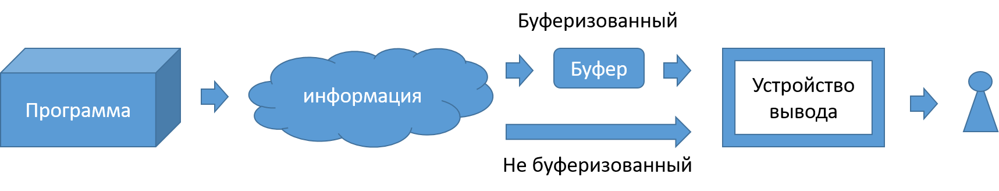

# Лекция 4: Классы, инкапсуляция, наследование полиморфизм.

### План лекции:

1. Виртуальные методы
   1. Связывание на этапе компиляции 
   2. Определение
   3. Виртуальные деструкторы
   4. Чистые виртуальные методы
2. Абстрактные классы
3. Реализация по умолчанию
4. Интерфейсные классы
5. Структура классов библиотеки iostream
6. Потоки
7. Стандартные потоки и манипуляция с ними
8. Взаимодействие с потоками.
9.  Строковые потоки
10. Файловые потоки ввода вывода
11. Файловый указатель


----------------
### Виртуальные методы


#### Связывание на этапе компиляции 

Вновь обратимся к схеме приведенной в первой лекции, которая описывала этапы написания программы:


Линковщик, проводит связывание каждого метода в момент компиляции. Под связыванием понимается указание в месте вызова метода области памяти в которой расположен код соответствующей функции, функция выбирается на основании компилируемого типа переменной у которой он вызывается.В случае же использования виртуального метода, связывания на стадии компиляции не происходит, и мы говорим компилятору, что этот метод может быть переопределён и заставляем исполняющую машину во время исполнения нашего кода определить реальный тип скрытый за указателем или ссылкой и вызвать именно его.

```cpp
#include <iostream>
#include <string>
#include <cstdarg>

using namespace std;

class Weapon{
    public:
        string name;
        Weapon(string name): name(name) {}
        void printName(){
            cout << "name: " << name << endl;
        }
};

class Pistol: public Weapon{
    public:
        Pistol(string name): Weapon(name) {}
        void printName(){
            cout << "Pistol name: " << name << endl;
        }
};

class Sword: public Weapon{
    public:
        Sword(string name): Weapon(name) {}
        void printName(){
            cout << "Sword name: " << name << endl;
        }
};

int main(){
    const int N = 3;
    Weapon w("JustWeapon");
    Pistol p("9mm");
    Sword s("Excalibur");
    w.printName(); // name: JustWeapon
    p.printName(); // Pistol name: 9mm
    s.printName(); // Sword name: Excalibur
    Weapon* weapons[N] {&w, &p, &s};
    for(int i = 0; i < N; i++)
        weapons[i]->printName();
    // name: JustWeapon
    // name: 9mm
    // name: Excalibur
    Weapon& w2 = p;
    Weapon w3 = s;
    w2.printName(); // name: 9mm
    w3.printName(); // name: Excalibur
    return 0;
}
```


#### Определение

Виртуальные функции — специальный вид функций-членов класса. 
Для объявления виртуальной функции используется ключевое слово virtual. Функция-член класса может быть объявлена как виртуальная, если:
класс, содержащий виртуальную функцию, базовый в иерархии порождения;
реализация функции зависит от класса и будет различной в каждом порожденном класс

```
virtual <тип возвращаемого значения> <название метода> (<аргументы>){
    // … Тело метода
}

```

- Если функция отмечена как виртуальная, то все соответствующие переопределения тоже считаются виртуальными, даже если возле них явно не указано ключевое слова virtual. Однако, наличие ключевого слова virtual возле методов дочерних классов послужит полезным напоминанием о том, что эти методы являются виртуальными, а не обычными.
- Типы возврата виртуальной функции и её переопределений должны совпадать.
- Никогда не вызывайте виртуальные функции в теле конструкторов или деструкторов. В таких случаях, в языке C++ будет вызываться родительская версия метода.
- Обработка и выполнение вызова виртуального метода занимает больше времени, чем обработка и выполнение вызова обычного метода. Кроме того, компилятор также должен выделять один дополнительный указатель для каждого объекта класса, который имеет одну или несколько виртуальных функций.


```cpp
#include <iostream>
#include <string>
#include <cstdarg>

using namespace std;

class Weapon{
    public:
        string name;
        Weapon(string name): name(name) {}
        virtual void printName(){
            cout << "name: " << name << endl;
        }
};

class Pistol: public Weapon{
    public:
        Pistol(string name): Weapon(name) {}
        void printName(){
            cout << "Pistol name: " << name << endl;
        }
};

class Sword: public Weapon{
    public:
        Sword(string name): Weapon(name) {}
        void printName(){
            cout << "Sword name: " << name << endl;
        }
};

int main(){
    const int N = 3;
    Weapon w("JustWeapon");
    Pistol p("9mm");
    Sword s("Excalibur");
    w.printName(); // name: JustWeapon
    p.printName(); // Pistol name: 9mm
    s.printName(); // Sword name: Excalibur
    Weapon* weapons[N] {&w, &p, &s};
    for(int i = 0; i < N; i++)
        weapons[i]->printName();
    // name: JustWeapon
    // Pistol name: 9mm
    // Sword name: Excalibur
    Weapon& w2 = p;
    Weapon w3 = s;
    w2.printName(); // Pistol name: 9mm
    w3.printName(); // name: Excalibur
    return 0;
}
```


#### Виртуальные деструкторы

Отдельного упоминания требуют виртуальные деструкторы. Как можно догадаться, если мы вызываем удаление объекта дочернего типа через указатель на родительский объект то вызовется деструктор родительского класса, а значит все дополнительная дочерняя память освобождена не будет, и произойдет ее утечка, когда программа к этой памяти доступа иметь не будет ни программа, ни система до окончания выполнения программы. Поэтому деструкторы в большинстве случаев следует делать виртуальными.

```
Virtual ~<название абстрактного класса>(){};

```


#### Чистые виртуальные методы

Есть особый вариант, чистые виртуальные функции (pure virtual functions). Это функции, которые не имеют определения и соответственно требуют своего переопределения в дочерних классах. Чтобы определить виртуальную функцию как чистую, ее объявление завершается значением "=0".

```
virtual <тип возвращаемого значения> <название метода> (<аргументы>) = 0;

```

----------------
### Абстрактные классы

Абстрактные классы - это классы, которые содержат или наследуют без переопределения хотя бы одну чистую виртуальную функцию. Абстрактный класс определяет интерфейс для переопределения производными классами.
Абстрактные классы в обязательном порядке требуют переопределения методов при наследовании, иначе наследники будут так же считаться абстрактными классами.

```
class <название абстрактного класса> {
    <любой спецификатор доступа>:
        <тип поля> <название поля>;
        … прочие поля
        <название абстрактного класса>(<аргументы конструктора>){}
        … прочие методы
        virtual <тип возвращаемого значения> <название метода>() = 0;
        … прочие методы
};

```

```cpp
#include <iostream>
#include <string>
#include <cstdarg>

using namespace std;

class Weapon{
    public:
        string name;
        Weapon(string name): name(name) {}
        virtual void printName() = 0;
};

void Weapon::printName() {
    cout << "Weapon name: " << name << endl;
}

class Pistol: public Weapon{
    public:
        Pistol(string name): Weapon(name) {}
        void printName(){
            cout << "Pistol name: " << name << endl;
            Weapon::printName();
        }
};

class Sword: public Weapon{
    public:
        Sword(string name): Weapon(name) {}
        void printName(){
            cout << "Sword name: " << name << endl;
        }
};

int main(){
    const int N = 2;
    // Weapon w("JustWeapon"); // использование объекта абстрактного типа класса "Weapon" не допускается: -- функцию "Weapon::printName" является чистой виртуальной функцией
    Pistol p("9mm");
    Sword s("Excalibur");
    // w.printName(); // name: JustWeapon
    p.printName(); // Pistol name: 9mm
    s.printName(); // Sword name: Excalibur
    Weapon* weapons[N] {&p, &s};
    for(int i = 0; i < N; i++)
        weapons[i]->printName();
    // Pistol name: 9mm
    // Sword name: Excalibur
    Weapon& w2 = p;
    // Weapon w3 = s; // использование объекта абстрактного типа класса "Weapon" не допускается: -- функцию "Weapon::printName" является чистой виртуальной функцией
    w2.printName(); // Pistol name: 9mm
    // w3.printName(); // name: Excalibur
    return 0;
}


```


----------------
### Реализация по умолчанию

Чистые виртуальные методы в абстрактных типах могут иметь реализацию по умолчанию. При этом функции не перестанут быть чистыми виртуальными функциями, а класс все еще будет считаться абстрактным и требовать переопределения метода внутри дочернего класса для того что бы тот не являлся абстрактным и позволил создать объекты своего типа.
Отличие от обычной виртуальной функции с реализацией заключается в том, что реализация выноситься в обязательном порядке за определение класса, а внутри него функция так и остается чистой виртуальной без реализации. А его вызов возможен только напрямую внутри метода дочернего класса.


```
class <название абстрактного класса> {
    <любой спецификатор доступа>:
        <тип поля> <название поля>;
        … прочие поля
        <название абстрактного класса>(<аргументы конструктора>){}
        … прочие методы
        virtual <тип возвращаемого значения> <название метода>() = 0;
        … прочие методы
};
virtual <тип возвращаемого значения>  <название абстрактного класса> ::<название метода>()  {
    // тело метода по умолчанию
}
// <название абстрактного класса> ::<название метода>();

```

----------------
### Интерфейсные классы

Интерфейс — это абстрактный класс, который не имеет переменных-членов, т.е. полей, и все методы которого являются чистыми виртуальными функциями! Интерфейсы еще называют «классами-интерфейсами» или «интерфейсными классами».

```
class <название абстрактного класса> {
    <любой спецификатор доступа>:
        … отсутствуют поля
        … отсутствуют конструкторы
        virtual <тип возвращаемого значения> <название метода>(<аргументы>) = 0;
        … только чистые виртуальные методы
};

```

Интерфейсы используются для того, что бы объединить похожие по смыслу и обращению с собой классы, но разные по функциональному наполнению. Например классы хранения данных в базе данных и в файле могут иметь один общий принцип работы с ними в вашей программе, но внутри устройство работы с ними будет разное
Не забудьте о подключении виртуальных деструкторов в ваши интерфейсные классы, чтобы при удалении указателя на интерфейс вызывался деструктор соответствующего (дочернего) класса.

```cpp
#include <iostream>
#include <string>
#include <cstdarg>

using namespace std;

class Weapon{
    public:
        virtual void printName() = 0;
};

class Pistol: public Weapon{
    private:
        string name;
    public:
        Pistol(string name): name(name) {}
        void printName(){
            cout << "Pistol name: " << name << endl;
        }
};

class Sword: public Weapon{
    private:
        string name;
    public:
        Sword(string name): name(name) {}
};

int main(){
    const int N = 1;
    // Weapon w("JustWeapon"); // использование объекта абстрактного типа класса "Weapon" не допускается
    Pistol p("9mm"); 
    Sword s("Excalibur"); // использование объекта абстрактного типа класса "Sword" не допускается
    // w.printName(); // name: JustWeapon
    p.printName(); // Pistol name: 9mm
    s.printName(); // Sword name: Excalibur // использование объекта абстрактного типа класса "Sword" не допускается
    Weapon* weapons[N] {&p};
    for(int i = 0; i < N; i++)
        weapons[i]->printName();
    // Pistol name: 9mm
    Weapon& w2 = p;
    // Weapon w3 = s; // использование объекта абстрактного типа класса "Weapon" не допускается
    w2.printName(); // Pistol name: 9mm
    // w3.printName(); // name: Excalibur
    return 0;
}


```

----------------
### Структура классов библиотеки iostream


При подключении заголовочного файла iostream, мы получаем доступ ко всей иерархии классов библиотеки iostream, отвечающих за функционал ввода/вывода данных (включая класс, который называется iostream).
Хорошая новость: Программисту не нужно знать детали взаимодействия потоков с разными устройствами и источниками данных, ему нужно только научиться взаимодействовать с этими потоками для чтения и записи данных.
Класс istream используется для работы с входными потоками. 
Класс ostream используется для работы с выходными потоками. 
Класс iostream может обрабатывать как ввод, так и вывод данных, что позволяет ему осуществлять двунаправленный ввод/вывод.


----------------
### Потоки

Поток — это последовательность символов, к которой можно получить доступ. Со временем поток может производить или потреблять потенциально неограниченные объёмы данных.
Поток ввода (или ещё «входной поток») используется для хранения данных, полученных от источника данных: клавиатуры, файла, сети и т.д.
Поток вывода (или ещё «выходной поток») используется для хранения данных, предоставляемых конкретному потребителю данных: монитору, файлу, принтеру и т.д. При записи данных на устройство вывода, это устройство может быть не готовым принять данные немедленно — например, принтер все ещё может прогреваться, когда программа уже записывает данные в выходной поток. Таким образом, данные будут находиться в потоке вывода до тех пор, пока принтер не начнёт их использовать.
Некоторые устройства, такие как файлы и сети, могут быть источниками как ввода, так и вывода данных. 



----------------
### Стандартные потоки и манипуляция с ними

Стандартный поток — это предварительно подключенный поток, который предоставляется программе её окружением. C++ поставляется с 4-мя предварительно определёнными стандартными объектами потоков, которые вы можете использовать (первые три вы уже встречали):

cin —связанный со стандартным вводом (обычно это клавиатура);
cout —связанный со стандартным выводом (обычно это монитор);
cerr —связанный со стандартной ошибкой (обычно это монитор), обеспечивающий небуферизованный вывод;
clog —связанный со стандартной ошибкой (обычно это монитор), обеспечивающий буферизованный вывод.


Есть два способа управления параметрами форматирования вывода:
флаги — это логические переменные, которые можно включать/выключать;
манипуляторы — это объекты, которые помещаются в поток и влияют на способ ввода/вывода данных.
Управление фалагами:
setf(флаг) включает флаг, можно включить сразу несколько флагов, используя побитовый оператор ИЛИ (|)
unsetf(флаг) выключает флаг
Флаги объединяются в группы форматирования — это группа флагов, которые выполняют аналогичные (иногда взаимоисключающие) параметры форматирования вывода. 


----------------
### Взаимодействие с потоками.


Ввод и вывод 
Оператор извлечения >> используется для извлечения значений из потока. 
Оператор вставки << используется для помещения значений в поток. 

Есть ещё несколько полезных функций класса istream, которые вы можете использовать:
get() - извлекает символ из входного потока. Один важный нюанс: get() не считывает символ новой строки!
getline() - работает точно так же, как get(), но при этом может считывать символы новой строки. Функция которая считывает строку как тип string находиться в файле <string>.
ignore() — игнорирует первый символ из потока.
ignore(int nCount) — игнорирует первые nCount (количество) символов из потока.
peek() — считывает символ из потока, при этом не удаляя его из потока.
unget() — возвращает последний считанный символ обратно в поток, чтобы его можно было извлечь в следующий раз.
putback(char ch) — помещает выбранный вами символ обратно в поток, чтобы его можно было извлечь в следующий раз.


----------------
### Строковые потоки

Есть 6 потоковых классов, которые используются для чтения и записи строк:
istringstream (является дочерним классу istream);
ostringstream (является дочерним классу ostream);
stringstream (является дочерним классу iostream);
wistringstream;
wostringstream;
wstringstream.
Чтобы использовать stringstream, нужно подключить заголовочный файл sstream.


----------------
### Файловые потоки ввода вывода

Есть три основных класса файлового ввода/вывода в C++:
ifstream (является дочерним классу istream);
ofstream (является дочерним классу ostream);
fstream (является дочерним классу iostream).
Для их использования нужно всего лишь подключить заголовочный файл fstream.
Файловые потоки как и строковые определяются программистом, они требуют открытия и явного закрытия потока вызова метода close().
Вывод в файл строго буферизованный по причинам производительности, однако можно принудительно очистить буфер закрытием файла или же метод ostream::flush(), или отправив std::flush в выходной поток.
Интересный нюанс: Поскольку std::endl; также очищает выходной поток, то его чрезмерное использование (приводящее к ненужным очисткам буфера) может повлиять на производительность программы

Конструкторы файлового потока принимают необязательный второй параметр, который позволяет указать программисту способ открытия файла. В качестве этого параметра можно передавать следующие флаги (которые находятся в классе ios):
app — открывает файл в режиме добавления;
ate — переходит в конец файла перед чтением/записью;
binary — открывает файл в бинарном режиме (вместо текстового режима);
in — открывает файл в режиме чтения (по умолчанию для ifstream);
out — открывает файл в режиме записи (по умолчанию для ofstream);
trunc — удаляет файл, если он уже существует.


----------------
### Файловый указатель

Каждый класс файлового ввода/вывода содержит файловый указатель, который используется для отслеживания текущей позиции чтения/записи данных в файл. Любая запись в файл или чтение содержимого файла происходит в текущем местоположении файлового указателя.
До этого момента мы осуществляли последовательный доступ к файлам, т.е. выполняли чтение/запись файла по порядку. Тем не менее, мы можем выполнить и произвольный доступ к файлу, т.е. перемещаться по файлу, как захотим. Это может быть полезно, когда файл имеет обширное содержимое, а нам нужна всего лишь небольшая конкретная запись из всего этого. 
Произвольный доступ к файлу осуществляется путём манипулирования файловым указателем с помощью методов seekg() (для ввода) и seekp() (для вывода). 
Методы seekg() и seekp() принимают следующие два параметра:
смещение на которое следует переместить файловый указатель (измеряется в байтах);
флаг ios, который обозначает место, от которого следует отталкиваться при смещении. 
Флаги ios, которые принимают методы seekg() и seekp() в качестве второго параметра:
beg — cмещение относительно начала файла (по умолчанию);
cur — cмещение относительно текущего местоположения файлового указателя;
end — смещение относительно конца файла.


