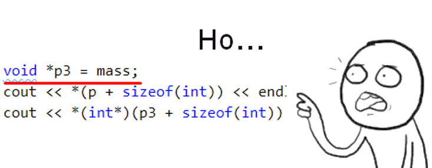

# Лекция 2: Память, указатели, ссылки, передача параметров в функцию

### План лекции:

1. Как работает Git
2. Линейное представление памяти
3. Указатель в рамках линейного представления памяти
4. Указатель в С++
5. Ссылка в С++
6. Операции взятия и разименования указателя
7. Массив в памяти
8. Арифметика указателей
9. Примеры
10. Void и Void*
11. Два вида памяти
    1.  Статическая
    2.  Динамическая
12. Выделение динамической памяти, оператор new
13. Освобождение памяти, оператор delete
14. Массивы и операторы new и delete
15. Передача по указателю
16. Изменяемый и не изменяемый указатель
17. Передача по ссылке, разница
18. Умные указатели

----------------
### Как работает Git

----------------
### Линейное представление памяти

----------------
### Ссылка и  указатель в рамках линейного представления памяти

----------------
### Указатель в С++
----------------
### Ссылка в С++

----------------
### Операции взятия и разименования указателя

----------------
### Массив в памяти

----------------
### Арифметика указателей
----------------
### Примеры
----------------
### Void и Void*

----------------
### Два вида памяти

#### Статическая

#### Динамическая
----------------
### Выделение динамической памяти, оператор new
----------------
### Освобождение памяти, оператор delete
----------------
### Массивы и операторы new и delete
----------------
### Передача по указателю
----------------
### Изменяемый и не изменяемый указатель
----------------
### Передача по ссылке, разница
----------------
### Умные указатели