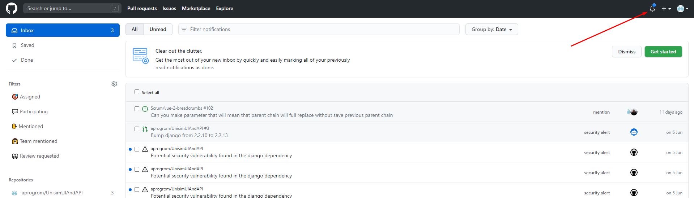
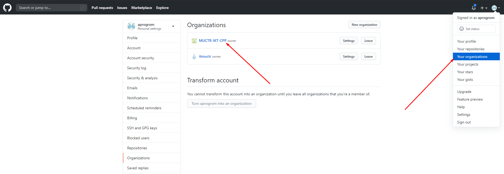
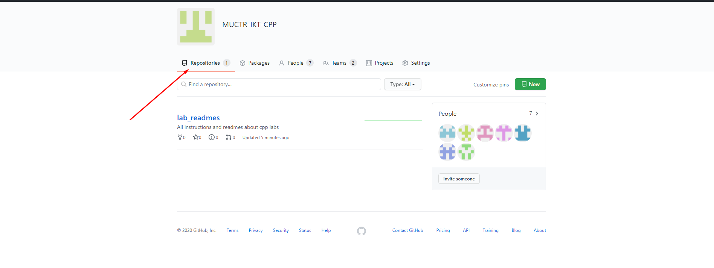
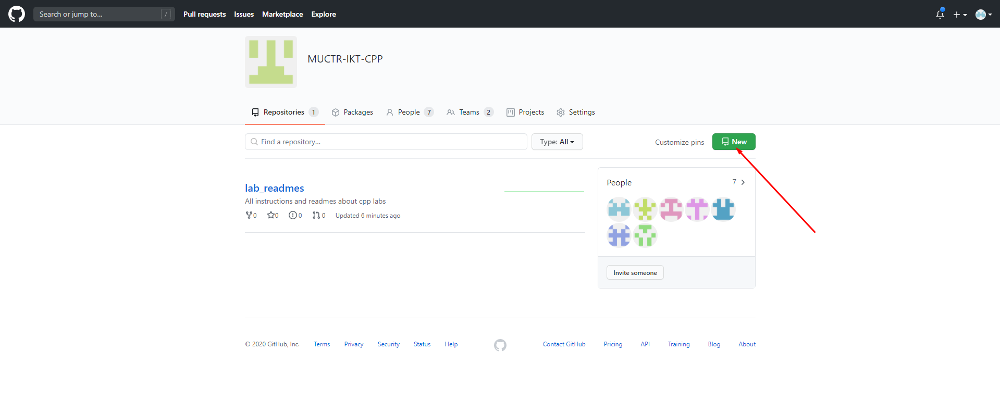
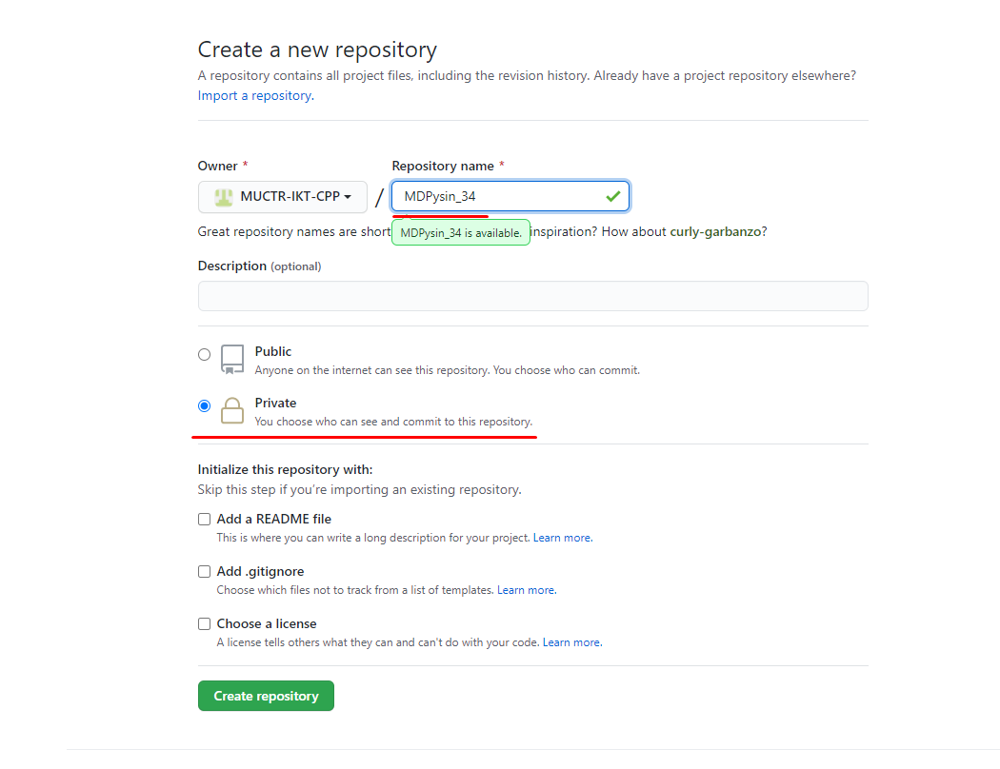
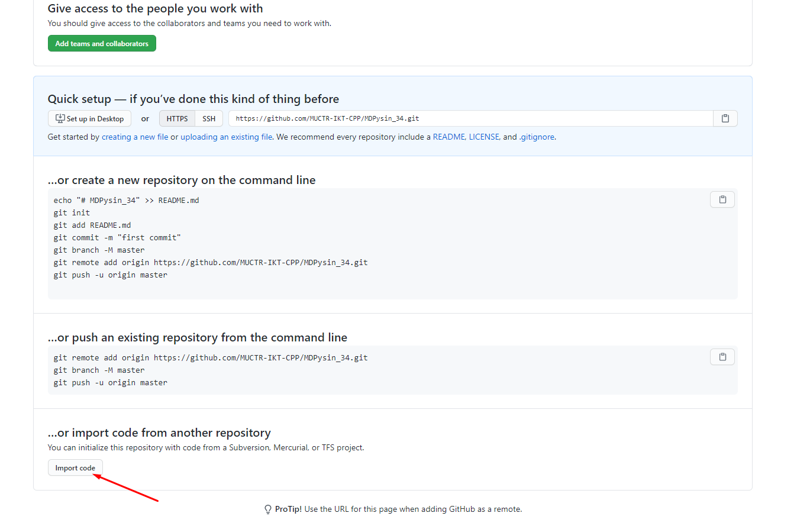
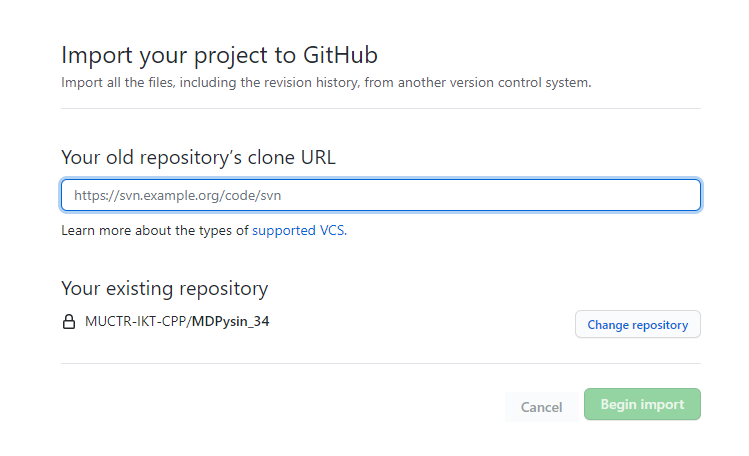
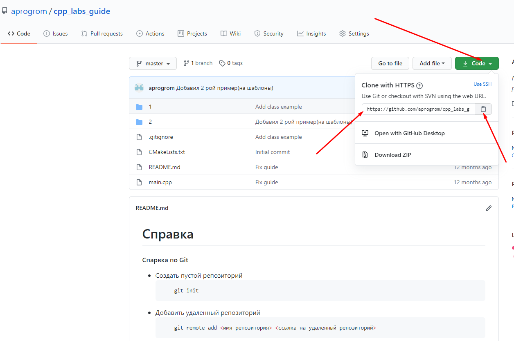
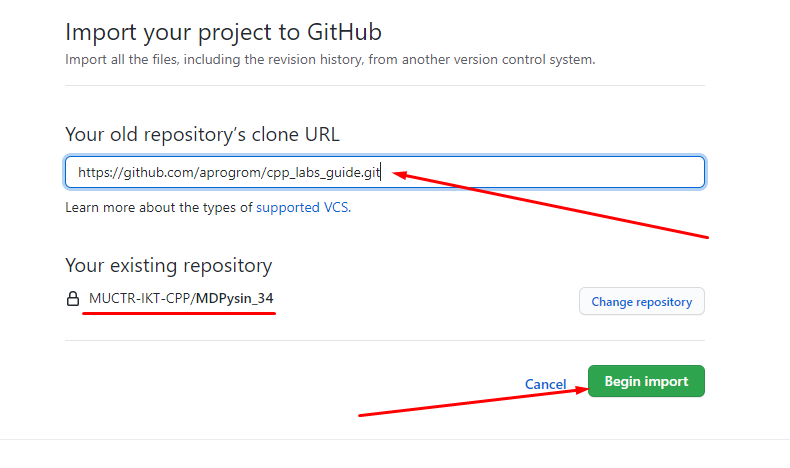

Как можно заметить на гитхабе была создана организация, и вас добавили в нее. Вам пришло письмо счастья на почту, о том, что вас пригласили в организацию на гитхабе, для принятия инвайта необходимо нажать на большую зеленую кнопку в письме. Если вы не видите его в своем почтовом ящике, к которому привязан ваш аккаунт, посмотреть их всегда можно в разделе оповещений на сайте гитхаба.

    

После того, как вы примете приглашение, у вас откроется доступ к организации:

    

Вам необходимо будет перейти на страницу организации, нажав на нее, и перейти на страницу репозиториев:

    

На ней вы можете заметить общий закрытый репозиторий lab_readmes, туда будет помещаться различная полезная информация.

После того как вы перешли на страницу репозиториев, вам необходимо будет создать новый репозиторий:

    

В название репозитория пишите ИОФамилия_36/34/30, очевидно, что число 36, 34, 30 пишете в зависимости от группы, автоматически репозиторий будет создаваться приватным, эту настройку не меняем:  

    

Если это необходимо, после создания репозитория можете импортировать в него свой репозиторий(не обязательно):

    

    

    

    

