# Инструкция по созданию репозитория в организации
Для создания репозитория есть несколько путей:

#### Первый путь, это нажать на символ + в верхней панели на сайте

    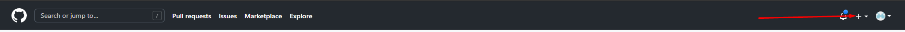

а затем выбрать "New repository"

    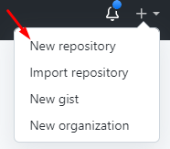

#### Второй путь, этой зайти к себе в профиль

    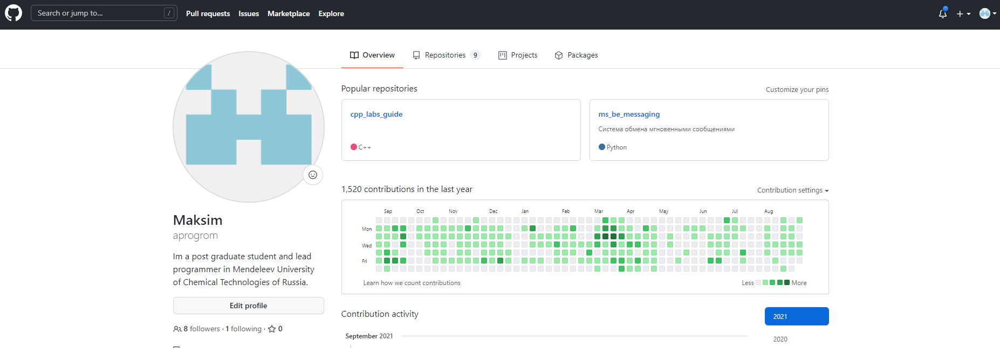

перейти в раздел профиля "Repositories"

    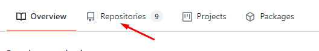

и нажать кнопку "New"

    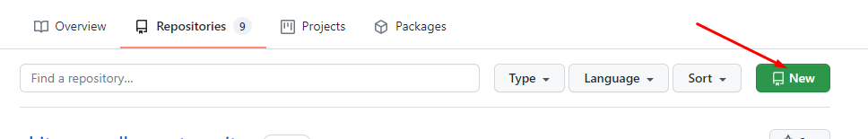

#### И третий путь, так же из вашего профиля перейти в организацию, для этого на странице вашего профиля в левой колонке найдите блок "Organizations"

    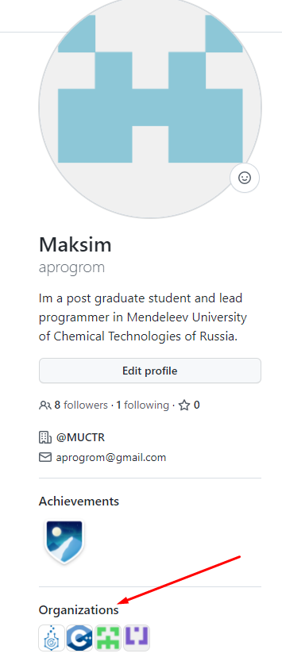

В этом блоке у найдите изображение логотипа C++ из википедии

    
    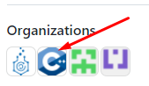

Если задержать на иконке курсор, то высветится краткая информация об организации, при помощи этого способа вы можете убедится, что ничего не перепутали

    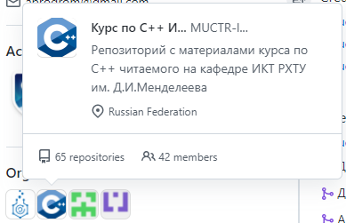

Перейдя на страницу организации, вам понадобится найти кнопку "New" и нажать на нее

    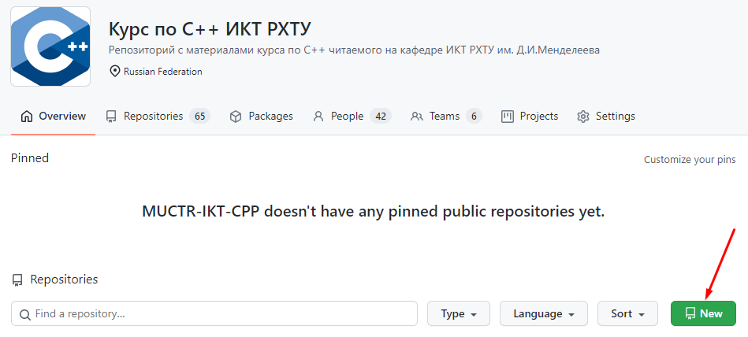

----------------------------

С этого момента дальнейшие действия аналогичны для всех 3х путей, вы попадаете на одну  иту же страницу выглядящую следующим образом.

    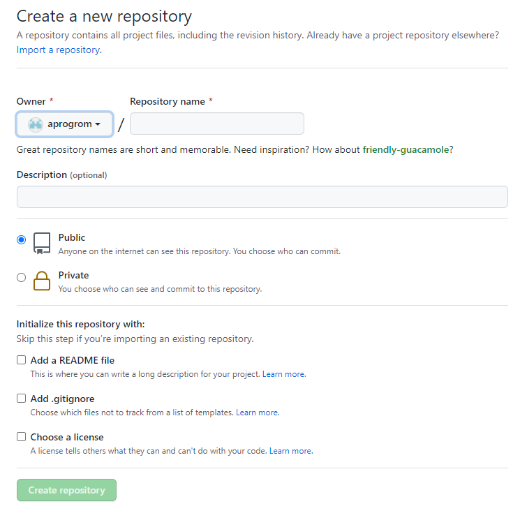

На этой странице вам необходимо убедится, что репозиторий будет создан внутри организации, иначе ваши работы не будут приняты.
Для смены владельца репозитория на организацию необходимо найти графу "Owner" и нажать на выпадающий список

    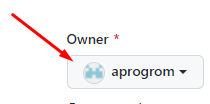

В появившемся списке находим MUCTR-IKT-CPP и нажимаем на него.

    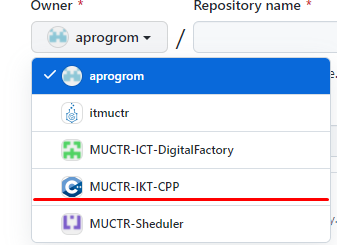

Следом обращаемся к графе "Repository name" расположенной рядом, и вводим в нее название репозитория. <b>!Название репозитория имеет следующий формат: ИОФамилия_НомерГруппы</b>, все буквы латинские, т.е. ваши фамилии нужно транслитерировать, например ИИИванов_34 МАПетрова_30

    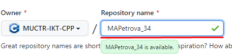

После чего в обязательном порядке необходимо поменять режим видимости для репозитория на приватный.

    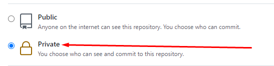

Пункты ниже обозначенные как "Initialize this repository with", так же как и пункт "Description" заполняете на свое усмотрение.  
После завершения всех действий выше, нажимаем кнопку "Create repository"

    

#### Репозиторий создан 

    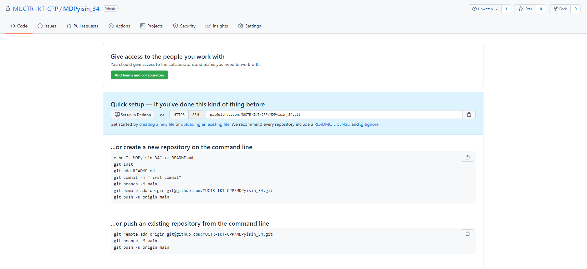

