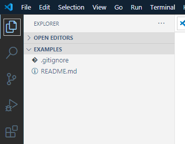
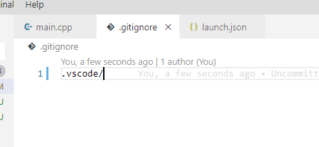

Инструкция по установке и настройке Visual Studio Code для работы на лабораторных работах по C++
=====================================================
Если вы не знаете какую IDE вам использовать, предлагается централизованно всем использовать Visual Studio Code так как она является бесплатной для использования и достаточно легка.  
Для ее установки вам необходимо перейти на сайт https://code.visualstudio.com/ и на сайте нажать кнопку:

    

Если сайт не правильно определил вашу операционную систему, то нажимаем на кноку download сверху, либо под кнопкой на которую указывает стрелка нажимаем other platforms и выбираем нужную платформу

    

После нажатия начнется скачивание:  

    

   
Как завершается скачивание, открываем скачанный файл и устанавливаем VS Code. Выбираем любое удобное вам месторасположение установленной программы, а так же все промежуточные настройки.
Для работы с C++ нам необходимо воспользоваться инструкцией для настройки под один из вариантов компилятора
<table>
    <tr>
        <td>Для mingv</td>
        <td>Для компилятора от Visual Studio</td>
    </tr>
    <tr>
        <td>https://code.visualstudio.com/docs/cpp/config-mingw</td>
        <td>https://code.visualstudio.com/docs/cpp/config-msvc</td>
    </tr>
        <tr>
        <td>
            
        </td>
        <td>
            
        </td>
    </tr>
</table> 	 

В обоих случаях необходимо установить расширения для VSCode предназначенное для работы с С++ кодом:

    

Для чего по инструкции нам необходимо открыть VSCode, нажать в нем комбинацию клавишь Ctrl Shift X и ввести в поисковой строке c++

    

Рассмотрим вариант с установкой для компилятора mingw:  
Необходимо скачать инсталятор с сайта производителя компилятора MinGW installer (ссылка так же приведена в инструкции ссылка на которую приведена ранее)  
После скачивания, запускаем установщик

    

В случае если у вас установлена 64 битная версия операционной системы во время установки в разделе настроек(Settings) в пункте Architecture x86_64

    

Путь установки выбираем удобный нам

    

Нажимаем далее и ждем окончательной установки.  
После установки, нам необходимо прописать наш компилятор в системную переменную PATH:  
Для этого открываем панель управления(работает на 10 и 7)

    

Находим пункт система

    

В открывшемся окне, в левом меню выбираем пункт дополнительные параметры системы

    

В открывшемся окне выбираем переменные среды

    

В списке переменных сред вашего пользователя находим пеменную Path

    

Нажимаем изменить, в открывшемся окне нажимаем на пункт создать

    

В выделенную строку копируем путь до папки bin лежащей в подпапке mingw64 папки установки компилятора MinGW

    

    

Нажимаем Ок, затем, в окне с переменными средами пользователя вновь нажимаем ОК, и в окне дополнительных свойств системы вновь нажимаем ОК.     
Далее проверяем что наш компилятор установлен правильно и правильно прописан в PATH, для этого переходим в командную строку(можно поиском слова cmd в пуске) и вводим команды:   
- g++ --version (эта команда вернет нам версию компилятора)
- gdb –version (эта команда вернет нам версию дебагера)
В выводе мы должны увидеть ту версию, которую мы только что установили (и вообще версию в принципе)

    

На этом установка компилятора MinGW завершена.

-------------------------------------------------

В случае если вы хотите использовать компилятор Visual Studio, если он у вас не установлена, вам достаточно перейти по ссылке https://visualstudio.microsoft.com/ru/downloads/ и на открышейся странице найти:

    

    

После чего скачать файл по кнопке загрузить и его установить, дальнейшей специализированной настройки не требуется, так как все необходимое будет прописано и настроен автоматически.  

Для подключения удаленного репозитория в который будут загружаться лабораторные работы и инициализации проекта в котором вы будете выполнять лабораторные работы, необходимо клонировать репозиторий по средством нажатия кнопки Clone repository:

    

    

Для получения ссылки на репозиторий необходимо открыть страницу репозитория и скопировать ссылку для доступа к нему

    

А затем ввести ее в открывшееся после нажатия кнопки окно и нажать появившийся пункт clone from url

    

Затем откроется окно выбора места, в которое репозиторий должен быть склонирован, т.е. папки расположения папки с проектом лабораторных работ.

    

Обратите внимание, что в выбранной папке будет создана папка с названием соответсвующим названию репозитория

    

После клонирования внутри редактора высветиться окно с предложением открыть свежесклонированный проект

    

Выбираем пункт открыть. После этого возможно VSCode спросит у вас сохранять ли текущий проект, если вы открыли VSCode впервые не сохраняйте изменения, если вы работали с каким-то другим проектом, можете сохранить изменения.

В открывшемся окне вы увидите всю структуру папок и файлов вашего склонированного репозитория.

    

Теперь вы можете настроить вносить изменения в файлы проекта. К примеру, создадим проект нулевой лабораторной работы:

    

 
Как можно заметить VSCode подсвечивает нам файлы зеленым цветом, что означает что эти файлы еще не были добавлены в репозиторий. Эту же информацию, мыможем увидеть в меню репозитория показывающего все изменения актуальной версии относительно последнего коммита(в том числе и локального)

    

Мы создали файл нулевой лабораторной, наполним его кодом для компиляции:

    

Теперь нам необходимо настроить компиляцию этой лабораторной:    
Для этого, необходимо открыть файл с кодом нашего проекта и в верхнем меню находим пункт Terminal и в нем находим подпункт Configure Default Build Tasks

    

 
В открывшемся окне видим перечисление доступных нам компиляторов 

    

 
Выбираем пункт g++.exe, после чего в нашем проекте появляются папка .vscode с файлом tasks.json которые содержат настройки для компилятора, указывающее как собирать наш файл. Так же, мог появиться файл c_cpp_properties.json который содержит настройки подсказчика и подсветки кода для расширения 

    

 
Сам файл tasks выглядит следующим образом:

    

 
Далее, нам понадобится настроить запуск нашей скомпилированной программы в режиме дебага, для этого, вновь открываем файл с кодом! и в верхнем меню выбираем пункт Run и в нем нажимаем подпункт Add Configuration

    

 
После нажатия откроется выбор конфигурации для запуска, если у вас установлен MinGW то используете GDB/LLDB если же вы используете компилятор от компании Microsoft выбираете Windows

    

 
Затем, редактор предложит выбрать из пресетов которые он создает на основании тех компиляторов которые обнаруживает в вашей системе.

    

 
В дереве папок, в папку .vscode будет добавлен новый файл launch.json, в котором описаны настройки запуска собранных файлов в режиме дебага.

    

 
Сам файл выглядит так

    

 
Теперь ваш проект готов к сборке и запуску, для этого необходимо вновь открыть файл который вы хотите запустить, находясь в этом файле либо нажать F5 для запуска с дебагером, CTRL+F5 для запуска без дебагера, CTRL + SHIFT + B для просто сборки.    
Либо воспользоваться интерфейсом:

    

 

И нажать на стрелку для запуска.   
В итоге у нас получиться следующая структура папок в нашем проекте:

    

 
Так же, мы можем зайти на вкладку системы контроля версий и увидеть все сделанные нами изменения.

    

 
Как можно заметить на изображении отображается всего 3 изменения, хотя у нас добавилось 3 файла, и 1 папка. Это связано с тем, что добавление папки само по себе не является значимым изменением. Однако, все еще не хватае файла с расширением .exe. Этот файл исключен из индексирования изменения при помощи файла .gitignore который вы могли автоматически добавить в свой созданный репозиторий, если же его у вас не будет, то вы увидите в списке всех изменений так же и файл .exe. Такая ситуация нас не устраивает, выкладывать в репозитории исполняемые файлы и файлы настройки IDE считается не правильным, и поэтому разумно исключить эти файлы из индексации. Для этого откроем, или создадим, файл .gitignore (обратите внимание что имя файла начинается с символа точки). Сгенерированный по умолчанию в репозитории файл охватывает основную массу типичных расширений исполняемых файлов, среди которых так же есть и exe.

    

 
Однако по умолчанию в него не добавляются никакие настройки IDE потому что их достаточно большое количество. Очистим сгенерированный файл, что бы настроить его самостоятельно так как нам необходимо. Сделав это в списке изменений мы увидим следующую картину.

    

 
Настроим файл так что бы исключить всю папку с настройками IDE, для этого напишем следующее:

    

 
Вновь посмотрим на список изменений:

    

 
Файлы содержащие настройки компилятора пропали из списка доступных для добавления. Теперь осталось исключить файл с расширением .exe для этого напишем:

    

 
В списке изменений остались только нужные нам изменения.

    

 

Обратим внимание, что исключать файл .gitignore из индекса не следует, для того что бы не настраивать его каждый раз как вы склонируете ваш репозиторий так как он не зависит от локальных путей компьютера, что и служит основанием исключения файлов настройки IDE.   
Теперь нам необходимо сохранить сделанные изменения в репозитории, для этого в списке изменений у каждого из них нажмем кнопку со значком +.

    

 

Кнопка со значком возврата откатит наши изменения.  
Так же можно добавить все изменения нажав на плюс у всего пункта Changes
После нажатия на плюс хотя бы у одного изменения у нас появиться пункт Stage Changes

    

 
Это те изменения которые будут добавлены в коммит, остается только его создать. Для этого нажимаем на символ галочки

    

 
После чего VSCode попросит вас ввести текст подписи к комиту, в этот текст мы пишем для себя краткую выжимку и суть наших изменений.

    

 

После нажатия на кнопку Enter на клавиатуре наш коммит окончательно создастся.  
Теперь нам необходимо отправить его на сервер гита на хранение, для этого мы нажимаем на символ трех точек, в открывшемся меню выбираем пункт Push, Pull и в нем выбираем Push

    

 
После этого VSCode отправит изменения на сервер и мы будем спокойны за их сохранность. 

    

 
На этом настройка и экскурс в работу с VSCode можно считать законченной. 
