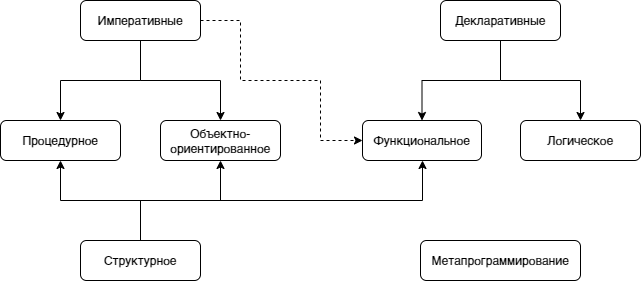
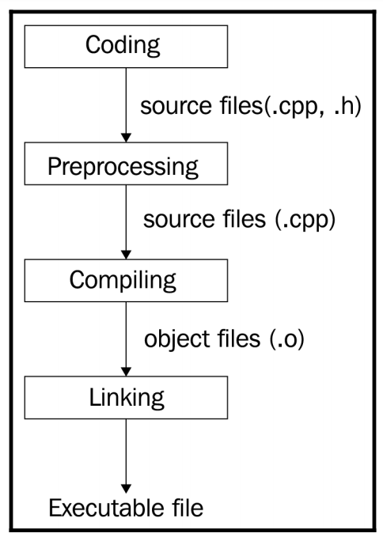
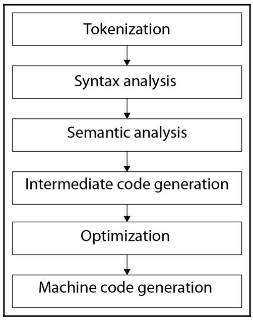
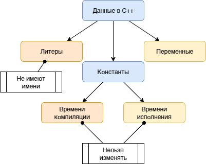
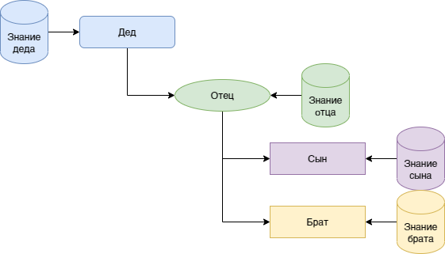

# Лекция 1: О языке C++ и основных конструкциях

### План лекции:

1. Как устроен курс
2. Соглашение об именовании
3. Git и история изменений
4. Язык C++ и парадигмы программирования
5. Создание и компиляция программы
6. Структура исходного файла
7. Данные, типы и переменные
8. Литералы и константы
9. Структурный подход и область видимости
10. Условия
11. Циклы
12. Функции
13. Массивы

### Как работать с материалами курса

Изучать новый язык гораздо проще, когда уже знакомы базовые идеи программирования: данные, ветвления, циклы и функции. Однако курс не предполагает, что мы знаем все особенности C++. Их как раз и предстоит разобрать — постепенно, от простых конструкций к классам, шаблонам и стандартной библиотеке.

Основные материалы находятся в репозитории курса. Там собраны презентации, лабораторные работы, инструкции, примеры и дополнительные источники. Презентация задаёт порядок тем, но одних слайдов недостаточно: код нужно запускать, изменять и проверять самостоятельно.

Правила начисления баллов и сроки сдачи могут меняться, поэтому для организационных вопросов следует пользоваться актуальным журналом и объявлениями преподавателя, а не старой копией конспекта.

### Соглашение об именовании

В реальной программе имя связывает техническую деталь с предметной областью. Переменная `x` вполне терпима в формуле на три строки, но в расчёте доставки гораздо полезнее увидеть `distance_km`, `tariff` и `delivery_cost`: тогда мы понимаем не только тип данных, но и роль каждого значения. Такое именование особенно помогает во время изменения требований, когда формула остаётся прежней, а смысл одного из коэффициентов уточняется.

Можно представить программу как мастерскую с подписанными ящиками. Если на каждом ящике написано «разное», нужный инструмент формально хранится правильно, но искать его придётся методом археологических раскопок. С идентификаторами происходит то же самое: компилятор примет короткое имя, а человек заплатит за него временем чтения.

Имя `tmp2_final_really_final` обычно означает, что соглашение об именовании проиграло переговоры с дедлайном.

Первое, о чём стоит договориться при совместной работе с кодом, — как называть его элементы. **Соглашение об именовании** — это набор правил, по которым команда оформляет имена переменных, функций, типов и констант. Оно не изменяет поведение программы, зато уменьшает количество вопросов при чтении чужого кода.

В рамках курса используется следующая основа:

| Категория | Стиль | Пример |
| --- | --- | --- |
| глобальная именованная константа | `UPPER_CASE` | `MAX_ATTEMPTS` |
| переменная или параметр | `lower_snake_case` | `student_count` |
| функция | `lowerCamelCase` | `calculateAverage` |
| пользовательский тип | `UpperCamelCase` | `StudentRecord` |

Имя должно говорить о назначении сущности. Для переменных и типов чаще подходят существительные, для функций — глаголы или глагольные сочетания, потому что функция описывает действие.

Кроме самих имён, полезно помнить ещё несколько правил:

- не создавать изменяемые глобальные переменные без крайней необходимости;
- не использовать макросы препроцессора вместо обычных констант;
- объявлять переменную как можно ближе к первому использованию и сразу инициализировать;
- заменять непонятные числовые значения именованными константами.

Последнее правило защищает нас от так называемых магических чисел. Увидев в условии число `37`, читатель вынужден угадывать его смысл. Имя `MAX_GROUP_SIZE` объясняет намерение ещё до чтения комментария.

### Git: что хранится в истории

Практическая ценность истории хорошо видна на примере лабораторной работы. Мы добавили ввод данных, затем проверку, затем оптимизацию. Если после оптимизации результат изменился, отдельные осмысленные коммиты позволяют сравнить именно этот шаг, а не перечитывать весь проект. Коммит в такой модели похож на контрольную точку маршрута: он сообщает не только где мы оказались, но и зачем сюда пришли.

Сообщение `fix` загадочно хранит историю проекта; особенно хорошо оно хранит загадку о том, что именно было исправлено.

Git — распределённая система управления версиями. В упрощённом виде она хранит не просто набор файлов, а последовательность зафиксированных состояний проекта и связи между ними.

Рабочий процесс удобно представить как несколько областей:

1. **Рабочая директория** — файлы в том виде, в котором мы редактируем их сейчас.
2. **Индекс** — выбранные изменения, подготовленные к следующей фиксации.
3. **Локальный репозиторий** — история коммитов на нашем компьютере.
4. **Удалённый репозиторий** — общая копия истории на сервере, например GitHub.

Команда `git add` добавляет выбранные изменения в индекс, а `git commit` создаёт новую фиксацию в локальной истории. Команда `git push` отправляет локальные коммиты на сервер, `git pull` получает изменения и интегрирует их в текущую ветку.

Ветки позволяют развивать несколько вариантов истории параллельно. Когда работа в отдельной ветке готова, её можно объединить с другой веткой. Важно понимать границу аналогии: ветка — не отдельная копия всего проекта на сервере, а имя, указывающее на определённую линию коммитов.

### Что представляет собой C++

> Я изучаю C++ — звучит гордо. Иногда даже заслуженно.

C++ — компилируемый язык программирования общего назначения со статической системой типов. Он предоставляет как высокоуровневые абстракции, так и средства достаточно низкоуровневого управления ресурсами. Именно это сочетание делает язык одновременно мощным и сложным.

Стандарт C++ развивается версиями: C++98, C++11, C++14, C++17, C++20, C++23 и следующими редакциями. Номер стандарта важен: доступные конструкции и библиотечные возможности зависят от выбранного режима компилятора.

C++ часто называют кроссплатформенным. Точнее будет сказать, что исходную программу можно написать переносимо и собрать для разных платформ, если не использовать зависимые от конкретной системы возможности. Уже скомпилированный исполняемый файл обычно привязан к операционной системе, архитектуре и используемому двоичному интерфейсу.

Язык исторически вырос из C и сохраняет большую совместимость с ним, но C++ не является строгим надмножеством современного C. Существуют корректные программы на C, которые без изменений не компилируются как C++.

Почему язык продолжают использовать:

- существует огромная кодовая база, которую необходимо развивать и поддерживать;
- важен контроль над временем жизни объектов, памятью и другими ресурсами;
- требуются предсказуемая производительность и абстракции без обязательных накладных расходов;
- на C++ создают системное ПО, игровые движки, встраиваемые системы, высокопроизводительные библиотеки и многие прикладные программы.

Разумеется, у этого выбора есть цена: большой язык, сложные правила, историческое наследие и множество способов решить одну задачу. Поэтому мы будем не только изучать конструкции, но и обсуждать границы их безопасного применения.

### Парадигмы программирования

**Парадигма программирования** — это совокупность идей и приёмов, определяющих, как мы представляем задачу и организуем программу.



C++ поддерживает несколько парадигм: процедурную, объектно-ориентированную, обобщённую и функциональные приёмы. Их не нужно воспринимать как взаимоисключающие лагеря. В одной программе функция может обрабатывать контейнер пользовательских объектов с помощью шаблонного алгоритма и лямбда-выражения.

На первых лекциях мы начнём со структурного и процедурного подходов, затем перейдём к объектной модели и обобщённому программированию.

### Как исходный код становится программой

Прежде чем обсуждать синтаксис, полезно понять общий путь программы.



Упрощённо процесс состоит из пяти этапов:

1. **Разработка** — программист пишет и изменяет исходные файлы.
2. **Препроцессинг** — обрабатываются директивы вроде `#include` и условная компиляция.
3. **Компиляция** — отдельные единицы трансляции проверяются и преобразуются в объектный код.
4. **Компоновка** — компоновщик связывает объектные файлы и библиотеки в итоговую программу.
5. **Запуск** — операционная система загружает программу и передаёт ей управление.

Препроцессор фактически формирует единицу трансляции: раскрывает включения заголовков, макросы и выбранные ветви условной компиляции. Компилятор обычно работает с каждой такой единицей отдельно, а компоновщик соединяет результаты.

### Что происходит при компиляции

Рассмотрим механику на бытовом сценарии. Мы меняем объявление функции в заголовке, но забываем изменить один из файлов реализации. Препроцессор честно подставит заголовок, компилятор проверит каждый файл по отдельности, а затем линковщик попробует соединить вызов с определением. Поэтому сообщение об ошибке на стадии линковки нередко означает, что отдельные части программы синтаксически корректны, но не договорились об общей сигнатуре.

Эта последовательность объясняет и практическую диагностику. Сначала мы смотрим, распознаны ли имена и типы; затем — создан ли объектный код; после этого — найдены ли все определения. Не стоит исправлять «ошибку C++ вообще»: полезнее определить, какой этап не смог выполнить свою работу.

Компилятор не придирается к коду — он просто единственный участник команды, который читает каждую запятую в техническом задании.



Внутри компилятора можно выделить следующие логические стадии:

1. **Лексический анализ** разбивает текст на токены: ключевые слова, идентификаторы, литералы и операторы.
2. **Синтаксический анализ** проверяет грамматическую структуру и строит внутреннее представление программы.
3. **Семантический анализ** проверяет типы, поиск имён, допустимость операций и другие правила языка.
4. **Построение промежуточного представления** переводит программу в форму, удобную для дальнейшей обработки.
5. **Оптимизация** пытается улучшить код, сохраняя наблюдаемое поведение корректной программы.
6. **Генерация машинного кода** создаёт инструкции для целевой платформы.

Конкретный компилятор может организовать эти стадии иначе, но такая модель помогает понимать сообщения об ошибках и назначение флагов сборки.

К распространённым оптимизациям относятся свёртка констант, удаление недостижимого или неиспользуемого кода, встраивание функций, устранение повторных вычислений и преобразование циклов. Уровни `-O0`, `-O1`, `-O2`, `-O3`, `-Os` и `-Ofast` управляют наборами и агрессивностью оптимизаций в GCC и Clang. Это настройки конкретных компиляторов, а не часть языка C++.

> Важно: оптимизатор вправе исходить из того, что корректная программа не выполняет операций с неопределённым поведением. Ошибки времени жизни, выход за границы массива или неверное разыменование указателя могут проявляться по-разному на разных уровнях оптимизации.

### Точка входа и минимальная программа

В обычной размещённой среде выполнение программы C++ начинается с функции `main`. Минимальный пример выглядит так:

```cpp
#include <iostream>

int main() {
    std::cout << "Hello, world!\n";
    return 0;
}
```

Функция `main` возвращает целое значение окружению. Ноль означает успешное завершение по соглашению языка, а ненулевые значения можно использовать как коды ошибок. Если управление достигает конца `main` без явного `return`, стандарт C++ трактует это как `return 0;`.

Следовательно, утверждение «`return` обязателен в `main`» слишком строго. В других функциях с невозвращаемым типом достижение конца без возврата значения обычно является ошибкой или приводит к неопределённому поведению в зависимости от ситуации.

### Структура исходного файла

Исходные файлы C++ обычно имеют расширения `.cpp`, а заголовочные — `.h`, `.hpp` или принятый в проекте вариант. Расширение само по себе не является правилом стандарта, но помогает инструментам и людям понимать назначение файла.

Простой файл может содержать:

```cpp
#include <iostream>

int calculateAnswer();

int main() {
    std::cout << calculateAnswer() << '\n';
}

int calculateAnswer() {
    return 42;
}
```

Здесь сначала подключается заголовок, затем объявляется функция, потом определяется `main`, а ниже — сама функция. Такой порядок не единственно возможный. Важно лишь, чтобы имя было объявлено до места использования.

Директива подключения записывается как `#include`, а не `#import`. Конструкция `using namespace std;` допустима в небольших учебных примерах, но в заголовочных файлах и крупном проекте она приносит имена всего пространства `std` в текущую область и способна вызвать конфликты. Поэтому в конспекте мы преимущественно будем писать квалифицированные имена вроде `std::cout`.

### Как читать описание синтаксиса

Далее нам неоднократно понадобится показать общую форму конструкции. Будем называть её **сигнатурой** в учебном смысле, хотя в стандарте C++ слово «сигнатура» имеет более узкие значения.

В метаописании:

- `<тип>` означает место для типа;
- `<имя_переменной>` — место для выбранного программистом имени;
- `<значение>` — выражение, задающее значение;
- вертикальная черта разделяет возможные варианты.

Например:

```text
<тип> <имя_переменной> = <значение>;
```

Угловые скобки в такой записи не являются символами программы. Они лишь показывают, какую часть нужно заменить.

### Данные в программе

Представим приложение учёта склада. Число коробок, название товара и признак наличия — это разные факты, хотя в памяти каждый из них в итоге представлен битами. Тип сообщает, какие операции осмысленны: коробки можно складывать, название — дополнять и сравнивать, а признак — проверять в условии. Если смешать эти роли, программа может остаться синтаксически допустимой, но перестанет выражать задачу.

Во время выполнения переменная связывает три вещи: область памяти, тип интерпретации и текущее значение. Операция присваивания меняет значение в уже существующем объекте, тогда как инициализация создаёт начальное состояние объекта. Это различие мы будем встречать и дальше — особенно в классах, ссылках и управлении ресурсами.



Если очень сильно упростить, программа получает данные, преобразует их и выдаёт результат. Часть данных приходит извне — из пользовательского ввода, файла или сети. Другую часть задаёт разработчик непосредственно в исходном коде.

Чтобы хранить и обрабатывать значение, программе нужно знать его тип. **Тип** определяет множество допустимых значений, набор операций и представление, с которым работает реализация.

### Фундаментальные и пользовательские типы

К фундаментальным типам относятся:

- `bool` — логические значения `true` и `false`;
- символьные типы `char`, `wchar_t`, `char8_t`, `char16_t`, `char32_t`;
- целочисленные типы с модификаторами `signed`, `unsigned`, `short`, `long`;
- типы с плавающей точкой `float`, `double`, `long double`;
- `void`, обозначающий отсутствие значения в ряде контекстов;
- `std::nullptr_t`, тип литерала `nullptr`.

Размеры большинства фундаментальных типов зависят от реализации. Стандарт задаёт минимальные диапазоны и относительные ограничения, а не универсальную таблицу «`int` всегда четыре байта». Гарантируется, что `sizeof(char) == 1`, но байт C++ содержит как минимум 8 бит и не обязан совпадать с восьмибитным октетом на любой возможной платформе.

Символьные типы тоже нельзя напрямую приравнять к кодировкам. Например, `wchar_t` не означает UTF-8. Типы `char8_t`, `char16_t` и `char32_t` связаны с кодовыми единицами соответствующих строковых литералов, но сама корректная обработка Unicode требует дополнительных правил и библиотечных средств.

**Пользовательский тип** создаётся средствами языка из уже доступных типов. Структуры, классы, перечисления и объединения мы рассмотрим на следующих лекциях.

### Переменные: объявление и инициализация

**Переменная** связывает имя с объектом или ссылкой, с которыми программа может работать. Простое объявление с инициализацией выглядит так:

```cpp
bool is_ready = false;
int student_count = 10;
double temperature = 13.24;
char command = 'c';
```

Здесь происходят два связанных действия:

- **объявление** вводит имя и сообщает компилятору его тип;
- **инициализация** задаёт начальное значение объекта.

Вместо знака `=` часто удобно использовать инициализацию фигурными скобками:

```cpp
int answer{42};
double coefficient{2.5};
```

Такая форма, среди прочего, запрещает многие сужающие преобразования:

```cpp
int value{2.5}; // ошибка: теряется дробная часть
```

Неинициализированная локальная переменная фундаментального типа обычно имеет неопределённое значение. Читать её до присваивания нельзя. Поэтому безопасное правило для начала курса простое: если переменную можно инициализировать сразу, так и следует сделать.

### Литералы

**Литерал** — запись значения непосредственно в исходном коде.

```cpp
42        // целочисленный литерал типа int
108.87    // литерал с плавающей точкой типа double
14.2f     // float
15.1L     // long double
16u       // unsigned int
15L       // long int
true      // bool
's'       // char
"text"    // строковый литерал
```

Суффикс уточняет тип литерала. Регистр большинства суффиксов не принципиален, но заглавная `L` обычно читается лучше, потому что строчную `l` легко спутать с цифрой `1`.

Литерал не обязан находиться только справа от инициализации. Он может участвовать в выражении, быть аргументом функции или частью условия.

### Вывод данных

Для первого знакомства достаточно стандартного потока `std::cout`:

```cpp
#include <iostream>

int main() {
    int answer{42};
    std::cout << "Ответ: " << answer << '\n';
}
```

Оператор `<<` последовательно помещает значения в поток. Символ `\n` добавляет перевод строки. Манипулятор `std::endl` также переводит строку, но дополнительно принудительно сбрасывает буфер, поэтому использовать его после каждой строки обычно не требуется.

### `const` и `constexpr`

Константность в C++ описывает несколько связанных, но не одинаковых идей.

Объект с квалификатором `const` нельзя изменять через его имя после инициализации:

```cpp
int group_size{20};
const int current_group_size{group_size};
```

Значение `current_group_size` может быть получено во время выполнения, поэтому не всякий объект `const` является константным выражением.

Объявление `constexpr` требует, чтобы значение можно было получить как константное выражение:

```cpp
constexpr int base{5};
constexpr int doubled{base * 2};
```

Функцию также можно объявить `constexpr`:

```cpp
constexpr int sum(int left, int right) {
    return left + right;
}

constexpr int compile_time_value{sum(5, 12)};

int runtimeValue(int input) {
    return sum(input, 12);
}
```

Одна и та же `constexpr`-функция может участвовать в вычислении на этапе компиляции или выполняться во время работы программы — это зависит от контекста и аргументов. Само наличие `constexpr` не означает, что любой вызов обязательно будет вычислен компилятором заранее.

### Структурный подход и блоки кода

**Структурное программирование** предлагает строить программу из понятных вложенных конструкций вместо неуправляемых переходов. В C++ блок кода ограничивается фигурными скобками:

```cpp
{
    int local_value{10};
    // local_value доступна внутри этого блока
}
```

Блоки встречаются в функциях, условиях, циклах, классах и других конструкциях. Они формируют области видимости и влияют на время жизни локальных объектов.

### Область видимости

**Область видимости** определяет, где в исходном тексте имя можно использовать для обращения к объявленной сущности.



Бытовая аналогия с семейной информацией помогает запомнить направление доступа: вложенный блок видит имена из окружающего блока, а окружающий не видит имена, объявленные только внутри дочернего. Параллельные блоки также не получают локальные имена друг друга.

```cpp
int value{10};

{
    std::cout << value << '\n'; // внешнее имя доступно
    int inner_value{20};
}

// inner_value здесь уже не видна
```

Вложенная область может объявить имя, совпадающее с внешним. Тогда внутреннее объявление **скрывает** внешнее:

```cpp
int value{10};

{
    int value{20};
    std::cout << value << '\n'; // 20
}

std::cout << value << '\n'; // 10
```

Такой код допустим, но одинаковые имена легко запутывают читателя. Использовать сокрытие без необходимости не стоит.

### Условная конструкция `if`

Практический пример — проверка возможности оформить заказ. Условие может объединять наличие товара, корректность адреса и достаточный лимит оплаты. Вычисление идёт до получения логического результата, после чего выполняется ровно одна подходящая ветвь. Важно, что сама проверка не должна незаметно менять проверяемые данные: иначе повторный вопрос «можно ли оформить заказ?» способен дать другой ответ только потому, что мы его уже задали.


`if` выбирает ветвь по результату выражения, преобразуемого к `bool`:

```cpp
if (<условие>) {
    // выполняется, если условие истинно
} else if (<другое условие>) {
    // проверяется, если предыдущее условие ложно
} else {
    // выполняется, если все предыдущие условия ложны
}
```

Пример:

```cpp
int temperature{18};

if (temperature < 0) {
    std::cout << "Мороз\n";
} else if (temperature < 20) {
    std::cout << "Прохладно\n";
} else {
    std::cout << "Тепло\n";
}
```

Проверки идут сверху вниз. После выбора первой истинной ветви остальные ветви этой цепочки не выполняются.

Логические операторы `&&` и `||` вычисляются с сокращением. В выражении `left && right` правая часть не вычисляется, если левая уже ложна. В `left || right` правая часть не вычисляется, если левая истинна. Это важно, когда правая часть допустима только при выполнении предварительного условия:

```cpp
if (pointer != nullptr && *pointer > 0) {
    // разыменование выполняется только для ненулевого указателя
}
```

### Выбор по значению: `switch`

`switch` сравнивает управляющее значение с константными метками `case`:

```cpp
char direction{'t'};

switch (direction) {
    case 't':
        std::cout << "Вверх\n";
        break;
    case 'b':
        std::cout << "Вниз\n";
        break;
    default:
        std::cout << "Неизвестное направление\n";
        break;
}
```

Управляющее выражение должно иметь целочисленный или перечислимый тип либо тип, преобразуемый к нему по правилам языка. Метки `case` являются константными выражениями.

Оператор `break` завершает `switch`. Без него выполнение продолжится со следующей метки — это называется проваливанием. Иногда такое поведение нужно, но намеренный переход лучше помечать атрибутом `[[fallthrough]]`:

```cpp
switch (command) {
    case 'a':
    case 'A':
        std::cout << "Команда A\n";
        break;
    case 'n':
        prepare();
        [[fallthrough]];
    case 'r':
        run();
        break;
}
```

`if` и `switch` не заменяют друг друга полностью. `if` удобен для диапазонов и произвольных логических выражений, а `switch` — для выбора среди дискретных значений одного выражения.

### Цикл `for`

В прикладной программе цикл может последовательно обработать позиции заказа. Счётчик определяет, какой элемент рассматривается сейчас; условие не позволяет выйти за допустимый диапазон; выражение изменения переводит нас к следующему элементу. Тело цикла выполняет предметное действие — например, добавляет стоимость позиции к итогу.

Полезно мысленно проследить четыре момента: начальное состояние, первую проверку, изменение после тела и последнюю проверку, которая завершит цикл. Такой разбор быстро обнаруживает пропуск первого элемента, лишнюю итерацию и неверную границу.

Бесконечный цикл очень последователен: однажды начав работу, он не отвлекается на завершение.

Цикл `for` удобен, когда рядом естественно записать инициализацию, условие продолжения и изменение состояния:

```cpp
for (<инициализация>; <условие>; <изменение>) {
    // тело цикла
}
```

Суммирование элементов массива:

```cpp
constexpr int size{5};
int values[size]{10, 4, 6, 8, 3};
int sum{0};

for (int index{0}; index < size; ++index) {
    sum += values[index];
}

std::cout << sum << '\n';
```

Переменная `index` существует только внутри конструкции `for`. Элементы заголовка можно опускать, но бесконечный `for (;;)` должен быть осознанным решением, а не результатом забытого условия.

### Циклы `while` и `do while`

`while` проверяет условие до каждой итерации:

```cpp
while (<условие>) {
    // тело цикла
}
```

Если условие изначально ложно, тело не выполнится ни разу.

`do while` сначала выполняет тело и только затем проверяет условие:

```cpp
do {
    // тело выполнится хотя бы один раз
} while (<условие>);
```

Таким образом, в C++ не две, а три базовые конструкции цикла: `for`, `while` и `do while`. Выбор определяется не тем, «разрешено» ли использовать конструкцию, а тем, какая запись яснее выражает намерение.

### Функции

**Функция** объединяет последовательность действий под именем. Она помогает повторно использовать код, разделять задачу на части и скрывать детали реализации за понятным интерфейсом.

Общая форма определения:

```text
<возвращаемый тип> <имя функции>(<параметры>) {
    <тело функции>
}
```

Пример:

```cpp
double square(double value) {
    return value * value;
}

int main() {
    double result{square(3.0)};
    std::cout << result << '\n';
}
```

`double` перед именем функции — возвращаемый тип. Переменная `value` — параметр, а значение `3.0` при вызове — аргумент. Выражение после `return` становится результатом вызова.

Если функция не возвращает значение, используется тип `void`:

```cpp
void printGreeting() {
    std::cout << "Здравствуйте!\n";
}
```

Функцию можно сначала объявить, а определить позднее:

```cpp
int sum(int left, int right); // объявление

int main() {
    return sum(2, 3);
}

int sum(int left, int right) { // определение
    return left + right;
}
```

Это позволяет размещать код в нескольких файлах. Подробно объявления, определения и передачу параметров мы разберём дальше.

### Массивы

Массив удобно представить рядом однотипных ячеек на складе. Индекс задаёт смещение от первой ячейки, а тип элемента определяет размер каждого шага. Поэтому доступ к `items[i]` не ищет элемент по имени: программа вычисляет его положение относительно начала массива.

Когда мы передаём массив в функцию привычным способом, информация о его длине автоматически не сопровождает адрес первого элемента. Значит, вызывающая и вызываемая стороны должны отдельно согласовать размер. Именно из-за этого корректная граница цикла является частью контракта, а не косметической деталью.

Индексация с нуля сначала кажется странной, зато потом программист начинает считать с нуля даже чашки кофе — и на третьей утверждает, что выпил только две.

**Встроенный массив** хранит фиксированное количество элементов одного типа последовательно:

```cpp
constexpr int size{5};
int values[size]{10, 4, 6, 8, 3};
```

Индексы начинаются с нуля, поэтому допустимы индексы от `0` до `size - 1`:

```cpp
std::cout << values[0] << '\n'; // первый элемент
values[2] = 42;                 // изменить третий элемент
```

Размер встроенного массива в такой форме должен быть константным выражением. Некоторые компиляторы поддерживают массивы переменной длины как расширение, но стандартный C++ их не включает.

> Важно: встроенный массив сам не проверяет границы. Обращение за пределы массива приводит к неопределённому поведению.

В современном коде для многих задач удобнее `std::array` или `std::vector`: они лучше взаимодействуют со стандартной библиотекой и явно предоставляют размер. Эти контейнеры мы рассмотрим в отдельной лекции.

### Что важно вынести из первой лекции

Мы познакомились не со всем синтаксисом C++, а с его основным каркасом. Исходный код проходит препроцессинг, компиляцию и компоновку; данные имеют типы и хранятся в объектах; блоки задают структуру и области видимости; условия, циклы и функции управляют вычислением.

Следующий важный вопрос возникает почти автоматически: где именно находятся наши объекты, что означает их адрес и как избежать лишнего копирования при вызове функций. Этому будут посвящены указатели, ссылки и модель памяти следующей лекции.
