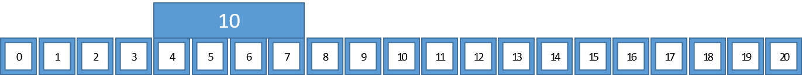
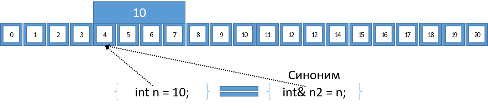
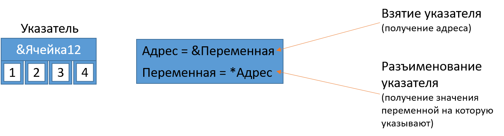
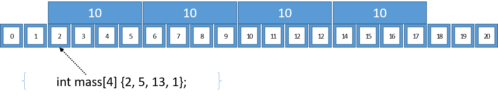
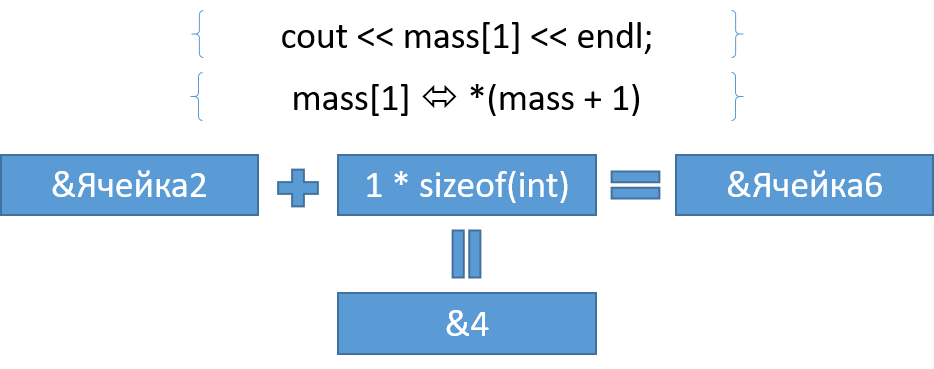

# Лекция 2: Память, указатели, ссылки и передача параметров

### План лекции:

1. Объекты и память
2. Ссылки
3. Указатели и операции с ними
4. Массивы и арифметика указателей
5. `void` и `void*`
6. Время хранения и динамическая память
7. Операторы `new` и `delete`
8. Передача параметров по значению, указателю и ссылке
9. Константность указателей
10. Категории значений
11. Перемещение и оптимизация возврата
12. Умные указатели
13. Статические переменные

### Как программа видит память

Практически эту модель можно связать с обработкой заказа. Объект заказа существует в некотором месте памяти, ссылка позволяет дать ему ещё одно имя, а указатель хранит адрес, по которому его можно найти. Ни ссылка, ни указатель сами по себе не продлевают жизнь заказа: если исходный объект уничтожен, путь к нему больше не становится безопасным только потому, что адрес сохранился.

Адрес в памяти похож на номер квартиры: он помогает найти жильца, но не гарантирует, что жилец всё ещё там и вообще приглашал нас войти.

На первой лекции переменная выглядела как имя, тип и значение. Теперь заглянем на уровень ниже: значение объекта хранится в памяти, а программа получает доступ к нему по адресу.


Память удобно представлять как последовательность адресуемых байтов. Это модель, а не точное описание всех уровней физической памяти: между программой и микросхемами находятся виртуальная память, операционная система, кэши процессора и другие механизмы.

**Объект** в терминах C++ занимает некоторую область хранения, имеет тип и время жизни. Тип сообщает компилятору, сколько данных нужно учесть для конкретной реализации и какие операции допустимы.



Адрес объекта можно получить оператором `&`:

```cpp
int number{10};
std::cout << &number << '\n';
```

Конкретное числовое значение адреса заранее неизвестно и может отличаться между запусками. Для нас важнее не само число, а возможность однозначно обратиться к живому объекту.

### Ссылки

**Ссылка** создаёт ещё одно имя для уже существующего объекта:

```cpp
int number{10};
int& alias{number};

alias = 25;
std::cout << number << '\n'; // 25
```



В объявлении `int& alias` символ `&` относится к типу ссылки. В выражении `&number` тот же символ является оператором получения адреса. Контекст у конструкций разный, поэтому важно читать объявление целиком.

Обычная lvalue-ссылка должна быть сразу привязана к подходящему объекту. После этого её нельзя «переключить» на другой объект: присваивание через ссылку изменяет тот объект, к которому она уже относится.

```cpp
int first{10};
int second{20};
int& reference{first};

reference = second; // first теперь равен 20; ссылка всё ещё относится к first
```

Ссылка не обязана быть реализована как отдельный указатель в памяти. Стандарт задаёт её поведение, а способ реализации выбирает компилятор.

### Указатели

**Указатель** — объект, который может хранить адрес другого объекта или специальное нулевое значение.



```cpp
int number{25};
int* pointer{&number};

std::cout << number << '\n';   // значение объекта
std::cout << pointer << '\n';  // адрес, хранящийся в указателе
std::cout << *pointer << '\n'; // значение по этому адресу
std::cout << &pointer << '\n'; // адрес самого указателя
```

Оператор `&` получает адрес объекта. Оператор `*` в выражении **разыменовывает** указатель, то есть предоставляет доступ к объекту по хранящемуся адресу.

Сам указатель тоже является объектом: у него есть тип, значение и собственный адрес. Тип `int*` сообщает, что после разыменования мы ожидаем получить `int`.

### Нулевой, недействительный и висячий указатели

Различие особенно важно в коде с необязательным ресурсом. Нулевой указатель явно сообщает «объекта нет», и это состояние можно проверить. Недействительный указатель может содержать любое непригодное для доступа значение. Висячий указатель когда-то указывал на настоящий объект, но пережил его; внешне адрес сохранился, а право обращения исчезло.

При чтении примера полезно отслеживать не число в указателе, а событие, которое меняет допустимость доступа: выход объекта из области видимости, `delete`, перераспределение контейнера или перемещение владельца. Именно время жизни определяет, можно ли разыменовать адрес.

`nullptr` ничего не обещает и потому часто надёжнее указателя, который уверенно обещает уже уничтоженный объект.

Указатель не всегда указывает на объект. Явное отсутствие адресата обозначается `nullptr`:

```cpp
int* pointer{nullptr};

if (pointer != nullptr) {
    std::cout << *pointer << '\n';
}
```

Разыменовывать `nullptr` нельзя. Однако не всякий недействительный указатель равен `nullptr`. Например, после окончания времени жизни объекта указатель на него становится **висячим** и может продолжать хранить старый адрес.

```cpp
int* pointer{new int{10}};
delete pointer;
pointer = nullptr;
```

Присваивание `nullptr` не освобождает память само по себе, но после освобождения помогает не спутать старый адрес с действительным.

### Массив в памяти

Элементы встроенного массива расположены последовательно и имеют один тип:



```cpp
int values[4]{2, 5, 13, 1};
```

Во многих выражениях имя массива преобразуется в указатель на первый элемент. Поэтому следующие выражения обращаются к одному и тому же объекту:

```cpp
std::cout << values[1] << '\n';
std::cout << *(values + 1) << '\n';
```

### Арифметика указателей



Прибавление единицы к `int*` сдвигает указатель к следующему `int`, а не на один байт:

```cpp
int values[4]{2, 5, 13, 1};
int* pointer{values};

++pointer;
std::cout << *pointer << '\n'; // 5
```

Размер типа компилятор учитывает сам. Поэтому выражение `pointer + sizeof(int)` сдвигается на `sizeof(int)` элементов и почти наверняка не означает «перейти к следующему `int`».

Арифметика указателей определена только в пределах одного массива и позиции сразу после него. Указатель на позицию после массива можно получить и сравнить, но нельзя разыменовывать.

Количество элементов встроенного массива можно вычислить там, где тип массива ещё не потерян:

```cpp
int values[4]{2, 5, 13, 1};
constexpr std::size_t count{sizeof(values) / sizeof(values[0])};
```

В современном C++ предпочтительнее `std::size(values)`: намерение читается яснее, а риск ошибиться меньше.

### `void` и `void*`

Тип `void` обозначает отсутствие значения в определённых контекстах. Например, функция `void` не возвращает значение:

```cpp
void printNumber(int value) {
    std::cout << value << '\n';
}
```

Обычный объект типа `void` создать нельзя, но существует тип `void*`. Такой указатель способен хранить адрес объекта без информации о его конкретном типе:

```cpp
int number{10};
void* raw_address{&number};
```

Разыменовать `void*` напрямую нельзя. Сначала нужно восстановить правильный тип:

```cpp
int* number_pointer{static_cast<int*>(raw_address)};
std::cout << *number_pointer << '\n';
```

> Важно: `void*` не «указывает строго на один байт» и не разрешает безопасно читать память как произвольный тип. Он хранит адрес без типа адресата. Неверное преобразование и чтение через несовместимый тип может нарушить требования выравнивания и правила доступа к объектам, что приводит к неопределённому поведению.

Стандартный C++ также не определяет арифметику над `void*`. Если действительно нужно исследовать представление объекта по байтам, используют указатель на `unsigned char`, `char` или `std::byte` с соблюдением правил языка.

### Время хранения и привычные области памяти

На слайдах память разделена на код, статическую область, стек и кучу. Эта схема полезна как первое приближение, но стандарт C++ описывает прежде всего **продолжительность хранения**, а не обязательное физическое расположение.

Основные варианты:

- **автоматическая продолжительность хранения** — обычно локальные объекты блока; типичная реализация размещает их в стеке;
- **статическая продолжительность хранения** — глобальные объекты, объекты пространства имён и локальные `static`; они существуют до завершения программы;
- **потоковая продолжительность хранения** — объекты `thread_local`, отдельные для потоков;
- **динамическая продолжительность хранения** — область получается и освобождается явно или через управляющий объект; типичная реализация использует кучу.

Размер стека не задан стандартом и не равен обязательно 8 МБ. Он зависит от операционной системы, настроек процесса, потока и среды выполнения.

### Операторы `new` и `delete`

Представим библиотеку, которая создаёт объект подключения по запросу пользователя. `new` выделяет подходящую память и конструирует в ней объект; результатом становится указатель на уже начавший жизнь объект. `delete` сначала вызывает деструктор, а затем освобождает память. Эти две операции должны относиться к одному и тому же объекту и выполняться ровно по одному разу.

Именно поэтому ручное владение требует ответа на практические вопросы: кто обязан удалить объект, что произойдёт при раннем выходе и может ли указатель быть скопирован. Если ответы распределены между несколькими функциями, код становится хрупким даже при корректном синтаксисе.

Ручное управление памятью прекрасно развивает память программиста: особенно память о том месте, где он забыл `delete`.

Выражение `new` создаёт объект в динамической области хранения и возвращает указатель:

```cpp
int* pointer{new int{10}};
std::cout << *pointer << '\n';
delete pointer;
pointer = nullptr;
```

`delete` завершает время жизни объекта и освобождает соответствующую область, ранее полученную совместимым выражением `new`.

После `delete` нельзя читать или изменять объект по старому указателю:

```cpp
int* pointer{new int{1}};
delete pointer;
// std::cout << *pointer; // неопределённое поведение
```

Нельзя вызывать `delete` для адреса локальной переменной, для середины массива или повторно для уже освобождённой области.

### Динамические массивы

Для массива используется форма `new[]`, а освобождение выполняется парной формой `delete[]`:

```cpp
std::size_t count{10};
int* values{new int[count]{}};

// работа с values

delete[] values;
values = nullptr;
```

Смешивать `new[]` с `delete` или обычный `new` с `delete[]` нельзя.

Динамическую таблицу можно представить массивом указателей на строки:

```cpp
std::size_t rows{3};
std::size_t columns{4};

int** matrix{new int*[rows]};
for (std::size_t row{0}; row < rows; ++row) {
    matrix[row] = new int[columns]{};
}

for (std::size_t row{0}; row < rows; ++row) {
    delete[] matrix[row];
}
delete[] matrix;
```

Строки здесь выделены независимо и не обязаны лежать рядом. Код требует аккуратно освобождать каждую строку даже при ошибке в середине создания. Поэтому для прикладного кода чаще подходит `std::vector`, который сам управляет памятью:

```cpp
std::vector<std::vector<int>> matrix(rows, std::vector<int>(columns));
```

### Почему ручное управление памятью опасно

Сырые `new` и `delete` создают несколько типичных проблем:

- утечка памяти из-за забытого освобождения;
- утечка при исключении или досрочном `return`;
- двойное освобождение;
- несоответствие `delete` и `delete[]`;
- использование объекта после уничтожения;
- потеря исходного адреса выделенной области.

Современное правило звучит просто: владение ресурсом следует выражать объектом, который освобождает ресурс в своём деструкторе. Для памяти это контейнеры и умные указатели. Сырые указатели при этом остаются полезны как невладеющие ссылки на объекты.

### Передача по значению

По умолчанию параметр функции является отдельным объектом, инициализированным из аргумента:

```cpp
void increment(int value) {
    ++value;
}

int number{10};
increment(number);
// number всё ещё равен 10
```

Для маленьких фундаментальных типов передача по значению проста и обычно эффективна. Для классов и других сложных типов инициализация параметра может вызвать копирование или перемещение, а иногда быть устранена оптимизацией.

### Передача по указателю

Указатель позволяет функции обратиться к объекту вызывающего кода:

```cpp
void add(int* target, int value) {
    if (target != nullptr) {
        *target += value;
    }
}

int number{4};
add(&number, 10);
std::cout << number << '\n'; // 14
```

Проверка `nullptr` показывает важное свойство указательного параметра: отсутствие объекта можно выразить естественно.

При передаче встроенного массива параметр фактически становится указателем, поэтому размер нужно передавать отдельно:

```cpp
void printArray(const int* values, std::size_t count) {
    for (std::size_t index{0}; index < count; ++index) {
        std::cout << values[index] << ' ';
    }
    std::cout << '\n';
}
```

Более безопасный современный интерфейс может принимать `std::span<const int>`, который хранит и адрес, и количество элементов.

### Передача по ссылке

В прикладном сценарии функция может обновлять состояние существующего заказа. Параметр-ссылка связывается с объектом вызывающей стороны, поэтому отдельный заказ не создаётся. Запись в поля через параметр видна после возврата из функции, а время жизни по-прежнему контролирует вызывающий код.

Если ссылка константная, функция получает доступ к тому же объекту без права изменять его через эту ссылку. Такой контракт хорошо подходит для чтения больших структур: мы избегаем копирования и одновременно сообщаем читателю, что функция лишь наблюдает данные.

Ссылка также позволяет работать с исходным объектом, но вызывающий код не передаёт адрес явно:

```cpp
void add(int& target, int value) {
    target += value;
}

int number{4};
add(number, 10);
```

Ссылка подходит, когда объект обязателен. Указатель удобен, когда отсутствие объекта допустимо или требуется явная указательная семантика.

Ссылки могут связываться и с объектами динамической продолжительности хранения:

```cpp
int* pointer{new int{10}};
int& reference{*pointer};
reference = 20;
delete pointer;
```

После `delete` ссылка становится висячей. Следовательно, ссылка не управляет временем жизни и сама по себе не делает работу с динамической памятью безопасной.

Массив тоже можно передать по ссылке, сохранив его размер в типе:

```cpp
template <std::size_t Size>
void printArray(const int (&values)[Size]) {
    for (int value : values) {
        std::cout << value << ' ';
    }
}
```

### Константность и указатели

Расположение `const` меняет смысл объявления:

```cpp
int first{10};
int second{20};

const int* pointer_to_const{&first};
pointer_to_const = &second;  // сам указатель менять можно
// *pointer_to_const = 30;   // объект через него менять нельзя

int* const const_pointer{&first};
*const_pointer = 30;         // объект менять можно
// const_pointer = &second;  // сам указатель менять нельзя

const int* const fixed_view{&first};
```

Последний вариант запрещает менять и адрес в указателе, и объект через этот указатель.

Для функции, которая только читает обязательный объект, часто используется константная ссылка:

```cpp
void printStudent(const Student& student);
```

Для необязательного объекта естественен указатель на `const`:

```cpp
void printStudent(const Student* student);
```

### Категории значений: зачем они нужны

Выражения в C++ имеют тип и **категорию значения**. Категория помогает определить, относится ли выражение к конкретному объекту, можно ли связать с ним ссылку и разрешено ли использовать его ресурсы для перемещения.

Современная система включает:

- **glvalue** — выражение, определяющее объект или функцию;
- **prvalue** — чистое значение, часто используемое для вычисления или инициализации;
- **xvalue** — «истекающее» glvalue, ресурсы которого можно переиспользовать;
- **lvalue** — glvalue, которое не является xvalue;
- **rvalue** — prvalue или xvalue.

Иерархию можно представить так:

```text
expression
├── glvalue
│   ├── lvalue
│   └── xvalue
└── prvalue

rvalue = prvalue + xvalue
```

Слова `lvalue` и `rvalue` исторически связаны с левой и правой сторонами присваивания, но такое объяснение давно недостаточно. Например, не всякое lvalue можно изменять: объект `const` остаётся lvalue.

```cpp
int value{10};       // имя value в выражении — lvalue
int result{value+2}; // value + 2 — prvalue
```

### Ссылки и категории значений

Неконстантная lvalue-ссылка связывается с изменяемым lvalue:

```cpp
int value{10};
int& reference{value};
```

Константная lvalue-ссылка может продлить время жизни временного объекта:

```cpp
const std::string& text{std::string{"temporary"}};
```

Rvalue-ссылка записывается как `T&&` и способна связываться с rvalue:

```cpp
std::string&& text{std::string{"temporary"}};
```

Это один из механизмов перемещающей семантики, но сама запись `&&` не перемещает данные автоматически.

### Возврат из функции и время жизни

Функция, возвращающая объект по значению, обычно даёт prvalue:

```cpp
int answer() {
    return 42;
}
```

Функция может возвращать lvalue-ссылку, если объект гарантированно продолжает жить:

```cpp
int global_value{0};

int& globalValue() {
    return global_value;
}

globalValue() = 5;
```

Возвращать ссылку на локальную переменную нельзя:

```cpp
int& broken() {
    int local{10};
    return local; // ошибка времени жизни: после выхода local уничтожена
}
```

То же относится к rvalue-ссылке на временный объект, уничтожаемый при выходе из функции. Пример `int&& h() { return 42; }` возвращает висячую ссылку и не является корректным способом получить xvalue.

### `std::move` и перемещение

`std::move` не переносит байты самостоятельно. Он меняет категорию выражения и тем самым разрешает выбрать перемещающую операцию, если тип её предоставляет. Уже конструктор или оператор присваивания решает, какие ресурсы можно забрать и в каком допустимом состоянии оставить источник.

Практический пример — передача большого буфера в объект, который станет его новым владельцем. Вместо копирования всех элементов новый объект может принять внутренний указатель, а исходный буфер — стать пустым. После этого исходный объект разрешено уничтожить или присвоить заново, но нельзя предполагать, что прежнее содержимое сохранилось.

`std::move` похож на наклейку «можно забирать»: грузовик всё равно должен приехать в перемещающем конструкторе.

`std::move` не переносит ресурсы сам по себе. Он выполняет преобразование к xvalue, разрешая выбрать перемещающий конструктор или оператор присваивания:

```cpp
std::string source{"long text"};
std::string target{std::move(source)};
```

После перемещения `source` остаётся корректным объектом, но его конкретное значение обычно не определено спецификацией типа. Его можно уничтожить или присвоить ему новое значение; полагаться на прежнее содержимое нельзя.

### Оптимизация возврата значения

При возврате объекта по значению компилятор часто создаёт результат сразу в месте назначения. Это называется **оптимизацией возвращаемого значения** — RVO. В некоторых случаях, начиная с C++17, устранение промежуточного объекта гарантировано правилами языка.

```cpp
Big makeBig() {
    return Big{};
}

Big value{makeBig()};
```

Здесь не нужно добавлять `std::move` к локальному результату без причины: это может помешать некоторым формам оптимизации. Возврат объекта по значению в современном C++ часто является правильным и эффективным интерфейсом.

### Умные указатели

Умный указатель связывает владение динамическим объектом со временем жизни обычного объекта-обёртки. Для них подключается `<memory>`.

`std::unique_ptr` выражает единоличное владение:

```cpp
#include <memory>

auto owner{std::make_unique<int>(10)};
std::cout << *owner << '\n';

auto next_owner{std::move(owner)};
```

Копировать `unique_ptr` нельзя, но владение можно переместить. После перемещения `owner` пуст, а объектом управляет `next_owner`.

`std::shared_ptr` выражает совместное владение и использует счётчик владельцев:

```cpp
auto first{std::make_shared<int>(42)};
auto second{first};
```

Объект уничтожается, когда исчезает последний владеющий `shared_ptr`. Это не означает, что `shared_ptr` следует применять повсюду: совместное владение сложнее и дороже уникального. Циклы из `shared_ptr` также требуют `std::weak_ptr`.

Функции `std::make_unique` и `std::make_shared` обычно предпочтительнее явного `new`: они короче, безопаснее при исключениях и яснее выражают владение.

Сырой указатель, полученный методом `.get()`, не становится владельцем. Его нельзя самостоятельно передавать в `delete`.

### Локальные статические переменные

Локальная статическая переменная создаётся при первом прохождении через объявление и продолжает существовать до завершения программы. Поэтому функция может помнить состояние между вызовами, например число выданных идентификаторов. Область видимости при этом остаётся локальной: обратиться к переменной по имени снаружи нельзя.

Такое состояние удобно, но оно создаёт скрытую связь между вызовами. Результат функции теперь зависит не только от аргументов, но и от истории обращений, что важно учитывать при тестировании и параллельном выполнении.

Статическая переменная живёт долго и всё помнит — почти как система контроля версий, только без удобного `git blame`.

Локальный объект с `static` создаётся один раз и сохраняет состояние между вызовами:

```cpp
void countedFunction() {
    static int counter{0};
    std::cout << ++counter << '\n';
}
```

Последовательные вызовы выведут `1`, `2`, `3` и так далее. Начиная с C++11 инициализация локальной статической переменной защищена от одновременного выполнения несколькими потоками, но дальнейший доступ к изменяемому объекту всё равно может требовать синхронизации.

Для имени функции или переменной на уровне пространства имён `static` задаёт внутреннее связывание: имя доступно только в текущей единице трансляции. В современном коде для той же цели часто используют безымянное пространство имён.

### Итоги

Указатель хранит адрес и может выражать отсутствие объекта, ссылка предоставляет другое имя существующему объекту, а ни один из этих механизмов сам по себе не управляет временем жизни. Именно время жизни определяет, можно ли безопасно обращаться к памяти.

Ручные `new` и `delete` полезно понимать, но владение в прикладном коде лучше передавать контейнерам и RAII-объектам. Категории значений, ссылки и перемещение объясняют, когда программа копирует объект, когда может переиспользовать его ресурсы и почему ссылка на уничтоженную локальную переменную опасна.
