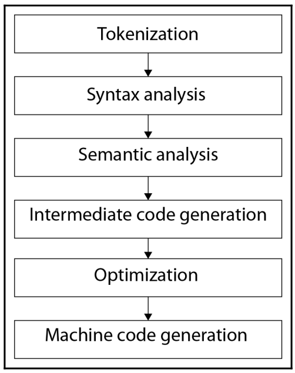
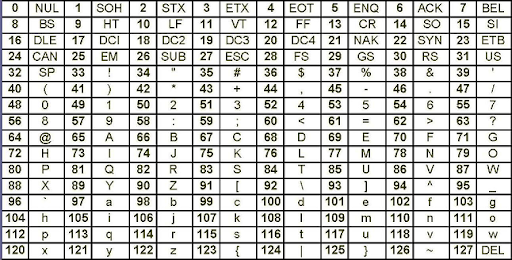

# Лекция 1: Знакомство с языком С++

### План лекции:

1. Введение
2. Соглашение о именовании
3. Язык С++, какой он?
4. Процесс появления программы
5. Процесс компиляции
6. С чего начинается программа
7. Переменные
8. Типы
9. Литералы
10. Константы
11. Структурный подход
12. Область видимости
13. Условия
14. Циклы
15. Функции
16. Массивы
    
----------------
### Введение

Достаточно легко начать изучать какой либо язык если у вас в голове уже есть определенный набор базовых знаний. Как бы может кому то не показалось это странным, но этот базовый набор не включает в себя в большинстве случаев ничего особенно сложного и невероятного. Как правило начинающие программисты могут подумать что им нужно знать базовые математические концепции, дискретную математику, теорию графов и теорию множеств. Да это все вполне справедливо, если вы знаете эти базовые теории то в значительной мере вы определенно подготовлены к тому, что бы стать программистом. Но, это все еще не упрощает вам задачу изучения языка, так как никакая другая дисциплина к сожалению не дает вам тех базовых идей и концепций которые нужны для понимания большинства языков программирования. К таким концепциям можно отнести переменные, константы, структуры данных, блочные конструкции кода. Все это, вы в будущем будете подхватывать налету, лишь единожды разобравшись в этом, однако нужно в этом разобраться.

-----------------
### Соглашение о именовании

Конечно, первое о чем следует поговорить, и то на чем следует даже акцентировать внимание когда вы начинаете работать с каким либо языком, это соглашение о именовании. Под соглашением в данном случае понимается некий набор правил, который устанавливается командой разработчиков либо организацией относительно того как они будут оформлять свой код, что в дальнейшем позволяет им упростить взаимодействия между друг другом, так как каждый из них перейдя в подпроект или модуль другого разработчика без проблем будет способен различать различные структурные элементы, просто на основании их оформления. Именно поэтому и мы договоримся с вами о таком соглашении. Подробнейшим образом оно описано в файле под названием [NAMING_CONVENTION.md](../NAMING_CONVENTION.md) хранящемся в репозитории.

-------------
### Язык С++

> Я изучаю язык С++

Согласитесь, это звучит гордо(наверное). Как бы кто не говорил, а язык С++ стал очень важной вехой в истории программирования и все еще часто входит в обязательную программу обучения программистов. Так же во всевозможных топах языков занимает место в первой пятерке, а на различных сайтах по поиску работы ищут соискателей на позиции с заманчивыми зарплатами в которых основным языком является именно он, родимый С++. Он все еще является основным языком для многих больших корпораций и маленьких компаний, и сколько бы хипстеров и новомодных стартапов не писалось на python, rust, сколько бы не выпускалось убийц C++, а он все живет и востребован.
> Сложно сказать к добру ли такой подход, но несмотря ни на что есть одна самая вжная причина, почему этот язык до сих пор изучается повсеместно программистами, и имя этой причине легаси код(код старых программ), который до сих пор используется и нужно поддерживать. В качестве примера: обработка поиска в яндексе и гугле написаны на языке с++ и их переписывание стоит неимоверных денег, поэтому каким бы замечательным не был любой новый язык на это ни кто не пойдет.  

 Несмотря на долгую уже историю, которая насчитывает аж  37 лет(1983 год), он до сих пор не потерял своей былой актуальности и все еще активно используется. Конечно он не совершил того, на что возможно рассчитывали его создатели, не заменил собой язык С, и даже не потеснил его в привычных для его использования областях(но это не точно), однако он занял свою нишу, и стоит заметить достаточно обширную.
 > Вообще ситуация с Си собственно такая же, пусть С++ и задумывался как замена, но выкинуть весь тот легаси код что уже есть невозможно, именно поэтому сейчас все еще ищут Cobol специалистов, хотя языку по меркам индустрии слишком много лет, но, банковские системы написанные на нем стоят слишком дорого.

Итак, что мы однозначно знаем про С++:

-----------------------------------
- он является языком высокого уроня  
    
  Помним что языки делятся на языки высокого и низкого уровня, ко вторым относятся только различные асемблеры и отличаются привязкой к оборудованию, компактностью  и скоростью программ, но полностью лишенный каких либо удобств и не поддерживающий никаких абстракций и парадигм, а так же привязанные к конкретным процессорным архитектурам.  
  > конечно этот термин достаточно спекулятивен, и на самом деле, говорить в современных реалиях о языках высокого или низкого уровня абсолютно некорректно. Сейчас все языки, кроме различных видов асемблеров, являются языками высокого уровня, по той причине, что построены на достаточно серьезных абстрактных концепциях и не опираются на конкретное железо. Некоторые языки, как C и C++ могут работать с ним на самом близком к нему уровне, но все равно, это даже нельзя назвать каким либо средним уровнем, хотя бывает так и называют.

-----------------------------------
- язык является компилируемым
    
  Компилируемый язык, это такой язык которому, для работы программы написанной на нем, после написания ее необходимо обработать при помощи специального программного обеспечения называемого компилятор и перевести в машинный код, после чего для запуска такой программы более ничего не будет требоваться кроме нее самой.

  > В противовес компилируемым существуют интерпретируемые языки, это такие языки для работы программ на которых нужна специальная программа интерпретатор, которая и исполняет написанную на нем программу построчно, и без работающего интерпретатора программа не может использоваться.  
  > На данный момент широкую популярность вновь приобретает концепция компиляции как таковая, даже интерпретируемые языки такие как например JS пытаются собирать в большие бандлы в процессе занимаясь оптимизацией условно подражая компиляции как таковой

-----------------------------------
- язык поддерживает несколько парадигм программирования
    
  Парадигмой программирования называют набор идей, норм и правил которые определяют стиль написания программы, ее восприятия и интерпретации. Парадигмы программирования позволяют при программировании оперировать определенным набором абстракций и идей, а не конкретными строчками кода, и как следствие организовывать код в сложные но понятные знакомому с парадигмой человеку структуры выполняющие комплексные задачи решения которых без применения подобного рода абстрактного мышления приведет к значительным трудностям.
  > Важно понимать, что парадигма не есть свод заповедей, это набор рекомендаций и идей, который не требует строго следования им если это нарушает композиционную или логическую структуру программы и процессов ей описываемых, т.е. не нужно натягивать процессы на неподходящие им парадигмы, как сову на всем известный глобус. 
  
  - *структурное программирование*
  
    Структурной парадигмой называется такой набор прицепов который предполагает рассматривать и писать программу как иерархическую структуру блоков, т.е. набор из последовательно стоящих друг за другом блоков условий и циклов, вложенных друг в друга и организованных в цепочки исполнения.  Эта парадигма является следствием и ответом на рост сложности программ связанный с постепенным ростом востребованности программирования как такового в различных научно-технических задачах.

    > На данный момент практически любой язык поддерживает эту парадигму программирования, однако когда то она была невероятно уникальна
  
  - *процедурное программирование*
  
    Процедурной парадигмой называют такой набор принципов и правил который обязывает нас рассматривать и писать код программы объединяя операции с данными в наборы называемые процедурами(не возвращает значения) и функциями(возвращает значение)
    > Примерно по тому же принципу как и со структурным, на данный момент таким уже никого не удивить, и большинство общеиспользуемых языков позволяют организовывать код в последовательные цепочки вызовов функций, но когда то это было достаточно необычно.
  
  - *метапрограммирование*
  
    Метапрограммированием называется такая парадигма программирования результатом следования которой будет программа организованная таким образом что бы писать другую программу в процессе компиляции или свой работы, либо же изменять саму себя модифицируя под изменяющиеся условия
  
  - *объектно-ориентированное программирование*
  
    объектно ориентированной парадигмой называют такой набор прицепов и правил который предполагает рассматривать как совокупность структур называемых объектами, каждый из которых относиться к определенному классу описывающего его поведение 
    > На данный момент парадигму ООП поддерживают очень многие языки, в том или ином виде под нее адаптируются в том числе и старые языки, например язык **C**, в урезанном виде, но предоставляет ее использование на своей базе.

-----------------------------------
- язык по праву считается популяризатором идеи объектно ориентированного программирования
  > да он не был первым, он не был последним, он даже не следовал всем канонам ООП того времени, однако основную массу концепций и идей ООП опробованы именно на этом языке, они интегрированы в него достаточно хорошо, и в меру удобны к использованию. Конечно, не без недостатков, но языка без недостатков не существует, как бы кто не утверждал обратного.

-----------------------------------
- язык постоянно развивается.
  
  У языка был достаточно большой период застоя, в плане развития, период с 98 года по 2011, в которые стандарт официально не обновлялся и еще 10 лет назад язык выглядел так же в каком состоянии его оставили в 98.
  > Это, пожалуй, играло ему на руку, так как в условии отсутствия широкополосного доступа в интернет, можно было купить не самую свежую книгу рассказывающую об этом языке, и вот всего несколько недель чтения и можно сказать ты владеешь(очень конечно условно), тем же языком что очень высококлассные специалист.

  В последние 10 лет, язык претерпел ряд изменений, некоторые крупные, некоторые нет, но он однозначно прошел большой путь развития в сторону читаемости и применимости, поэтому на данный момент существуют употребимые стандарты 98, 11, 14, 17, 20.
  > Между 98 и 11 был ряд других стандартов но не один из них так и не стал официально используемым и были скорее как пробные перед 11м.

-----------------------------------
- язык позиционирует себя как кроссплатформенный.

  Кроссплатформенным называется тот язык которы может запускаться на различном железе, а главное программа может писаться на одной конфигурации, а запускаться уже совершенно на другой. При этом финальная сборка и компиляция для С++ всегда производится на машине, на которой программа будет запускаться.
  > В общем и целом таковым его считать можно. Но, его кроссплатформенность базируется на том, что под каждую из существующих платформ на которых его можно использовать, написан свой компилятор. Таким образом код и кодовая база, если ее не насыщали специфическими для того или иного оборудования ассемблерными вставками, будет компилироваться на любой из возможных платформ. С другой стороны, язык нельзя называть кроссплатформенным, так как исполняемый файл, скомпилированный под одну платформу, не способен с одинаковым успехом отработать на различных платформах, поэтому про С++ говорят так: сам язык не зависит от платформы, и он кроссплатформенный, а вот конечные программы зависят от платформы, и поэтому не являются кроссплатформенными.

-----------------------------------
- язык позиционируют себя как наследник и продолжатель С
  
    Поэтому имеет множество особенностей связанных с обратной совместимостью с ним, что позволяет нам писать на нем так, будто это и есть С. Однако, обратная совместимость хоть и работает, она предназначена для упрощенного переноса программ написанных на С(по крайней мере когда то искренне верили, что он заменит его), а не для написания новых, поэтому злоупотреблять ими не правильно, и считается моветоном.

На этом краткий экскурс в язык можно считать завершенным, мы успели поговорить про парадигмы, вспомнить понятия компилируемых и интерпретируемых языков и теперь можно с уверенностью приступать к непосредственно языку.

-------------------------
### Процесс появления программы

Итак, с чего можно начать разговор о программировании на каком либо языке? Вполне разумным будет сначала, порассуждать об общем процессе появления программ.
Итак, какой же путь проходит любая программа:
1. Самое начало любой программы лежит в какой либо концептуальной идее, идее которую придумал кто либо, будь то программист, заказчик или преподаватель на занятии.
2. После оформления концептуальной идеи самое время описать эту идею каким либо удобным образом, в этот момент наша программа из концептуальной идеи превратится в некое задание, документацию или проект.
  > По нормальному этот процесс называется формализацией задачи, т.е. выделение и превращения некоторого абстрактного описания в конкретный условный документ(чаще всего не один), который содержит основные функции программы(функционал), требования к ее работе(набор базовых требований и ограничений), описание как оценить результат(критерии оценки выполнения работы)
3. После описания и выдачи задания в эту замечательную игру вступает программист, он радостно и самозабвенно принимается за превращения концептуальной идеи оформленной в виде какого либо измеримого задания в конкретную программу посредством написания файлов содержащих код.
4. После того как программа была написана самое время произвести компиляцию , для создания исполняемого файла, файлов библиотек и прочего, сбора их всех в кучу для того что бы можно было запаковать программу в один контейнер и доставить ее пользователю или заказчику.
5. По завершению компиляции и получении программы неким условным пользователем, ожидаемо, следует ее запуск и работа в течении какого либо срока, в зависимости от потребностей пользователя и возможностей программы.
6. После того как надобность в программе отпадает, ее выкидывают на свалку истории, условно.

Таков путь программы и программист, с одной стороны ее главный создатель, не будь его в этой схеме, не будет и программы, а с другой является всего лишь пунктом в ее жизни, ведь кто то программы придумывает(далеко не всегда программист) и кто то их использует(так же, далеко не всегда программист). А соответственно будучи программистом вам предстоит постоянно взаимодействовать со множеством других участников этого всего процесса.

<---------------->

На этой схеме можно заметить как в целом происходит процесс перехода программы из файлов с кодом в исполняемый файл, и в какой момент какими файлами оперирует весь этот процесс. Важно отметить что этот процесс в таком виде характерен только для С++.


1. Процесс разработки, программист работает с файласи *.cpp *.h 
2. Далее, компилятор, после запуска процесса компиляции программистом, запускает процесс называемый препроцессингом который выполняет препроцессор, именно в этот момент обрабатываются все дерективы препроцессора, такие как #include, #define, а так же объединяет каждую пару *.cpp и *.h файлов с одинаковыми названиями в единый *.cpp
3. Это этап компиляции, именно в этот момент наша программа из написанного для людьми и для людей превращается в то что уже может интерпретировать компьютер.
4. Процесс связывания, он нужен для того, что бы мы могли разбивать наши программы на большое количество подмодулей и использовать функции из одного подмодулям в другой. Сам по себе линковщик тесно связан с понятием единицы трансляции, под которой понимается некоторый максимальный кусок кода, который за один раз способен обработать компилятор, и перевести в машинный код. Понятное дело, что такие единицы очень зависимы друг от друга, и выстроить эту зависимость и помогает линковщик, он находит каждое описание функции и каждое ее использование и связывает их между собой.

----------------------
### Процесс компиляции

Немного подробнее остановимся на самом процессе компиляции исходного кода. Весь процесс разбит на следующий набор стадий:




1. Токенизация, это процесс разбиения компилируемого кода на минимальные значимые элементы, к примеру:
   `cpp
    int a = 42;
   `
   будет превращена в токены: int, a, =, 42, ;. Важно что наличие или отсутствие пробелов не влияет на этот процесс.
2. Синтаксический анализ, проверяет все ли правильно в тех токенах что мы написали с точки зрения синтаксиса, правильно ли написаны названия типов, переменных функций и т.жд, правильно ли оформлена каждая единица. По сути, если проводить грубые аналогии, то синтаксический анализ это проверка кода на орфографию. В этот момент в целом код проверяется по словам, не вникая в их смысл значение и последовательность.
3. Семантический анализ, в свою очередь занимается абсолютно другим, он проверяет смысл того что мы написали, проверяет правильные ли последовательности токенов выстроены, и по сути, если проводить аналогию дальше проверяет орфографию.
4. В этот момент наш код написанный на С++ перестает быть С++. Он превращается в некий промежуточный вариант, условно похожий на С. Этот процесс необходим для того что бы в первую очередь уйти от абстракции классов, которая не реализуется сама по себе оборудованием и логикой процессора, этот этап необходим для следующего.
5. На этом этапе компилятор пытается оптимизировать код который мы написали, везде где можно вставить литералы(значения вбитые в код) он их вставляет, все где можно развернуть циклы, где можно вычислить что то на этапе компиляции, отказаться от лишних ветвлений, все он это делает.
6. Именно в этот момент мы и получаем наш машинный код. Правда это все еще не машинный код всей программы. Так же важно заметить, что в этот момент в рамках единицы трансляции компилятор проставляет ссылки на все локальные переменные и функции и место их расположения относительно начала скомпилированной единицы, все же, что он не может найти, он предполагает как имеющееся в другой единице трансляции, и оставляет эту задачу на линковщик.
   
! Важно, компилируется за раз не вся программа а лишь одна единица трансляции, именно поэтому далее в работу вступает линковщик, который начинает связывать их между друг другом.

------------
### С чего начинается программа

С чего же начинается исполняться наша программа после того как мы ее запустим? Для языка С++ местом старта является функция `main()`, именно так называющаяся, и никак иначе. Это точка начала нашей программы, с началом выполнения этой функции программа начинается, как только будет вызван возврат значения из функции посредством ключевого слова `return` функция завершиться. Если будет возвращает 0, то считается что успешно, любой другой отличный от 0 результат считается ошибкой, причем каждое значение является кодом этой ошибки.

------------
### Переменные

Итак, с чего может начинаться разговор о любом языке программирования, с циклов, условий, может быть сразу классов. Конечно можно начать и с них, но как правило, так не принято, да и все таки нужно осваивать материал по мере усложнения, а не наоборот. Поэтому первое с чего следует начинать это переменный. В общем то смысл любой программы, в очень упрощенном виде, сводиться к простой последовательности действий: `Входные данные > Работа с данными > Выходные данные `, т.е. преобразование входных данных в выходные. Для того что бы обеспечить этот процесс необходимо эти данные где то хранить, и посредством чего то с ними взаимодействовать. Именно тут и выходят на первый план предмет нашего разговора в этом пункте: **Переменные**.  
Как ясно видно из названия, переменные хранят какие то изменяющиеся данные, конечно про данные название ничего не говорит, но логично предположить что для сокращения подразумеваются переменные данные. Как же выглядят переменные в языке?

```
int a = 0;
double b = 1.;
char c = 'c';
```
Вот они, переменные. Целочисленная, с плавающей запятой(по сути дробная), и символьная. если обратить внимание на то что у нас написано, то можно заметить определенно сходство построения каждой строки:
- в каждой строке есть первое слово, обозначающее тип переменной
- затем разделенное пробелом идет название или имя переменной, т.е. символьное обозначение, по которому в коде всегда можно будет вызвать переменную в коде для получения ее текущего значения
- затем символ равно, который в языке С++ означает операцию присвоения, которая записывает некоторое значение стоящее справа в переменную что стоит слева от операции.
- и собственно значение переменной.
  
Такой разбор строки на составные части называется выделением сигнатуры, а его результат называется сигнатурой. Так сигнатура объявления переменной будет такой:
```
type name = value;
```

Как можно заметить, в том, что написано выше фигурирует значение переменной. Логично было бы поинтересоваться, обязательно ли каждой переменной значение. И ответ будет, не обязательно. Но к сожалению, все не так просто. Как только мы задаемся этим вопросом, к нам подкрадываются два важный и ключевых для дальнейшего изучения языка понятия: декларирование и инициализация.  
**Декларирование** - это процесс резервирования имени под переменную. Т.е теперь, в дальнейшем, каждый раз когда мы будем упоминать переменную по ее имени, после ее декларирования, обращаться мы всегда будем именно к ней и больше ни к кому. При этом повторная декларация переменной в рамках одной области видимости невозможно(пока, что оставим это понятие).  
**Инициализация** - это процесс присвоения переменной своего первого, начального значения. После того как это процесс был проведен, переменная получает конкретное знамение, и в дальнейшем когда мы будем к ней обращаться, до тех пор пока его не изменят, мы будем получать именно это значение.  
В итоге, получается, что в процессе создания переменной мы проделываем 2 действия, декларируем или объявляем переменную, и после чего инициализируем или присваиваем ей значение. Таким образом, раз мы утверждали ранее что можем не задать переменной никакого значения, значит мы можем остановиться, и получиться следующее:
```
int a;
double b;
char c;
```
А затем, позже, когда нам понадобиться проставить первое значение, присвоить переменной значение:
```
a = 0;
b = 1.;
c = 'c';
```
Является ли в этом случае то, что мы сделали уже после объявления инициализацией? Ведь по сути, мы сделали то же самое, мы присвоили первое значение переменной. И раз такой вопрос был поднят, то ответ видимо будет нет. Почему же? Потому что, инициализация это процесс присвоения значения происходящий в самом начале, во время объявления, а не после, хоть и кажется что они отделимы. Ведь если мы объявим переменную, но не инициализируем ее и после выведем ее, то мы обнаружим там какое либо значение. Это связано с тем, что в случае отсутствия инициализации, в переменной остается то значение и она им инициализируется, которое было у памяти в которой переменная была выделена. На данный момент мы просто запомним, инициализация это тот процесс который неразрывно связан с декларацией, не сделаешь его самостоятельно, это сделает устройство работы языка, о самом же выделение памяти мы поговорим позже.

--------
### Типы

Итак, у переменных в сигнатуре имеется важная вещь как тип. Что же это такое? По сути, это то как компьютеру следует интерпретировать ту информацию которую хранит ваша переменна, любая информация есть лишь набор нулей и единиц, и именно ее интерпретация делает ее такой какая она есть. По крайней мере это верно дял языков программирования.  
Важно отметить, язык С++ является языком с явной статической нестрогой типизацией. Что же означает этот набор слов?:
- Первое слово означает, что нам необходимо постоянно указывать тип в явном виде при объявлении чего либо что может имеет тип. 
- Второе слово, говорит нам о том, что если мы единожды объявили, что информацию которую мы помещаем в определенную переменную мы интерпретируем как информацию типа целое число, то значит только так, и никак по другому не будет. 
- Последнее слово чуточку сложнее, при желании, информацию можно перевести из одного вида в другой. Более того, язык умеет делать это самостоятельно, и вот о том насколько он делает это самостоятельно и говорит слово нестрогая, а еще иногда говорят слабая. Язык С++ не может стойко выдержать удары судьбы, и пытается преобразовывать переменные из одного типа в другой если они фигурируют в одном выражении которое требует их взаимодействия, а объекты разных типов взаимодействовать не могут(если не указано обратно), так к сожалению, язык не уведомляет вас об этих преобразованиях, т.е. делает их неявно, потому что он падок на подобное и слаб.

На этом маленький ликбез в типизацию в целом можно считать завершенным, и следует поговорить о непосредственно типах. В языке С++ имеется 2 вида типов:
1. Встроенные типы
   > к ним относятся все те типы что есть в языке сами по себе, и по сути, существуют шире, в самом оборудовании.
2. Пользовательские типы
   > Это те типы которые пользователь комбинируя каким либо образом встроенные типы и описывая взаимодействия между ними создает сам

К встроенным типам относятся:
- Логический тип - bool
  > Предназначен для хранения логических значений, может принимать одно из двух значений true - истинно, false - ложно. Отдельно следует отметить что ложное значение в числовом выражении это всегда 0, а вот истинное значение в числовом выражении это любое число(в том числе и отрицательное) не равное 0, это знание полезно при преобразовании числовых значений в логическое значение в логических выражениях. Используется логический тип, как это логично предположить, в различных логических выражения. Важно помнить что несмотря на то, что хранимое значение имеет всего 2 вариации и могло бы кодироваться 1 битом, тип все равно занимает 1 байт, так как это минимальный размер меньше которого занимать не может ни что. 
- Символьный тип - char, wcahr_t, char16_t, char32_t
  > Предназначен для хранения символьных значений, под символьными понимаются все символы относящиеся к кодировки ANSI. Символы хранятся в виде целочисленных кодов. Таблица символов ANSI выглядит следующим образом:  
    
  Как можно заметить часть символов не отображается, это так называемые системные символы и они предназначены для передачи определенных признаков, таких как перенос строки, окончания ввода и т.д.  
  Так же можно заметить что после 127 символа идут символы местного языка, под местным понимается тот язык который выбран в системе. Исходя из всего вышесказанного очевидно что размер занимаемый переменной типа char равен 8 байтам.  
  Тип wcahr_t хранит символы в кодировке UTF-8 и занимает 8 байт, char16_t - UTF-16, char32_t - UTF-32, эти кодировки содержат гораздо больше символов по умолчанию, поэтому если программа предполагает работу с различными языками, правильнее использовать именно их.
- Целочисленный тип - int, short, long
  > Он предназначен для хранения целых числе, и в зависимости от архитектуры системы может занимать от 2 до 4 байт(на самом деле сейчас практически все обычные компьютерные системы используют 4 байта для кодирования этого типа, 2 байта как правило относятся к различным микропроцессорам используемым в прочей электронике)  
  Помимо int, есть еще short, он же short int, по сути просто приставка, которая уменьшает занимаемую типом память в 2 раза, до 2 х байт соответственно. Приставка long она же long int увеличивает занимаемую память в 2 раза, соответственно до 8 байт.  
  Так же есть еще один важный момент, который необходимо отметить, в 64 битных системах int все равно занимает 4 байта, хотя по логике вещей должен занимать 8, это связано с обратной совместимостью архитектур 32 и 64, т.е. банально, что бы программы написанные под 32 битную архитектуры, не требовали своего переписывания. 
- Тип для числе с плавающей запятой - float, double
  > Типы данных с плавающей запятой нужны для хранения дробных чисел, и их важной особенностью является то, что из-за правил перевода таких чисел в двоичное представление существует значительная проблема сравнений. Так например значение 1 записанное в переменную типа int может не быть равно 1 записанной в переменную типа double если int привести к double, а не наоборот. Перевод целого числа в форму дроби часто происходит не однозначно, а в округленной форме, т.е. 1 в форме дроби может храниться как 1,000...001 или 0,999..999, но при выводе информации будет отображаться как 1, но сравнение даже между собой этих числе будет давать ложное значение.  
  Тип double занимает 8 байт и принимает значение от +/- 1.7E-308 до 1.7E+308, а тип float это половина от типа double т.е. занимает 4 байта и принимает значение от +/- 3.4E-38 до 3.4E+38

------------
### Литералы

Переменной как мы уже выяснили можно присваивать значения, эти значения могут вычисляться из других переменных, однако все равно рано или поздно мы должны будем присвоить нашей переменной какое то первичное значение, вот этим первичным значением и будет являться литерал. Конечно литералами являются не только инициализирующие значения, в общем смысле литералом является любое значение, которое прописанное коде и не имеющее имени. Литерал по своей сути безымянный, обычно именно литералами и являются пресловутые магические числа(это числа которые проставлены прямо в коде без присвоения их к какой либо переменной или константе с говорящим названием и контекстом). При этом важно понимать, что при присвоении литералу к чему либо, его значение помещается в память на которое ведет имя, а не имя присваивается к памяти литерала. Литералы выглядят следующим образом:
```cpp
42; // Целочисленный типа int
108.87; // С плавающей запятой типа double
12.; // С плавающей запятой типа double
14.2f; // С плавающей запятой типа float
15.1L; // С плавающей запятой типа long double
16u; // Целочисленный типа unsigned int
15l; // Целочисленный типа long int
true; // Логический
's'; // Символьный
"str"; // Строковый
```
Как можно обратить внимание, некоторые литералы имеют постфиксы, в виде символов f, l, u. Это связано с тем что по умолчанию литералы имеют некоторый стандартный тип, так для целочисленных литералов это signed int. Для литералов с плавающей запятой это double. Но есть ситуации когда необходимо другое, отличное, поведение, тогда на помощь нам и приходят постфиксы. для целочисленного литерала постфикс u означает unsigned а постфикс l, означает long int. Постфиксы f и l для дробных чисел соответственно означают float и long double.  
Так же стоит отметить что в С++ принципиально различаются строки и символы, а поэтому и литералы так же различаются, так символьный должен быть заключен в одинарные кавычки, а строковый в двойные. 

-------------
### Константы

Следующим важным пунктом будут константы. В С++ все еще есть возможность использовать детективы препроцессора в качестве констант, как это возможно кто то использовал в С, однако это не считается хорошей практикой.  
В противоположность переменным, которые хранят изменяемые данные, константы хранят данные неизменяемы, по сути те пресловутые магические числа, но только как раз наличие приемлемого по смыслу имени, превращает просто магическое число в константу. По своей сути константы нужны для того, что бы заблокировать для дальнейшего исполнения какие либо изменения каких либо данных еще на стадии написания программы, именно поэтому их часто используют при передаче параметров в функции, что бы функция гарантировала, что внутри нее эти данные меняться не будут.  
В C++ существует 2 типа констант, это:  
- Константы времени исполнения, значение которых вычисляется во время выполнения программы.
  ```cpp
  int b = 2;
  const int N = 10;
  const int M = N / b;
  ```
- Константы времени компиляции, значение которых вычисляется компилятором при компиляции.
  ```cpp
  int b = 2;
  constexpr int N = 10;
  constexpr int M = N / b; // ошибка во время компиляции
  ```
Их основное отличие в том, что в первом случае можно для получения значения константы использовать переменные, т.е. рассчитывать неизменяемые данные на основе изменяемых во время исполнения. Во втором же случае, как и показано в примере, при попытке использовать константы компиляции с переменной, компилятор выдаст ошибку, и не скомпилирует код, так как не может гарантировать однозначность значения переменной. Так же он выдаст ошибку если попытаться использовать константу времени исполнения вычисляемую на основе переменной, и укажет нам на то, что такую константу нельзя преобразовать к константе времени компиляции, а значит нельзя использовать в вычислении другой такой константы, так как ее значение на момент компиляции не может быть однозначным.

----------------------
### Структурный подход

Важным пунктом в языке С++ является структурированность программы. Она объясняется тем, что язык поддерживает и в отличии от остальных парадигм программирования практически требует, что бы вы пользовались структурной парадигмой, которая говорит нам о том, что программа есть набор иерархически организованных блоков кода. Так в С++ блоком кода называют любой набор строчек кода, которые заключены в фигурные скобки. Соответственно каждое условие, цикл, функция, класс являются блоком кода.  

---------------------
### Область видимости

Строго за понятие структурной парадигмы программирования следует понятие области видимости переменных, ей называется набор правил который определяет какая переменная и в каком блоке кода будет видна. В концептуальном виде это можно описать как передачу данных по наследству в семье:
```
Дед
    \
      Отец <- отец знает то же что знает дед, но не знает что знают дети
          \
            Сын <- сын знает то что знает отец и дед, но не знает того что знает брат
          \
            Брат 
```
Это достаточно грубая аналогия, но она хорошо иллюстрирует следующие правила области видимости переменных:
1. Переменная объявленная в родительской области видимости, видна в любой дочерней области видимости
2. Переменная объявленная в дочерней области видимости, видна только в дочерней и вложенных в нее областях, но не видна в родительской
3. Переменная объявленная в параллельной области видимости, видна только в ней и ее дочерних областях, но не видная в параллельной.
4. Переменная объявленная в дочерней области видимости с одинаковым названием с переменной родительской области видимости заменяет внутри этой области видимости верхнюю переменную.
   > Касательно этого пункта, следует пояснить, что это значит. Если мы к примеру объявим переменную top перед условием, а затем внутри него объявим переменную с таким же названием, но другим типом и значением, в рамках этого условия, мы будем работать со второй переменно, при этом первая никуда не пропадет, и когда мы выйдем из условия, по этому имени у нас снова будет доступна первая племенная.
   К примеру 
   ```cpp
    int top = 10;
    cout << top << endl; // выведет 10
    {
      double top = 20.f;
      cout << top << endl; // выведет 20
    }
    {
      char top = 't';
      cout << top << endl; // выведет t
    }
    cout << top << endl; // выведет снова 10
   ```   
И еще один пример:
```cpp
{
  // Блок кода
  int a = 1; // переменная объявлена в верхнем блоке
  {
    // Вложенный блок кода
    // Если переменная заново объявлена внутри блока кода, то в этом блоке кода будет видна
    // только эта переменная, а переменная объявленная в верхнем блоке не будет видна в этом
    int a = 2; // переменная во внутреннем подчиненном блок
    int b = 1; // переменная во внутреннем блоке
  }
  {
    a = 3; // изменяем переменную во внутреннем блоке но меняется переменная внешняя
    b = 1; // здесь нет  этой переменной, будет ошибка
    // Вложенный параллельный блок кода
    // Во вложенном праламельном блоке не будет видно переменных из параллельного блока, 
    // но будут видны переменные верхнего блока
  }
}
```
Рабочий пример для запуска расположен в папке [examples/visibility/code.cpp](./examples/visibility/code.cpp)

------------------------
### Условия

Одной из самых важных частей языка являются условия, так как во многом именно за счет них и появляется у программ работать вариативно. Язык С++ предоставляет 2 принципиально отличающихся типа условий, первый это условная конструкция if else и вторая это switch case.  
Конструкция if else оперирует понятием условного выражения, и исполнимость того или иного блока кода зависит строго от того истинно ли условное выражение или ложно. Switch case в свою очередь оперирует переменной и ее значением либо значением вычисляемого выражения. Как бы странно это не казалось, но именно это принципиальное отличие и возвысило if else относительно switch case, который не сказать что бесполезен или не используется, нет, он бывает очень полезен, и он используется, но однозначно не так часто и не так повсеместно как if else. Красноречивым в данном случае является то, что некоторые языки попросту отказались от оператора switch case из за его непопулярности и слабой применимости.

Однако в С++ есть оба оператора, поэтому рассмотрим сигнатуры и примеры каждого из них, первым будет if else.  
```
if(<условие>){
  // Блок кода если условие истинно
}else if(<условие 2>){
  // Блок кода если первое условие ложно а второе условие истино
}else{
  // Блок кода если все условия ложны
}
```
Как можно заметить, в сигнатуре присутствует вторым блоком, блок else if, этот блок выполняется тогда когда условие первого блока было ложным. Он является не обязательным, и в случае не надобности может быть отброшен, а так же он может быть не единичным, т.е. таких блоков каждый со своим условием может быть несколько, при этом проверка условий будет происходить в порядке следования блоков друг за другом. Блок else всегда выполняется если все условия, что были проверены дали ложный результат. Он так же является не обязательным, и в случае если при ложном результате никаких действий не требуется может не использоваться. При этом хотя бы один положительный результат завершает исполнения всего блока условий, т.е. как только хотя бы одно условное выражение будет истинным, расчет и проверка остальных остановиться, и исполнение передвинется к окончанию всего блока условий.
> Важно отметить условное выражение и его арифметику. Как и в обычных выражения(математических) в условных имеется порядок выполнения, и он идет слева на право, при этом в случае если все части условного выражения объединены между собой только оператором &&(И), то если хотя бы одна часть из всего выражения будет ложной то ложным будет все выражение, и С++ перестанет рассчитывать выражение дальше.  
В качестве примера:
```cpp
bool b = true;
bool c = true;
if(b){
  cout << "in if" << endl;
}else if(c){
  // даже при том, что условие истинно, 
  // выведено все равно не будет
  cout << "in else if" << endl; 
}else{
  cout << "in else" << endl;
}
```

Конструкция switch case имеет следующую сигнатуру:
```
switch(<проверяемая переменная>){
  case <первое значение>:
    // блок кода если переменная имеет значение 1
    break;
  case <второе значение>:
    // блок кода если переменная имеет значение 2
    break;
  case <третье значение>:
    // блок кода если переменная имеет значение 3, не завершается и выполняет следующий по порядку блок, до тех пор пока не встретит break
  case <четвертое значение>:
    // блок кода если переменная имеет значение 4
    break;
  default:
    // блок кода если переменная не имеет ни одного из представленных значений.
    break;
}
```
Как можно заметить из этой сигнатуры, есть 2 очень важных отличия от оператора if else, первое, вычисление проверяемого выражения происходит лиш 1 раз в самом начале, далее происходит сравнение результата со значениями, при этом в качестве значения могут быть использованы только константы или литералы. И второе отличие, после нахождения совпадения, если блок case не заканчивается ключевым словом break будет выполняться следом идущий блок, ровно до тех пор пока не будет встречено ключевое слово break хоть в каком либо лежащем ниже по коду блоке, либо при завершении всего оператора.  
Стоит отметить, что блок default не является обязательным, так как этот блок рассчитан на ту ситуацию когда значение проверяемой переменной не совпало ни с одним из представленных значений.
> Как можно заметить из двух сигнатур, понятно почему условие if else приобрело большую популярность, ответ до банального прост, условие switch case можно представить в виде конструкции if else if, да она будет чуточку медленнее чем нормальный switch case, так же она будет возможно чуть более громоздкой, но зато в ней четко выделяются блоки кода, и глядя на ее визуальную структуру сразу понятно, что и где находиться. Единственное конкурентное преимущество оператора switch case это возможность выполнения нескольких условий в случае нахождения одного, однако, это преимущество сомнительно, так как для подгона под такой вариант исполнения необходимо будет выстраивать четкие цепочки последовательно идущих проверок значений.
-------------------------
### Циклы

По аналогии с условия, в С++ существует 2 вида циклов, цикл for и цикл while/do while.

Цикл for предназначен для тех ситуаций, когда нам точно известно количество итераций, и как правило используется для работы с коллекциями, или в вычислениях где точно известно заранее либо сколько нужно итераций, либо в процессе до цикла, это количество вычисляется.  
Разумеется ни где не сказано, что цикл for нельзя использовать в ситуации когда количество итераций не известно, но структура его определения для таких целей подходит плохо.
```
for(
  <тип> <название счетчика> = <значение>; 
  <условие на сравнение счетчика>; 
  <изменение счетчика>
){
  // Блок кода
}
```
У цикла for идет 3 блока. 
1. Инициализация счетчика, здесь определяется начальное значение, по сути номер первой итерации
2. Условие окончания итераций, по сути здесь идет сравнение с максимальным кол-вом необходимых операций
3. Изменение счетчика, здесь происходят операции прибавление или убавления счетчика.
> Важно отметить, что значение счетчика и переменная существует на протяжении всего исполнения цикла, тогда как любые переменные объявленные в рамках блока кода объявляются и инициализируются на каждой итерации цикла, а как следствие не сохраняют значения между итерациями   

Как можно заметит, в пункте 1, 2 и 3 не сказано, что туда нельзя помещать double или какое либо сложное условие, все это возможно, однако так не принято.

Пример типичного цикла for цикла выглядит так:
```cpp
  const int N = 10;
  int array[N] {10, 4, 6, 8, 3, 9, 4, 5, 9, 40};
  int sum {0};
  for(int i = 0; i < N; i++){
    sum += array[i];
  }
  cout << sum << endl;
```
> обратите внимание, что можно инициализировать значения не только при помощи операции присвоения, но и специальной конструкции в виде фигурных скобок, это новшество новых стандартов.

Вторым типом циклов являются циклы while/do while, это тип циклов предназначенный для операций с неизвестным количеством итераций, к примеру расчет до достижения точности. Сигнатура такого цикла выглядит так:
```
while(<условие>){
  //код, пока условие истинно будет повторно выполняться
}
do{
  // код, важно помнить что в таком цикле обязательно выполниться хотя бы 1 раз код
}while(<условие>);
```
В обоих случаях используется условное выражение, а выполнение цикла идет до тех пор пока условное выражение истинно, и отличаются эти две вариации одного и того же цикла только тем когда проверяется условие. В случае while цикла, условие проверяется в начале, т.е. если оно изначально ложно, то не будет выполнено ни 1 итерации. С другой стороны, цикл do while наоборот проверяет условие в конце, и соответственно если условие изначально ложно, цикл будет выполнен хотя бы 1 раз.  
Примером использования цикла while может служить метод поиска половинным делением.

```cpp
double a = -10;
double b = 10;
double x = a;
double y = x * x;
double y_o = 0;
while (y - y_o > 0.001){
    y_o = y;
    x = (a + b) / 2;
    if(a * a * x * x < 0){
        b = x;
    }else{
        a = x;
    }
    y = x * x;
}
cout << x << endl;
```
-----------------------
### Функции

Помимо замечательно идеи разбивать код на структурные единицы в виде условий и циклов, достаточно давно программистам пришла в голову мысль, что можно выделять какой либо код который повторяется на протяжении всей программы несколько раз в отдельный структурный блок, и обращаться к нему в случае если его вновь необходимо использовать, так и получаются функции. Функция это специальная конструкция языка, которая имеет возвращаемое значение, имеет аргументы, и некий код который выполняется при ее вызове, а в нее передаются перечисленные в ее объявлении аргументы. Так сигнатура объявления функции выглядит так:
```
<тип> <название функции>(<тип> <название параметра>, ...){
    // код функции
    return <возвращаемое значение тип которого соответствует типу написанному перед функцией>;
}
```
Как можно увидеть из этой сигнатуры, функция обязательно должна иметь возвращаемое значение и его тип, в случае если функции нечего возвращать, то ставиться тип void который означает пустое значение.
> пустое значение не равно 0  

Следом за типом возвращаемого значения, по аналогии с переменной, следует название функции, которое так же как переменная не может начинаться с цифр, но может использовать внутри себя любые числа и буквы, а так же символ нижнего подчеркивания.    

После названия функции идет список параметров заключенный в круглые скобки. Параметры указываются так же как объявляются переменные, единственное отличие от переменных, параметры не инициализируются если этого не написано, так как они функции требуется, что бы в нее передавались параметры, поэтому их называют обязательными.
> Однако, в случае необходимости параметр может иметь значение по умолчанию, для этого нужно написать следующую конструкцию `<тип> <название параметра> = <value>` и тогда, даже если в функцию не будет послан параметр, он будет инициализирован внутри функции этим значением. Стоит отметить, что параметры по умолчанию, не могут идти вперемешку с обязательным параметрами, поэтому сначала перечисляются обязательные параметры, и только потом параметры по умолчанию.  
> 
> Параметры функции могут быть константами времени исполнения, т.е. иметь следующую сигнатуру при объявлении функции `const <тип> <название параметра>`. Константные параметры не могут изменяться внутри функции, однако вне нее могут быть переменными.

После списка параметров идет блок кода называемый реализацией функции, и тут необходимо отдельно сказать, что реализация, может быть отделена от всего остального называемого объявлением функции(тип возвращаемого значения, название, список аргументов), единственное, что такое допускается лишь единожды. Так как, так же, как с переменными, у любой функции может быть только одно объявление, и одна реализация.
> Пометим, что мы говорим об абсолютно одинаковых функциях с одинаковым набором параметров и названием функции.

При этом, когда мы будет прописывать реализацию функции, мы будем описывать ее в полном объеме, так будто реализации выше и не было. Такой подход позволяет выносить реализации в отдельный файлы, либо размещать их в файле с функцией main ниже этой функции, но при этом вызывать их внутри нее, так как для вызова функции мы в обязательном порядке должны сказать компилятору что она существует.

Для вызова функции достаточно просто написать ее название, и передать список параметров:
```
<название функции>(<параметры функции>);
```
И в качестве примера приведем функцию вычисления квадрата:
```cpp
double square(double value){
    return value * value;
}
```

И затем ее использование в примере цикла while
```cpp
    double a = -10;
    double b = 10;
    double x = a;
    double y = square(x);
    double y_o = 0;
    while (y - y_o > 0.001){
        y_o = y;
        x = (a + b) / 2;
        if(square(a) * square(x) < 0){
            b = x;
        }else{
            a = x;
        }
        y = square(x);
    }
    cout << x << endl;
```
-------------------
### Массивы

Последней темой первой леции, которую нельзя не затронуть, будут массивы. Более подробно мы погорим о них в следующей лекции. Но все же пару слов скажем и в этой.
Массив это обычная перменная которая хранит последовательность из N элементов одного типа. Тип при этом может быть любым, к примеру можно создать массив сиволов и получить строку, или создать массив целых чисел, массив дробных и т.д. и т.п. Важно помнить, что для создания простого массива необходимо изначально знать точные его размерности, т.е. знать сколько нужно элементов для хранения всех данных. 

Сигнатура объявляения массива выглядит слудеющим образом:
```
<тип массива> <название массива>[<колличество элементов>] = {<значение/я инициализации>};
```

Как можно заметить из этой сигнатуры количество элементов, называемое размерностью, указывается у названия переменной а не у типа, это связано с тем что тип как бы имеет отношение к каждому элементу, а не ко всему массиву в целом, так как масив очевидно в целом не имеет тип int. 
Так же следует выделить отдельно, что количество размерностей массива может быть любым. Конечно, более 2х используется редко, но язык позволяет делать и более объемные по количетсву размерностей массивы.
Помимо уже перечисленного в сигнатуре массива мы можем увидеть операцию присвоения, однако не простого значния, а указанного в фигурных скобках, так указывается массив литералов, и он должен содержать либо количетсво литералов отделенных друг от друга запятой соответсвенно количеству элементов масива, либо иметь 1 литерал, тогда его значение будет присвоено всем элементам масива.
Пример определения массива с инициализацией приведен в примере для цикла for:
```cpp
int array[N] {10, 4, 6, 8, 3, 9, 4, 5, 9, 40};
```

---------------------
На этом первая лекция заканчивается, спасибо за внимание дальше будет только интереснее.