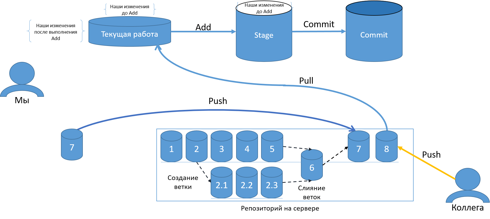
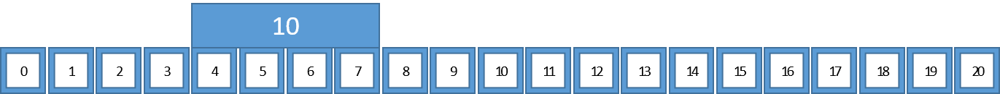
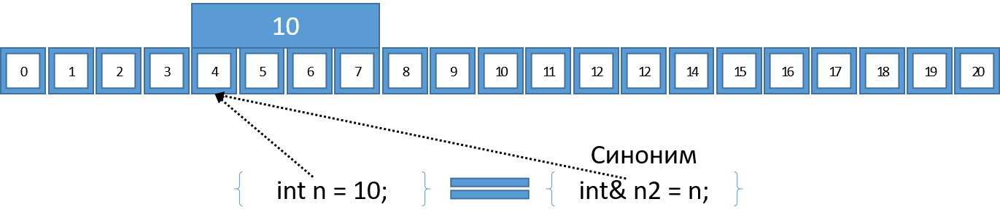
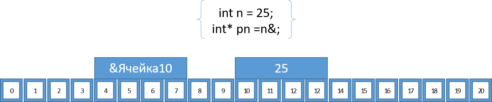
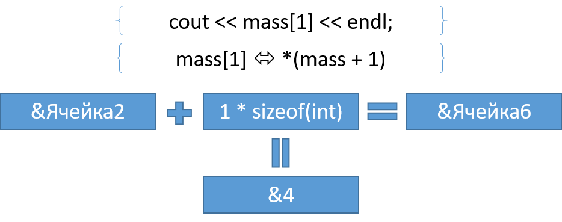
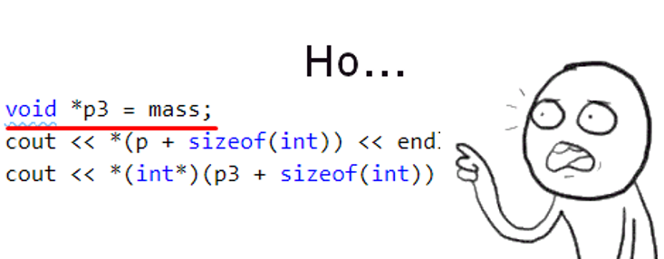

# Лекция 2: Память, указатели, ссылки, передача параметров в функцию

### План лекции:

1. Как работает Git
2. Линейное представление памяти. 
3. Указатель в рамках линейного представления памяти
4. Указатель в **С++**
5. Ссылка в **С++**
6. Операции взятия и разыменования указателя
7. Массив в памяти
8. Арифметика указателей
9. Примеры
10. Void и Void*
11. Два вида памяти
    1.  Статическая
    2.  Динамическая
12. Выделение динамической памяти, оператор new
13. Освобождение памяти, оператор delete
14. Массивы и операторы new и delete
15. Передача по указателю
16. Изменяемый и не изменяемый указатель
17. Передача по ссылке, разница
18. Умные указатели
19. Статические переменные


----------------
### Как работает Git


Первое о чем нам следует поговорить на этой лекции, это принципы и основы работы гита, ведь без понимания какой либо технологии ее использование в повседневной практике практически невозможно. В качестве помощи для объяснения всего принципа работы рассмотрим следующую иллюстрацию:



На ней мы видим 2 процесса, 1 расположен сверху, второй расположен снизу.  
Начнем с верхнего процесса, его можно сравнить с закатыванием консервов. Конечно, это не более чем аналогия, но она достаточно хорошо иллюстрирует все особенности и смыслы производимых манипуляций. Итак, у нас имеется следующие операции:

1. Самой первой операцией является подготовка нашего варева перед закаткой в банку, под этим мы понимаем процесс **написания кода**, создания файлов и папок в нашей рабочей директории проекта, их переименование и прочие операции со всем что находится в корне репозитория(под корнем понимается то место в котором лежит папка с названием .git).
2. Затем, следуют операция перекладывания нашего варева в банку, как бы подготовка ее к закатке, ошпаривание, дезинфекция и прочие операции свойственные подготовки консервы к консервированию. В нашем же случае, и нашей же терминологии эта операция называется **ADD** или добавление кода в индекс репозитория. Под этой операцией подразумевается, что гит берет все наши текущие изменения рабочей директории и делает их слепок, по сути копию, в минимизированном и специально обработанном виде, который позволяем ему в будущем, вернуть наш репозиторий в это же состояние. Изменения, которые прошли через эту операцию подготовки, считаются и называются добавленными в индекс, или staged changes. 
   > После попадания в индекс, даже если в рабочей директории произойдут какие либо изменения, они не будут учитываться без повторения команды ADD, продолжая аналогию, если мы продолжим варить что-то в кастрюле дальше, и добавлять новые ингридиенты, сами по себе они не появятся в банке для консервирования.
3. Последней идет операция консервирования, наша банка уже подготовлена, в ней есть все что мы хотим закрыть в ней, и нам остается только поместить крышку, закатать консерву и подписать банку, что бы не запутаться в будущем, что же мы там наварили. В нашей же терминологии эта операция называется **COMMIT**, а результат всего процесса по аналогии с ней, называется комитом. Т.е., вспоминая аналогию, комит = банка. В нем хранятся все наши изменения, которые мы посчитали необходимыми в него записать. 
   > Гит присваивает комиту уникальное имя, однако это уникальное имя не приспособлено для восприятия и использования человеком и как следствие не подходит для программиста в качестве того, что могло бы подсказать о чем был комит, поэтому мы и обязаны добавлять к комиту поясняющее сообщение, условно говоря как будто, наша закатная машинка сама ставит дату закатки, но она абсолютно не представляет что же мы закатали внутрь. 
   > Именно в этот момент, наш комит помещается в цепочку комитов, если продолжить аналогию, помещаются на полку с баками, единственное что полка локальна, однако локальная полка, ее наличие не влияет на объяснения дальнейшего процесса.

По итогу описанного процесса у нас получается банка. Однако, сама по себе эта банка не несет никакой пользы, именно поэтому, нам необходимо поместить эту банку на полку для банок, которая отражена в нижней части иллюстрации: 
> отдельно стоит отметить, что помимо удаленной полки, которая отражена в нижней части иллюстрации существует аналогичная локальная полка, с которой мы и работаем, а весь процесс описанный далее занимается синхронизацией локальной и удаленной полок, однако, он не является обязательным, и допускается работа только с локальной полкой, таким образом обеспечивается версионность, но не обеспечивается синхронизация и коллективная работа.

Для того что бы это сделать, нам необходимо выполнить операцию **PUSH** которая отправит наш комит в удаленный репозиторий. Эта операция, если продолжать аналогию, является операцией передачи банки на удаленную полку для длительного хранения, или для того, что бы ее кто то мог взять и использовать.  

В процессе операций с основной удаленной веткой, можно создавать некоторое количество параллельных ей малых веток. Для этого мы берем какой либо комит и от него выполняем операцию **CHECKOUT -b "название ветки"**. 

> Используя введенную ранее аналогию, мы берем одну из закатанных банок, исходя из иллюстрации банку с номером 2, и вскрываем, ее содержимое мы выливаем в кастрюлю для варева, после чего добавляем или удаляем какие либо ингридиенты. По завершению этого процесса мы закатываем новую банку с названием 2.1, а потом еще 2, 2.2 и 2.3. Эти банки идут параллельно основной полке, и не выключают в себя какие либо новые ингридиенты из банок на ней.  

Однако в какой то момент, мы заканчиваем все наши манипуляции c второстепенной веткой и хотим объединить работу с основной. Для этого нам необходимо выполнить их объединение, в правильной терминологии **MERGE**.
> Продолжая нашу аналогию, результатом такого действия станет объединения содержимого банки 2.3 и банки с основной полки за номером 5. В итоге получиться банка за номером 6, в которую попадет их объединение стоящая на основной полке, и все остальные банки помещаемые на основную полку будут следовать строго за ней, а значит базироваться на ее содержимом, т.е. включать в себя то что было добавлено в процессе работы с параллельной полкой. При этом на параллельную полку, новая банка не попадет, так как операция объединения вызывалась для передачи варева от второстепенной полке к основной.

Важно отметить, что ветка с которой происходит объединения не обязана закрываться и работа с ней не обязана завершаться, т.е. можно продолжать работать с ней и периодически объединять свою работу с основной веткой. В том числе и забирать сделанные изменения из основной ветки, не отдавая свои изменения.

В случае если кто-то, помимо нас решил добавить какие либо изменения(а именно это и предполагается в случае совместной работы над проектом), его изменения так же будет помещены в удаленную ветку, и мы можем забрать их себе операцией **PULL**.
> Продолжая нашу аналогию, кто то поставил после наших действий свою банку, сваренную на основании того, что ранее варили мы. Следовательно все, что мы будем делать далее в основной ветке, мы должны делать учитывая эти изменения, и для этого мы возьмем банку и вытащим ее содержимое к себе. При этом, если какое либо содержимое банки будет отличаться от наших локальных изменений, мы обязаны будем сначала закатать новую консерву с этими изменениями, и только после этого объединить их, иначе на придется расстаться с нашей незавершенной консервой, но такая ситуация возникает только если мы изменяем те же ингредиенты, что и тот чьи изменения мы у себя учитываем.

На это экскурс в мир гита можно считать законченным, а так же можно предположить, что основная масса читателей поняла принципы работы, ну по крайней мере я на это надеюсь.

----------------
### Линейное представление памяти 

Предметом этой лекции являются указатели и ссылки, а соответственно и то, без чего понять эти две сущности в **С++** достаточно сложно. Это память. Если быть точным, это представление и понимание памяти которое заложено в **С++**, и, если говорить чуточку шире, в целом во многие языки программирования и работу операционной системы, так как во многом такое представление памяти в **С++** связано с его достаточно глубокими возможностями по взаимодействию с ней, а значит нужно оперировать максимально приближенными к реальному положению вещей понятиями и идеями.  

На изображении ниже представлено линейное представление памяти.

Как можно заметить вся цепочка, состоит из последовательно следующих друг за другом сегментов, называемых ячейками памяти. Каждая ячейка в линейном представлении памяти имеет свой уникальный адрес, по сути порядковый номер этой ячейки относительно начала. Одна ячейка представляет собой ровно один байт информации.
> можно было бы предположить что будет один бит, однако бит слишком малое с точки зрения значимости значение, плюс, исторически так сложилось, что информация кодируется битами, но храниться пачками по 8 бит, называемых байтами.  

Переменные в рамках линейного представления памяти могут занимать от одной и более ячеек памяти. При этом адрес ячейки памяти для 32 битной системы всегда будет занимать 4 байта, или 32 бита, а для 64 битной системы, 8 байт, или 64 бита, собственно этим они и отличаются друг от друга.

Важно отметить, что линейное представление памяти это не единственный вариант, и более того, в физическом виде память не храниться как последовательность битов, очень часто она может быть двумерной матрицей, однако, в случае программирования на общих языках программирования с ней работают как с единой длинной линией. Это связано с тем, что двумерное представление памяти не является столь универсальным и гибким как линейное, и используется как правило в строго подходящих для этого ситуациях.

----------------
### Переменные в памяти

Итак, как и упоминалось ранее, каждая ячейка в памяти имеет адрес, а переменная занимает от одной до нескольких ячеек, собственно каждая переменная имеет свой уникальный адрес, который однозначно позволит найти ее внутри нашей линии данных. Так же логично будет отметить, что адресом переменной будет являться не пара адресов, начальной и конечной ячейки, а лишь один адрес, только начальный. Это связано с тем, что для каждого типа, в том числе и не стандартного можно рассчитать значение занимаемых им в памяти ячеек, а значит для прочтения переменной нам достаточно найти первую ячейку, после чего обработать столько ячеек сколько занимает тот или иной тип.  
На изображении ниже представлена переменная расположенная в памяти, она начинается с ячейки за номером 4, поэтому будем считать что ее адрес пишется как &Ячейка4.


Переменной является некое значение которое сохранено в памяти и имеет свое название, т.е. символьное обозначение, это то символьное обозначение которое в нашей программе от его появления и до его очистки, будет ассоциироваться с ячейкой номер 4, т.е. скрывать за собой определенный сегмент памяти и предоставлять к нему доступ.   

----------------
### Ссылка



Стрелкой с подпись `int n = 10;` указано основное название переменной которое скрывать за собой определенный сегмент памяти и предоставлять к нему доступ.   

Второй же стрелкой, так же ведущей к нашей ячейки является ссылка, определяемая строчкой `int& n2 = 2;`. Хорошей аналогией, через которую можно объяснить понятие ссылки, является синоним. Так же, как и в случае синонимов в русском языке, ссылка имеет тот же смысл что и наша изначальная переменная, т.е. предоставление доступа к тому же участку памяти, но имеет другое название, по которому мы можем обращаться к этой памяти. Со ссылкой мы можем проводить абсолютно все то же самое что и обычной переменной, при этом значение которое храниться в этой переменной будет меняться как через ссылку, так и через саму переменную.

#### Ссылка в **С++**

Для обозначения указателя используется следующие строчки:
```cpp
int& reference_n = origin_n;
float& reference_f = origin_f;
char& reference_c = origin_c;
```
Исходя из этого можно выделить следующую сигнатуру.
```
<тип>& <название ссылки> = <название переменной на которую ссылаются>;

<тип>& <название ссылки>;
<название ссылки> = <название переменной на которую ссылаются>
```
Нужно обратить внимание что компилятором допускается создание неинициализированной ссылки, однако это не приветствуется.  
Так же, обратите внимание, что тип со знаком & будет называться ссылочным типом, т.е. ссылка сама по себе является типом.

----------------
### Указатель

Помимо ссылки, в процессе работы с памятью возникает такое понятие как указатель  


В отличии от ссылки, указатель не является простым синонимом для переменной. Указатель является абсолютно отличной переменной, он имеет свою собственную занимаемую память, и хранит свое собственное значение. Весь секрет кроется именно в том, какое значение в себе хранит указатель, этим значением является номер первой ячейки переменной. Таким образом, использую эту значение из переменной указателя, мы можем обратиться непосредственно к памяти которая скрыта за этим номером, и взаимодействовать с ней не имея буквенного названия переменной.

#### Указатель в **С++**

Для объявления указателя используются следующие строки:
```cpp
int* pointer_n = &n;
float* pointer_f = &f;
char* pointer_c = &c;
```
Исходя из этих строчек мы можем выделить следующую сигнатуру:
```
<тип>* <название переменной указателя> = &<название переменной на который он указывает>; 

<тип>* <название переменной указателя>;
<название переменной указателя> = &<название переменной на который он указывает>;
```

----------------
### Операции взятия и разыменования указателя

Как только мы начинаем разговаривать про указатели, мы должны поговорить и об операциях связанных с указателями. в первую очередь это, конечно же, операция взятия адреса, или получения адреса обозначаемая префиксным символом `&`:
```
&<название переменной>
```
```cpp
int n = -1;
float f = 1.66;

cout << n << endl; // -1
cout << &n << endl; // 0x61fe1c
cout << f << endl; // 1.66
cout << &f << endl; // 0x61fe18

int* pn = &n;
float* pf = &f;

cout << pn << endl; // 0x61fe1c
cout << &pn << endl; // 0x61fe10
cout << pf << endl; // 0x61fe18
cout << &pf << endl; // 0x61fe08
```
Как можно заметить, адреса у переменных `pn`,`pf` и `n`,`f` соответственно различаются, при этом как видно из приведенного примера понятно, что в самих переменных `pn`,`pf` хранятся непосредственно адреса `n`,`f`.  
Однако, зачем может понадобиться указать по которому нельзя обратиться непосредственно к значению самой переменной, и именно поэтому второй операцией будет операция разыменования указателя, или операция обращения к памяти номер которой храниться в указателе. Эта операция обозначается как префиксный символ `*`:
```cpp
cout << *pn << endl; // -1
cout << *&n << endl; // -1
cout << *pf << endl; // 1.66
cout << *&f << endl; // 1.66
```
Как видно операции разыменования и операция взятия указателей взаимоисключающие, т.е. нет смысла одновременно получать адрес и сразу же обращаться к памяти по этому адресу, по крайней мере без какой либо дополнительной обработки.

----------------
### Арифметика указателей

Помимо вышеописанных операций с указателями можно так же выполнять следующие арифметические операции:
- Операция сложения, указываемая символом `+`, которая смещает наш указатель вправо (в сторону увеличения адреса) по нашей линии памяти на указанное значение, при этом смещение происходит не на N байт, а на N умноженную на длину базового типа указателя байт.
- Операция вычитания, указываемая символом `-`, которая аналогично сложению смещает указатель, но не вправо, а влево (в сторону уменьшения адреса).
- Операция инкремента, указываемая символом `++`, которая смещает указатель вправо(вперед) на количество байт базового типа. Может быть префиксной и постфиксной со всеми вытекающими из этого.
  > Префиксная операции сначала вычисляет значение и пишет его в переменную и только после передает полученное значение во все остальные операции.  
  Постфиксная операция сначала выдает текущее значение переменной для дальнейших с ней операций, и только потом увеличивает ее значение и записывает его в нее.
- Операция декремента, указываемая символом `--`, которая смещает указатель влево(назад) на количество байт базового типа.   

Все операции описанные выше смещают указатели по линии памяти не на 1 байт, а на длину базового типа указателя помноженное на значение сдвига. Т.е. для указателя `int*` при операции инкременте смещение будет происходить на 4 байта, так как это то количество байт которое занимает одна переменная типа `int`. Это можно проиллюстрировать следующим образом: пусть есть переменная указатель указывающая на некоторый тип занимающий 2 байта, попытаемся сместить ее при помощи операции сложения поставив с право от операции 2, получим выражение `<указатель> + 2`, это выражение в кулуарах работы исполняющей машины, превратиться в выражение `<указатель> + 2 * <размер типа указателя для примера равный 2>`

----------------
### Массив в памяти
Лучше всего арифметические операции с указателями показываются на примере массивов. Это последнее о чем мы должны поговорить перед тем как можно будет считать, что мы рассмотрели про указатели все что было необходимо. На изображении ниже показано как массив рассматривается в рамках линейного представления памяти.

Итак, раз массив был упомянут в контексте указателя, значит он как то с ним связан, но разумный вопрос, как? Все очень просто, сам по себе массив является указателем, т.е. при объявлении массива сточкой `int array[10];` в нашей области видимости появляется переменная array, при этом мы ожидаем, что эта переменная и есть массив, однако на самом деле, это переменная является указателем на начало массива из 10 элементов лежащего в памяти. Т.е. реальный тип переменной array это `int[10]*`, разумеется такого типа самого по себе не существует, и более того, компилятор будет очень сильно ругаться в случае если мы попытаемся такое написать, однако это именно так и есть. Саму же переменную array можно без каких либо преобразований присвоить к указателю на `int*`:
```cpp
int array[10] {0};
int* parray = array;
```
Так же, характерную для указателя картину, мы увидим если попытаемся вывести в консоль просто значение переменой array без указания элемента:
```cpp
    cout << array << endl; // 0x61fdf0
    cout << parray << endl; // 0x61fdf0
    cout << &parray << endl; // 0x61fde8
    cout << &array[0] << endl; // 0x61fdf0
    cout << &array << endl; // 0x61fdf0
```
Так же как видно из примера если вывести адрес этой переменной или адрес первого элемента в массиве, все они будут показывать одно и то же значение. Это единственное что отличает переменную массива от классического указателя, она не имеет своей собственной памяти для хранения этого адреса.

И именно из за того, что массив является указателем, очень хорошо на нем иллюстрируется работа арифметики указателей, ведь операция обращения к элементу массива, является упрощенной для написания операцией сдвига указателя:

Как видно из изображения, при использовании операции обращения к элементу массива, исполняющая машина выполняет операцию сдвига указателя и затем операцию разыменования указателя. Все это выражается формулой:
```
<название массива>[N] <=> *(<название массива> + N * <размер типа элементов массива>)
```
> Именно этот механизм, скрытый за работой с массивами, и объясняет истоки того почему индексация массивов начинается именно с 0 а не 1.

Важно отметить, в изображении упоминается функция `sizeof()`, это функция, которая возвращает количество занимаемую переменной памяти если в нее послать переменную, если же в нее послать название базового(и не только) типа, то она вернет количество памяти занимаемое любой переменной этого типа.

#### Пример
5
0x61fdf0
0x61fdf0
0x61fdf0
6422000
4
5
6422000
5

```cpp
int mass[4] {3, 5, 13, 1};
int k = 256;
int* p = mass;
cout << mass[1] << endl;                                 // 5
cout << &mass << endl;                                   // 0x61fdf0
cout << &mass[0] << endl;                                // 0x61fdf0
cout << p << endl;                                       // 0x61fdf0
cout << *(p + sizeof(int)) << endl;                      // 6422000
cout << sizeof(int) << endl;                             // 4
cout << *(p + 1) << endl;                                // 5
cout << *mass + 10 << endl;                              // 13
cout << mass[0] + 10 << endl;                            // 13
cout << *(p + 1) + 10 << endl;                           // 15
*(p + 1) = 11;
cout << mass[1] << endl;                                 // 11

```

----------------
### Void и Void*

Именно в этот момент нам пора рассмотреть особый для **С++** тип, это тип `void`. Тип `void` обозначает пустоту, т.е. по своей сути он ничего не занимает не имеет никакого значения и используется для обозначения функций которые не возвращают значений:
```cpp
void function(){
   // Блок кода
   return
}
```
Как можно заметить `return` у функции из примера не возвращает никакого значения по выходу из нее, но что бы не менять сигнатуру определения функции в **С++** введен тип который обозначает пустоту. При этом разумно что объявить переменную пустого типа невозможно, иначе это было бы как минимум странно, а как максимум провоцировало бы множество ошибок связанных с попытками взаимодействия с такими переменными и попытками переопределения названий которые они будут занимать.  
Однако этого раздела не было бы тут если бы все было так просто, давайте рассмотрим интересное дополнения предыдущего примера следующими строчками:
```cpp
void *p3 = mass;
cout << *(p + sizeof(int)) << endl;                     // 6422000
cout << *(int*)(p3 + sizeof(int)) << endl;               // 5
```

Пожалуй эта картинка отлично описывает наши чувства. Как мы только что взяли и объявили переменную пустого типа? Хотя стоп, не переменную пустого типа, а переменную указателя на пустоту. Хмм... Если вы задумались что именно это и является ключевым отличием от простого типа пустоты, то вы мыслите в правильном направлении. Именно указатель на пустоту является тем особым типом, который позволяет нам превратить наш строго типизированный **С++**, в язык с неким подобием динамической типизации, ведь именно за указателем на пустоту может скрываться абсолютно любой тип и любые данные в памяти. По сути, такой указатель просто указывает куда то в память, но ни как не говорит о том как данные которые хранятся в ней интерпретировать. Именно поэтому следующие строчки выдают тот результат который выдают, по сути? первая обращается за границу массива, так как смещает указатель на 4(результат работы функции `sizeof(int)`) умноженное на размер занимаемый int байт, а вторая строчка смещает указатель именно на 4 байта, так как размер типа `void` интерпретируется исполняющей машиной как 1 байт в данном случае, и позволяет смещать указатель именно на N байт. При этом, поскольку исполняющая машина не знает как интерпретировать скрытую за указателем память, мы должны явным образом сказать ей об этом, проведя явное преобразование к нужному указательному типу, для того что бы операция разыменования указателя взяла нужный отрезок памяти и интерпретировала его правильно.

----------------
### Два вида памяти

Логичным после всего вышесказанного будет задать вопрос: 
> А зачем же нам вся эта информация? Зачем нам работать с указателями если у нас есть обычный способ создания переменных?
И правда, зачем же? Ответ на этот вопрос лежит в понимании того, что в операционной системе в целом и в **С++**, как языке программирования для написания программ работающих под какой либо операционной системой есть два абсолютно разных по смыслу понятия памяти. 

#### Статическая

Первым таким понятием будет статическая память, это та память которую наша программа запрашивает у операционной системы для своей работы на стадии своего запуска. По сути это некая предустановленная величина которую во первых программа хочет, а так же та которую операционная система ей дает. И условно ее можно изобразить следующим образом:

Как можно заметить в эту память входит и та память которая нужна для хранения непосредственно кода программы, плюс есть еще разные системные участки памяти, отдельно идет участок памяти под константы и литералы, все это скрыто за участком обозначенным троеточием. Самым последним на картинке показан участок памяти под названием cтек, он то и является той памятью что дается программе для размещения своих переменных. Его величина не постоянна от программы к программе, но постоянна после ее запуска, а так же она не может превышать определенные значение, а т.е. программа ограничена в том сколько данных она может хранить в оперативной памяти.

#### Динамическая

Именно последнее замечание, про ограничение статической памяти в размере и подводит нас ко второму понятию, понятию динамической памяти, так же называемой Кучей. Эта память не выделяется программе на старте, программа во время своей работы сама запрашивает столько этого типа памяти сколько ей нужно, столько сколько операционная система вообще в состоянии ей дать. 
Операция выделения памяти в куче, это не совсем выделение, т.е. программа сама не занимается тем, что занимает какую то память, программа лишь посылает запрос в операционную систему, тогда как последняя занимается уже непосредственно управлением памятью. Эта память используется всеми, а операционная система является распределителем и контролером, именно поскольку все программы помещают туда свои данные она и называется кучей.  
Выделение памяти в Куче медленнее из-за особенностей работы с ней, но по быстродействию после выделения не отличается от статической. Именно поэтому выделять память в куче постоянно не разумно, особенно в тех ситуациях когда это касается одноразовых или временных переменных внутри циклов,условий и функций. Но куча, просто незаменима когда нам нужно хранить и обрабатывать программой большое количество данных, а так же если эти данные сложно организованы и имеют сложные взаимосвязи друг с другом.  

----------------
### Выделение динамической памяти, оператор new

Как же говорилось ранее, при выделении данных в куче, понимается не непосредственное выделение, а запрос данных у операционной системы. Для выполнения этого запроса используется оператор `new`:
```cpp
int* new_int = new int;
float* new_float = new float;
void* new_void = new char;
```
Общая сигнатура такого выделения следующая:
```
<тип переменной>* <название переменной> = new <тип переменной>;
```
При этом как видно из примера и сигнатуры оператор new по своему завершению возвращает указатель на выделенную память, это связано с тем что непосредственно операционная система позволяет работать с кучей исключительно по указателям. И именно поэтому и существуют указатели в **С++**.
> Важно отметить, что переменная в которую записывается адрес указателя выделяется в локальной памяти, однако это не значит, что в куче нельзя хранить указатели. 

----------------
### Освобождение памяти, оператор delete

Выделив память при помощи оператора `new` мы так же говорим операционной системе, что дальше этой памятью управляем мы. Мы совершаем с ней любые нужные нам операции, при этом операционная система не вмешивается в наши действия, однако, эта память помечается операционной системой как занятая, и она не дает работать с ней никому кроме нашей программы, по крайней мере в явном виде.  
Именно поэтому, по завершению работы с памятью, мы как программисты обязаны сказать операционной системе, что далее эта память нам не нужна, так как в отличии от статической памяти, эта память не очищается автоматически в случае если мы выходим из области видимости переменной ссылающейся на нее. Да, переменная которая содержит указатель, может быть уничтожена автоматически, так как мы вышли за ее область видимости. Но память освобождена автоматически не будет, так как указатель на эту память мог быть передан как возвращающееся значение из функции, или записан в переменную с большей чем текущая область видимости, которая не будет удалена.  
Именно из-за этой щепетильной ситуации, программа который вызывает запрос на выделение памяти в куче сама и несет ответственность за нее, и любая автоматика не может считаться однозначно работающей и выполнимой. А поскольку мы говорим о том что программа сама несет за это ответственность, то соответственно и программист который пишет программу несет за это ответственность, и как следствие **С++** предоставляет ему нужные для этого механизмы.  
Именно таким механизмом и является оператор delete:
```cpp
delete new_int;
delete new_float;
delete new_void;
``` 
Он высвобождает память, т.е. посылает операционной системе сигнал, после которого она, т.е. операционная система считает что эта память является свободной и она может использовать ее как ей заблагорассудиться.  
**!** Если какую либо выделенную в куче память забыть удалить, то такое событие будет называться утечкой памяти. Самое страшное когда такая утечка возникает в рамках выполнения какого либо длительного итерационного процесса на каждой итерации, что может привести к большому потреблению программой памяти.  
 
> Важно отметить, что в **С++** нет автоматических механизмов называющийся сборщиком мусора которые есть в других языках. Такой механизм способен сделать высвобождение памяти без нашей помощи в процессе работы программы если мы забыли это сделать. Т.е. программа продолжит работать, операция delete не будет выполнена, но память которую уже не использует программа, т.е. ту на которую нет ни одного активного указателя(т.е. нет указателей которые позволят обратиться к этой памяти в дальнейшем до самого конца программы) будет передана операционной системе. Хоть этот механизм и кажется очень замечательным, но в его работе во всех языках имеется определенная проблема, во первых нет никаких гарантий, что он будет вызван. Во вторых, невозможно определить когда он будет вызван. В третьих, далеко не всегда, он способен определить, что переменная не используется(это, в первую очередь, касается сложно связанных данных, которые много ссылаются друг на друга и хранятся в куче), и в этом случае он не высвобождает память, а соответственно появляются утечки памяти. Эти проблемы с определенной успешностью решаются в различных алгоритмах и подходах к сборке мусора, но **С++** принципиально отказался от этого, так как он позволяет управлять памятью самостоятельно так же как в С, только упростив этот процесс(отметим, что в статической памяти сборщик работает, но там все во много раз проще, и работает он по другому, так как опирается на область видимости.).

----------------
### Массивы и операторы new и delete

Абсолютно логично, что если мы говорим о том, что куча в первую очередь предназначена для выделения памяти в ситуациях когда ее, для хранения большого количества данных, необходимо значительные объемы, то одним из важнейших инструментов в этом случае должно быть выделение памяти под массивы данных. Пример выделения одномерного массива целых чисел:
```cpp
int N = 10;
int* new_array = new int[N];
```
В итоге, сигнатура выделения памяти под массивы выглядит следующим образом:
```
<тип>* <название переменной> = new <тип>[N];
```
Как можно заметить отличие от создания простого указателя заключается в том, что совместно с оператора `new` после указания типа элементов массива идет стандартное для массивов указание его размерности. 
Удаление памяти производиться так же оператором delete, но ему нужно явным образом показать что удаляется массив, для того что бы он зачистил его весь, а не только первый элемент.
```cpp
delete[] new_array;
```
Отдельным вопросом стоит выделение многомерных массивов и сразу стоит отметить, что выделить таким образом двойной массив, к примеру, как это было бы в случае выделения в статической памяти, не получиться, так как невозможно как тип элемента указать тип массива. Поэтому для выделения многомерного массива в куче используется следующий подход:
1. объявляем указатель того уровня какого хотим создать массив, т.е. для двумерного массива указатель типа `<тип>**`, для трехмерного `<тип>***` и т.д. по аналогии.
2. присвоить этому указателю в качестве значения указатель на начало выделенного через оператор `new` массива указателей на 1 уровень меньше чем предыдущий, т.е. для двумерного массива массив указателей типа `<тип>*`, для трехмерного `<тип>**` и т.д. по аналогии.
3. 
   1. если на предыдущем этапе инициализации тип является указателем значит в цикле повторить шаг 2 столько раз сколько нужно создать элементов первой по порядку размерности, инициализировав элементы массива с шага 2 новыми массивами с уровнем вложенности ниже текущего.
   2. если на предыдущем этапе инициализации тип не является указателем то завершить инициализацию  

Или в формальном виде(где M это требуемая вложенность):
```
<тип>(M)* <название> = new <тип>(M-1)*[(M)N]
for(
   int (M)i = 0; 
   (M)i < (M)N; 
   (M)i++
){
   <название>[(M)i] = new <тип>(M-2)*[(M-1)N]
   for(
      int (M)i = 0;
      (M)i < (M-1)N;
      (M)i++
   ){
      <название>[i] = new <тип>(M-3)*[(M-2)N]
      ...
   }
}
```
Или, если приводить менее формальный и более связанный с реальностью пример, выделение двумерного массива:
```cpp
int** new_2D_array = new int*[N];
for(int i = 0; i < N; i++)
   new_2D_array[i] = new int[N];
for(int i = 0; i < N; i++)
   delete[] new_2D_array[i];
delete[] new_2D_array;
```
Как можно заметить, удаление происходит в обратном порядке, относительно порядка выделения массива.

----------------
### Передача по указателю

Так же, важным аспектом и местом приложения указателей является передача параметров в функцию, т.е. один или несколько параметров в функции могут быть объявлены как указатели. В обычном случае, если мы просто указываем у параметра какой либо функции не указательный тип, исполняющая машина при выполнении вызова функции скопирует значения переданных параметров в локальную для функции память. Это связано с особенностями управления статической памятью при помощи области видимости, и позволяет исполняющей машине просто зачищать всю выделенную память не заботясь о том что какие либо данные могли относиться к другой области видимости, именно по этому же переменные более локальной области видимости с одинаковыми названиями для переменных более глобальной области видимости заменяют их, но при этом не стирает их реального значения. Так вот, изменяя тип с обычного на указательный, мы провоцируем исполняющую машину копировать в локальную область видимости не значение переменной, а значение адреса переменной, и соответственно можем из функции обращаться непосредственно к передаваемой переменной, таким образом изменяя ее значение вне функции.  
Такая передача называется **передаче по указателю**.
```cpp
void add(int* to, int from){
   *to += from;
}

int from = 10;
int to = 4;
add(&to, from);
cout << to << endl; // 14
```
Как видно из представленного примера, мы передаем в том числе и не выделенную в куче переменную по указателю, и меняем внутри функции ее значение, при том, что эта функция ничего об этой переменной не знает.
Абсолютно логично, что раз массив является указателем, то таким образом мы можем передавать и массивы(это в первую очередь полезно при передаче массивов произвольной длинны, так как массивы фиксированной длинны можно передавать копированием).
```cpp
void print_array(int* array, const int N){
   for(int i = 0; i < N; i++){
      cout << array[i] << ' ';
   }
   cout << endl;
}

int mass[4] {3, 5, 13, 1};
print_array(mass, 4); // 3 5 13 1
```
----------------
### Передача по ссылке, разница

Так же, важным является то, что помимо передачи по указателю существует способ передать параметр в функцию не копируя его и не прибегая к логике работы указателей с их разыменованиями. Таким способом является передача **параметра по ссылке**. Смысл у такой передачи тот же, что и у передачи по указателю, предоставить доступ к переменной не относящейся к функции, для того, что бы ее можно было изменять, или сэкономить память при копировании.
```cpp
void add(int& to, int from){
   to += from;
}

int from = 10;
int to = 4;
add(to, from);
cout << to << endl; // 14
```
Однако передать массив таким образом не представляется возможным.


----------------
### Изменяемый и не изменяемый указатель

Если вспомнить, то переменные это не единственная форма хранения данных, мы так же можем хранить какие либо предопределенные данные в виде констант. Указатели могут ссылаться на такие данные, более того, сами указатели могут быть константными. Разница в данном случае достаточно проста:
- В первом случае указатель на константу не дает возможности изменять ее значение, но может быть изменен сам. Т.е. во время исполнения перестать ссылаться на одну константу и начать на другую или на не константу, но все равно не будет предоставлять возможность ее изменения. Сигнатура этого варианта следующая:
   ```
   const <тип>* <название указателя> = &<переменная или константа на которую указывает>
   ```
- Во втором случае, сам указатель будет неизменяем, и не сможет ссылаться на какую либо другую переменную, однако, он будет позволять изменять данные той переменной на которую он ссылается. Сигнатура:
   ```
   <тип>* const <название указателя> = &<переменная или константа на которую указывает>
   ```
   > можно сделать неизменяемый указатель на неизменяемые данные 
   > ```
   > const <тип> * const <название> = &<переменна или константа>;
   > ```
В качестве иллюстрации может послужить следующий пример.
```cpp
int n = 10;
const int N = 15;
int m = 21;
const int* p = &n;
int* const pc = &n;
int* pc = &N;       // Ошибка, не дает присвоить константу к указателю позволяющему изменять значение
(*p) = 12;           // Ошибка, не дает присвоить новое значение
p = &m;
(*pc) = 13;
pc = &m;             // Ошибка, не дает присвоить новый указатель
```

Так же, параметр передаваемый по указателю может быть передан как неизменяемый, что будет гарантировать всем кто будет функцию вызывать, что она не создает ни каких эффектов в данных которые в нее передаются. 
```cpp
void test_function(const int* n, int * const m){
   // Блок кода
}

int* n = new int(10);
*n = 10;
int m {20};
test_function(n, n);     // Ошибка, использовать переменную тип int* нельзя для инициализации ссылки
test_function(&m, m);    // 0x61fe14        20      0x61fe14        20
test_function(n, m);     // 0xe84330        10      0x61fe14        20
test_function(&m, n);    // Ошибка, использовать переменную тип int* нельзя для инициализации ссылки
test_function(&m, *n);   // 0x61fe14        20      0xe84330        10
```
В этом примере так же отлично видно, что компилятор не дает скомпилировать тот код, который не учитывает факт изменяемости и неизменяемости указателей.

----------------
### Умные указатели

Существуя относительно за темой данной лекции, этот пункт все еще здесь необходим. Стандартная библиотека **С++** предоставляет возможность программистам не заботиться самостоятельно об управлением памятью и предоставляет два механизма, уникальный указатель `unique_ptr` и разделяемый указатель `shared_ptr`. Оба этих указателя  не требуют от программиста слежения за использованной памятью. Оба типа указателей хранятся в импортируемом файле `memory` входящем в состав стандартной библиотеки, а потому доступны на любом компиляторе. 
```cpp
#include <memory>

unique_ptr<int> x_up(new int(10));
unique_ptr<int> y_up;
// y_u_prt = x_u_prt; // Ошибка компиляции
// unique_ptr<int> z_u_prt(x_u_prt); // Ошибка компиляции
int* classic_p = x_up.get(); // Превращение в обычный указатель
y_up = std::move(x_up); // Передача указателя другому
y_up.reset(); // Сброс указателя
// unique_ptr<int> c_up(classic_p);
// delete classic_p;
shared_ptr<int> x_sp(new int(42));
shared_ptr<int> y_sp(new int(13));
y_sp= x_sp; // вызовет удаление объекта с числом 13, и оба указателя будут ссылаться на число 42
```
Первый указатель называется уникальным из-за того, что он не позволяет передать ту память которой он управляет под управлению другому такому же уникальному указателю без явного вызова этого процесса, в том числе и через преобразование к обычному указателю, однако не запрещает обращаться к данным через обычный указатель если он ранее был преобразован и присваивать указатель к другим обычными указателями.  
Второй же указатель позволяет передавать свою память в ведение другим указателям, но при этом контролирует количество всех указателей что ссылаются на эту память, и в тот момент когда количество таких указателей подойдет к 0 он высвободит занимаемую память.

----------------
### Статические переменные

Так же следующим упоминания является пункт о статических переменных. В рамках какой либо функции или файла может быть выделена статическая переменная, при этом:
- в рамках файла такая переменная будет глобальной для файла и не будет доступна из других файлов даже в случае его импорта.
- в рамках функции и тогда такая переменная будет создаваться на время работы всей программы, и не будет удаляться в момент выхода из функции, но будет доступна только из нее.

Второй вариант отлично иллюстрирует следующий пример:
```cpp
void counted_function(){
   static int counter = 0; 
   cout << ++counter << endl;
   // Блок кода
}
for(int i = 0; i < 10; i++)
   if(i % 3 != 0)
      counted_function();
// 1
// 2
// 3
// 4
// 5
// 6
```
### Передача массива в функцию как параметра

### Передача массива выделенного в статической памяти в функцию как параметра

как можно послать массив из статической памяти двойной в функцию с сигнатурой int**, иииии, ну, все мои способы любого прямого каста за 1 промежуточную переменную, или успехом не увенчались.
Все касты аля (int**)&x[0][0] приводят к ошибке sigmentation fault при обращении через [][].
Получилось передать и работать 2 мя путями. 1 путь:

```cpp
void func(int** mass, const int N){
    for(int i = 0; i < N; i++){
        for(int j = 0; j < N; j++){
            cout << mass[i][j] << " ";
        }
        cout << endl;
    }
}

int main (){
    int mass[N][N];
    int* surogate[N];
    for(int i = 0; i < N; i++)
        surogate[i] = mass[i];
    func(surogate, N);
    return 0;
}
```
И второй способ:
```cpp
void func1(int* mass, const int N){
    for(int i = 0; i < N; i++){
        for(int j = 0; j < N; j++){
            cout << mass[i * N + j] << " ";
        }
        cout << endl;
    }
}

int main (){
    int mass[N][N];
    func1((int*)mass, N);
    return 0;
}
```

Ну и в общем то ответ что логично кроется в разнице хранения и работы с этими типами в базисе. Для типа `int [N][N]`, операция обращения по индексу явно преобразуется в математику указателей т.е. для `mass[i][j]` полностью равна операции `*(mass + i * N + j)`. Т.е. статический массив железобетонное хранится локализовано, т.е. строго друг за другом. В свою очередь тип `int**` и двойной массив созданный при помощи new, операция `mass[][]` судя по всему равносильна `*(*(mass + i) + j)`, т.е. каждый вызов `[]` для чистого указателя обязательно подразумевает автоматическую операцию разъименования. Поэтому при попытке преобразовать `int [N][N]` к `int**` не несет ожидаемого эффекта. В качестве демонстрации привожу ниже кусочки кода и вывод в консоль.
```cpp
    cout << "MASS" << endl;
    for(int i = 0; i < N; i++){
        cout << &mass[i] << "|";
        for(int j = 0; j < N; j++)
            cout << &mass[i][j] << ":" << mass[i][j] << " ";
        cout << endl;
    }
```
```
MASS
0x61fd30|0x61fd30:0 0x61fd34:1 0x61fd38:2 0x61fd3c:3 0x61fd40:4
0x61fd44|0x61fd44:5 0x61fd48:6 0x61fd4c:7 0x61fd50:8 0x61fd54:9
0x61fd58|0x61fd58:10 0x61fd5c:11 0x61fd60:12 0x61fd64:13 0x61fd68:14
0x61fd6c|0x61fd6c:15 0x61fd70:16 0x61fd74:17 0x61fd78:18 0x61fd7c:19 
0x61fd80|0x61fd80:20 0x61fd84:21 0x61fd88:22 0x61fd8c:23 0x61fd90:24
```
```cpp
    cout << "PMASS" << endl;
    for(int i = 0; i < N; i++){
        cout << &pmass[i] << "|";
        for(int j = 0; j < N; j++)
            cout << &pmass[i][j] << ":" << pmass[i][j] << " ";
        cout << endl;
    }
```
```
PMASS
0x1f42e0|0x1f4710:0 0x1f4714:1 0x1f4718:2 0x1f471c:3 0x1f4720:4
0x1f42e8|0x1f4760:5 0x1f4764:6 0x1f4768:7 0x1f476c:8 0x1f4770:9
0x1f42f0|0x1f47b0:10 0x1f47b4:11 0x1f47b8:12 0x1f47bc:13 0x1f47c0:14
0x1f42f8|0x1f4800:15 0x1f4804:16 0x1f4808:17 0x1f480c:18 0x1f4810:19
0x1f4300|0x1f4850:20 0x1f4854:21 0x1f4858:22 0x1f485c:23 0x1f4860:24
```
```cpp
    cout << "PMASS 2" << endl;
    for(int i = 0; i < N; i++){
        cout << (pmass + i) << "|";
        for(int j = 0; j < N; j++)
            cout << *(*(pmass + i) + j) << ":" << pmass[i][j] << " ";
        cout << endl;
    }
```
```
PMASS 2
0x1f42e0|0:0 1:1 2:2 3:3 4:4
0x1f42e8|5:5 6:6 7:7 8:8 9:9
0x1f42f0|10:10 11:11 12:12 13:13 14:14
0x1f42f8|15:15 16:16 17:17 18:18 19:19
0x1f4300|20:20 21:21 22:22 23:23 24:24
```