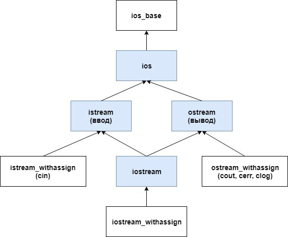
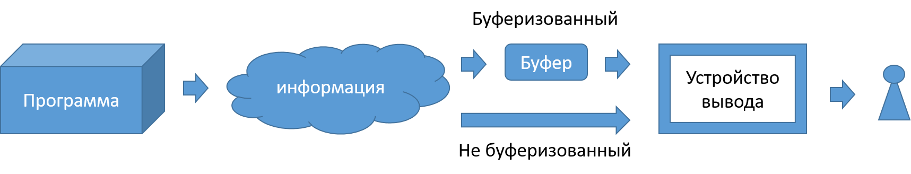

# Лекция 4: Классы, инкапсуляция, наследование полиморфизм.

### План лекции:

1. Полиморфизм и приведение типов
1. Виртуальные методы
   1. Связывание на этапе компиляции 
   2. Определение
   3. Виртуальные деструкторы
   4. Чистые виртуальные методы
2. Абстрактные классы
3. Реализация по умолчанию
4. Интерфейсные классы
5. Структура классов библиотеки iostream
6. Потоки
7. Стандартные потоки и манипуляция с ними
8. Взаимодействие с потоками.
9.  Строковые потоки
10. Файловые потоки ввода вывода
11. Файловый указатель


----------------

### Полиморфизм

Вспомним предыдущую лекцию, в которой мы рассматривали основны объектно ориентированного программирования и так называемые три кита, одним из которых был очень важный аспект ооп, называемый полиморфизмом. Если вспомнить о чем тогда упоминалось, то можно обратить внимание на то, что полиморфизм позволяет нам создать и определить набор функций которые позволят нам работать с различными классами одинаковыми образами. Совместив этот подход с классическим наследованием, мы получим мощный инструмент который позволит нам выделять общее поведение и гарантированно предоставлять в разных дочерних классах одинаковые методы для работы с объектами одного дерева классов. Но, С++ не был бы тем, чем он является если бы все было так просто.

#### Связывание на этапе компиляции 

Вновь обратимся к схеме приведенной в первой лекции, которая описывала этапы написания программы:


Как можно заметить, в процессе создания программы от написания ее до финального запуска есть несколько важных этапов, о которых мы говорили на первой лекции и одним из таких этапов является этап связывания, во время которого линковщик занимается тем что находит все места вызова функций и связывает их с местом определения функции. Под связыванием понимается указание в месте вызова метода области памяти в которой расположен код соответствующей функции, функция выбирается на основании компилируемого типа переменной у которой он вызывается. Однако, этот процесс, как видно из схемы связан с процессом компиляции, а значит происходит еще до того как программа будет запущена и тогда достаточно логично предположить, что если на момент компиляции класс объекта с которым мы пытаемся работать должен быть известен, иначе связывание не произойдет и будет выполняться тот код который мы бы не предполагали использовать. В случае же использования виртуального метода, связывания на стадии компиляции не происходит, и мы говорим компилятору, что этот метод может быть переопределён и заставляем исполняющую машину во время исполнения нашего кода определить реальный тип скрытый за указателем или ссылкой и вызвать именно его.

Проилюстрируем все выше описанное на нижеприведенном примере:

```cpp
#include <iostream>
#include <string>
#include <cstdarg>

using namespace std;

class Weapon{
    public:
        string name;
        Weapon(string name): name(name) {}
        void printName(){
            cout << "name: " << name << endl;
        }
};

class Pistol: public Weapon{
    public:
        Pistol(string name): Weapon(name) {}
        void printName(){
            cout << "Pistol name: " << name << endl;
        }
};

class Sword: public Weapon{
    public:
        Sword(string name): Weapon(name) {}
        void printName(){
            cout << "Sword name: " << name << endl;
        }
};

int main(){
    const int N = 3;
    Weapon w("JustWeapon");
    Pistol p("9mm");
    Sword s("Excalibur");
    w.printName(); // name: JustWeapon
    p.printName(); // Pistol name: 9mm
    s.printName(); // Sword name: Excalibur
    Weapon* weapons[N] {&w, &p, &s};
    for(int i = 0; i < N; i++)
        weapons[i]->printName();
    // name: JustWeapon
    // name: 9mm
    // name: Excalibur
    Weapon& w2 = p;
    Weapon w3 = s;
    w2.printName(); // name: 9mm
    w3.printName(); // name: Excalibur
    return 0;
}
```
Как видно из приведенного примера, несмотря на то что за указателем содержащимся в массиве оружий спрятаны различные типы оружий, результат вызова одной и той же функции, совпадает с результатом вызова аналогичной функции у класса `Weapon`.

### Полиморфизм и приведение типов

Одним из способов решения описанной выше проблемы, когда объект скрывающийся за указателем на класс родитель можно было бы использовать как объект дочернего класса, это прямое приведение типа.
Приведение типа это механизм, который позволяет преобразовывать объект одного типа к объекту другого типа. Этот механизм работает как с базовыми типами так и с пользовательскими.
Рассмотрим пример который позволит подробно проиллюстрировать этот способ.
Пусть у нас имеется родительский класс оружие:
```cpp
class Weapon{
    public:
        Type type;
        string name;
        double damage;
        double distance;
        Weapon(string name, double damage, double distance, Type type): 
            name(name), damage(damage), distance(distance), type(type)
        {}
        void printCharacteristics(bool without_endl = false){
            cout << "type: " << type << "; name: " << name << "; damage: " << damage << "; distance: " << distance;
            if(!without_endl) cout << endl;
        }
        Type getType(){
            return type; 
        }
};
```
В дополнение к нему, у нас имеется перечисление типов оружий, которые мы предполагаем ввести в программу, и с которыми ей предстоит работать.
```cpp
enum Type{
    PISTOL,
    SWORD
};
```
От родительского класса мы наследуем два дочерних класса оружия: пистолет и меч. Каждый из этих классов добавляет информацию свойственную только этому типу оружия и дополнительные методы этого оружия.
```cpp
class Pistol: public Weapon{
    public:
        int rounds_in_holder;
        string caliber;
        Pistol(string name, double damage, double distance, int rounds_in_holder, string caliber):
            rounds_in_holder(rounds_in_holder), caliber(caliber), Weapon(name, damage, distance, PISTOL)
        {}
        void printCharacteristics(){
            Weapon::printCharacteristics(true);
            cout << "; rounds_in_holder: " << rounds_in_holder << "; caliber: " << caliber << endl;
        }
        double shotByDistance(double distance){
            if(distance > this->distance){
                cout << "To far" << endl;
                return 0;
            }else {
                return damage;
            }
        }
};

class Sword: public Weapon{
    public:
        string steel;
        double length;
        Sword(string name, double damage, string steel, double length):
            steel(steel), length(length), Weapon(name, damage, length, SWORD)
        {}
        void printCharacteristics(){
            Weapon::printCharacteristics(true);
            cout << "; steel: " << steel << "; length: " << length << endl;
        }
        double strike(){
            return damage;
        }
};
```

Далее в функции main создадим два массива, первый содержит указатели на оружие, второй содержит указатели на пустоту.
```cpp
int main(){
    ...
    const int N = 10;
    Weapon* weapons[N];
    void* void_weapons[N];
    ...
}
```

Заполним эти массивы при помощи цикла генерации, двух функций и набора массивов со строковыми данными.
```cpp
const int NAMES_COUNT = 5;
const std::string PISTOL_NAMES[NAMES_COUNT] {"FN Five-seveN", "Smith & Wesson Model 500", "FN-FNP45", "Beretta 92", "Glock-17"};
const std::string CALIBER_NAMES[NAMES_COUNT] {"5,7×28mm", ".500 S&W Mag", ".45 ACP", "9x19mm", "9x19mm"};
const std::string SWORD_NAMES[NAMES_COUNT] {"Оркрист", "Жало", "Нарсил", "Херугрим", "Хедхафанг"};
const std::string STEEL_NAMES[NAMES_COUNT] {"09Г2С", "DX51D", "30MnB5", "08Х18Н10Т", "С345-09Г2С"};

Pistol* generate_pistol(){
    int pistol = rand() % NAMES_COUNT;
    return new Pistol(
        PISTOL_NAMES[pistol],
        (double)rand() / RAND_MAX * 100,
        (double)rand() / RAND_MAX * 1000,
        rand() % 20,
        CALIBER_NAMES[pistol]
    );
};

Sword* generate_sword(){
    return new Sword(
        SWORD_NAMES[rand() % NAMES_COUNT],
        (double)rand() / RAND_MAX * 1000,
        STEEL_NAMES[rand() % NAMES_COUNT],
        (double)rand() / RAND_MAX * 2
    );
};

int main(){
    ...
    for (int i = 0; i < N; i++) {
        if (rand() % 2 == 0){
            weapons[i] = generate_pistol();
            void_weapons[i] = (void*)weapons[i];
        } else {
            weapons[i] = generate_sword();
            void_weapons[i] = (void*)weapons[i];
        }
    }
    ...
}
```

Во первых, посмотрим, что будет если просто вызвать функцию printCharacteristics у каждого элемента массивов. В примере, вариант с вызовом метода у элементов массива указателей на пустоту закоментирован, по той причине, что компилятор не позволяет выполнить такой код. Этот код содержит ошибку которую отслеживает любой компилятор. Аналогичная ситуации с двумя строчками вызова методов дочерних классов, что логично.
```cpp
int main(){
    ...
    cout << "--|-- Без приведения указателя --|--\n" << endl;

    for(int i = 0; i < N; i++){
        weapons[i]->printCharacteristics();
        // void_weapons[i]->printCharacteristics(); // error: request for member 'printCharacteristics' in 'void_weapons[i]', which is of non-class type 'void*'
        // weapons[i]->strike(); // error: 'class Weapon' has no member named 'strike'
        // weapons[i]->shotByDistance((double)rand() / RAND_MAX * 1000); // error: 'class Weapon' has no member named 'shotByDistance'; did you mean 'distance'?
    }
    ...
}
```
Результат в консоли будет следующий:
```
--|-- Без приведения указателя --|--

type: 1; name: Нарсил; damage: 193.304; distance: 1.17002
type: 0; name: Beretta 92; damage: 89.5962; distance: 822.84
type: 1; name: Оркрист; damage: 710.501; distance: 0.60799
type: 1; name: Оркрист; damage: 364.452; distance: 0.331797
type: 1; name: Хедхафанг; damage: 119.083; distance: 0.0178228
type: 0; name: Smith & Wesson Model 500; damage: 57.1184; distance: 601.764
type: 1; name: Жало; damage: 450.789; distance: 0.114078
type: 0; name: FN-FNP45; damage: 80.2606; distance: 519.883
type: 1; name: Жало; damage: 955.901; distance: 1.07871
type: 0; name: Smith & Wesson Model 500; damage: 23.5328; distance: 862.239
```

Во вторых, выполним приведения типа для указателей на родительский класс, к указателям на дочерние объекты с учетом их типа, используя перечисление `Type`, которое ввели в самом начале. 
```cpp
int main(){
    ...
    cout << "\n--|-- С приведением указателя --|--\n" << endl;

    for(int i = 0; i < N; i++){
        if(weapons[i]->getType() == PISTOL){
            ((Pistol*)weapons[i])->printCharacteristics();
            cout << ((Pistol*)weapons[i])->shotByDistance((double)rand() / RAND_MAX * 1000) << endl;
        } else if (weapons[i]->getType() == SWORD){
            ((Sword*)weapons[i])->printCharacteristics();
            cout << ((Sword*)weapons[i])->strike() << endl;
        }
    }
    ...
}
```
В результате в консоль будет выведена следующая информация:
```
--|-- С приведением указателя --|--

type: 1; name: Нарсил; damage: 193.304; distance: 1.17002; steel: 09Г2С; length: 1.17002
193.304
type: 0; name: Beretta 92; damage: 89.5962; distance: 822.84; rounds_in_holder: 4; caliber: 9x19mm
89.5962
type: 1; name: Оркрист; damage: 710.501; distance: 0.60799; steel: 30MnB5; length: 0.60799
710.501
type: 1; name: Оркрист; damage: 364.452; distance: 0.331797; steel: 30MnB5; length: 0.331797
364.452
type: 1; name: Хедхафанг; damage: 119.083; distance: 0.0178228; steel: 08Х18Н10Т; length: 0.0178228
119.083
type: 0; name: Smith & Wesson Model 500; damage: 57.1184; distance: 601.764; rounds_in_holder: 15; caliber: .500 S&W Mag
To far
0
type: 1; name: Жало; damage: 450.789; distance: 0.114078; steel: 08Х18Н10Т; length: 0.114078
450.789
type: 0; name: FN-FNP45; damage: 80.2606; distance: 519.883; rounds_in_holder: 14; caliber: .45 ACP
To far
0
type: 1; name: Жало; damage: 955.901; distance: 1.07871; steel: 08Х18Н10Т; length: 1.07871
955.901
type: 0; name: Smith & Wesson Model 500; damage: 23.5328; distance: 862.239; rounds_in_holder: 8; caliber: .500 S&W Mag
To far
0
```
В этом выводе мы видим, что вызвался метод printCharacteristics дочернего класса, и через подобное преобразование мы можем вызывать дочерние методы. Стоит обратить внимание на конструкцию преобразования, в ней используется дополнительный набор `()` для отделения операции приведения от использования приведенного указателя. Без этого разграничения компилятор не позволит нам скомпилировать код.

В третьем случае будем работать с указателями на пустоту.
```cpp
int main(){
    ...
    cout << "\n--|-- С приведением указателя из указателя на пустоту --|--\n" << endl;

    // for(int i = 0; i < N; i++){
    //     if(void_weapons[i]->getType() == PISTOL){ // error: 'void*' is not a pointer-to-object type
    //         ((Pistol*)weapons[i])->printCharacteristics();
    //         cout << ((Pistol*)weapons[i])->shotByDistance((double)rand() / RAND_MAX * 1000) << endl;
    //     } else if (void_weapons[i]->getType() == SWORD){ // error: 'void*' is not a pointer-to-object type
    //         ((Sword*)weapons[i])->printCharacteristics();
    //         cout << ((Sword*)weapons[i])->strike() << endl;
    //     }
    // }

    for(int i = 0; i < N; i++){
        if(((Weapon*)void_weapons[i])->getType() == PISTOL){
            ((Pistol*)weapons[i])->printCharacteristics();
            cout << ((Pistol*)weapons[i])->shotByDistance((double)rand() / RAND_MAX * 1000) << endl;
        } else if (((Weapon*)void_weapons[i])->getType() == SWORD){ // error: 'void*' is not a pointer-to-object type
            ((Sword*)weapons[i])->printCharacteristics();
            cout << ((Sword*)weapons[i])->strike() << endl;
        }
    }
    ...
}
```
Вывод в этом случае не отличается от предыдущего, мы так же успешно вызвали нужные методы. В этом случае стоит обратить внимание, что нам сначала пришлось преобразовать указатель на пустоту к родительскому классу, что бы получить из объекта данные о его типе. После этого мы уже выполнили преобразование к дочернему классу и вызвали нужный метод. Если бы мы хранили информацию о типе объекта не внутри родительского класса, то первого преобразования не понадобилось и нам просто нужно было бы обратиться к этому хранилищу типов объектов. Альтернативой могла бы стать структура хранящая указатель на пустоту и его тип из перечисления.


Отдельного внимания заслуживает ситуация, когда мы преобразуем действительный указатель на пустоту к не его типу. Например в коде ниже приведено преобразование объектов типов `NotWeaponWithoutError*` и `NotWeaponWithError*` спрятанных за указателем на пустоту к типу `Weapon*`.
```cpp
class NotWeaponWithoutError{
    void printCharacteristics(){
        cout << "I am can do it " << endl;
    }
};

class NotWeaponWithError{
    void print(){
        cout << "I am cant do it " << endl;
    }
};

int main(){
    ...
    cout << "\n--|-- Ошибка приведение не к тому типу --|--\n" << endl;

    void* test;
    test = new NotWeaponWithoutError();
    ((Weapon*)test)->printCharacteristics(); // type: -1414812816; name: (неизвестное количество пробелов)
    delete test; // warning: deleting 'void*' is undefined [-Wdelete-incomplete]
    test = new NotWeaponWithError();
    ((Weapon*)test)->printCharacteristics(); // type: -1414812816; name: (неизвестное количество пробелов)
    delete test; // warning: deleting 'void*' is undefined [-Wdelete-incomplete]
    test = new NotWeaponWithoutError();
    ((Weapon*)test)->distance = 1.;  // Segmentation Fault
    delete test;
    ...
}
```
Такое преобразование приводит к неожиданному результату, программа не падает ни на этапе компиляции, ни на этапе исполнения, но она начинает выводить непонятные данные. В дополнение ко всему прочем, при попытке вывести объект типа стринг в консоль выводится неизвестное количество пробелов, а остановить работу программы получится только явным ее закрытием. В случае записи в этот объект разумеется будет выведена ошибка Segmentation Fault. Но при попытках обратится к данным, явных ошибок и остановки программы происходить не будет.

Во многом, для упрощения работы с наследованием и полиморфизмом в языке С++ появился механих виртуальных функций.

#### Определение

Виртуальные функции это специальный вид функций-членов класса, которые указывают компилятору о необходимости связывания вызова функции с местом ее вызова во время исполнения, а не на этапе компиляции. 
Для объявления виртуальной функции используется ключевое слово `virtual`. Если класс, содержащий виртуальную функцию, базовый в иерархии порождения, объявление функции виртуальной в дочернем классе не требуется, так как все функции с соответствующей сигнатурой будут всегда виртуальными. Вызванная в итоге реализация функции зависит от того класса к которому на самом деле относиться переменная скрытая за указателем

```
virtual <тип возвращаемого значения> <название метода> (<аргументы>){
    // … Тело метода
}

```

- Если функция отмечена как виртуальная, то все соответствующие переопределения тоже считаются виртуальными, даже если возле них явно не указано ключевое слова virtual. Однако, наличие ключевого слова virtual возле методов дочерних классов послужит полезным напоминанием о том, что эти методы являются виртуальными, а не обычными.
- Типы возврата виртуальной функции и её переопределений должны совпадать.
- Никогда не вызывайте виртуальные функции в теле конструкторов или деструкторов. В таких случаях, в языке C++ будет вызываться родительская версия метода.
- Обработка и выполнение вызова виртуального метода занимает больше времени, чем обработка и выполнение вызова обычного метода. Кроме того, компилятор также должен выделять один дополнительный указатель для каждого объекта класса, который имеет одну или несколько виртуальных функций.


```cpp
#include <iostream>
#include <string>
#include <cstdarg>

using namespace std;

class Weapon{
    public:
        string name;
        Weapon(string name): name(name) {}
        virtual void printName(){
            cout << "name: " << name << endl;
        }
};

class Pistol: public Weapon{
    public:
        Pistol(string name): Weapon(name) {}
        void printName(){
            cout << "Pistol name: " << name << endl;
        }
};

class Sword: public Weapon{
    public:
        Sword(string name): Weapon(name) {}
        void printName(){
            cout << "Sword name: " << name << endl;
        }
};

int main(){
    const int N = 3;
    Weapon w("JustWeapon");
    Pistol p("9mm");
    Sword s("Excalibur");
    w.printName(); // name: JustWeapon
    p.printName(); // Pistol name: 9mm
    s.printName(); // Sword name: Excalibur
    Weapon* weapons[N] {&w, &p, &s};
    for(int i = 0; i < N; i++)
        weapons[i]->printName();
    // name: JustWeapon
    // Pistol name: 9mm
    // Sword name: Excalibur
    Weapon& w2 = p;
    Weapon w3 = s;
    w2.printName(); // Pistol name: 9mm
    w3.printName(); // name: Excalibur
    return 0;
}
```


#### Виртуальные деструкторы

Отдельного упоминания требуют виртуальные деструкторы. Как можно догадаться, если мы вызываем удаление объекта дочернего типа через указатель на родительский объект то вызовется деструктор родительского класса, а значит все дополнительная дочерняя память освобождена не будет, и произойдет ее утечка, когда программа к этой памяти доступа иметь не будет ни программа, ни система до окончания выполнения программы. Поэтому деструкторы в большинстве случаев следует делать виртуальными.

```
Virtual ~<название абстрактного класса>(){};

```


#### Чистые виртуальные методы

Есть особый вариант, чистые виртуальные функции (pure virtual functions). Это функции, которые не имеют определения и соответственно требуют своего переопределения в дочерних классах. Чтобы определить виртуальную функцию как чистую, ее объявление завершается значением "=0".

```
virtual <тип возвращаемого значения> <название метода> (<аргументы>) = 0;

```

----------------
### Абстрактные классы

Абстрактные классы - это классы, которые содержат или наследуют без переопределения хотя бы одну чистую виртуальную функцию. Абстрактный класс определяет интерфейс для переопределения производными классами.
Абстрактные классы в обязательном порядке требуют переопределения методов при наследовании, иначе наследники будут так же считаться абстрактными классами.

```
class <название абстрактного класса> {
    <любой спецификатор доступа>:
        <тип поля> <название поля>;
        … прочие поля
        <название абстрактного класса>(<аргументы конструктора>){}
        … прочие методы
        virtual <тип возвращаемого значения> <название метода>() = 0;
        … прочие методы
};

```

```cpp
#include <iostream>
#include <string>
#include <cstdarg>

using namespace std;

class Weapon{
    public:
        string name;
        Weapon(string name): name(name) {}
        virtual void printName() = 0;
};

void Weapon::printName() {
    cout << "Weapon name: " << name << endl;
}

class Pistol: public Weapon{
    public:
        Pistol(string name): Weapon(name) {}
        void printName(){
            cout << "Pistol name: " << name << endl;
            Weapon::printName();
        }
};

class Sword: public Weapon{
    public:
        Sword(string name): Weapon(name) {}
        void printName(){
            cout << "Sword name: " << name << endl;
        }
};

int main(){
    const int N = 2;
    // Weapon w("JustWeapon"); // использование объекта абстрактного типа класса "Weapon" не допускается: -- функцию "Weapon::printName" является чистой виртуальной функцией
    Pistol p("9mm");
    Sword s("Excalibur");
    // w.printName(); // name: JustWeapon
    p.printName(); // Pistol name: 9mm
    s.printName(); // Sword name: Excalibur
    Weapon* weapons[N] {&p, &s};
    for(int i = 0; i < N; i++)
        weapons[i]->printName();
    // Pistol name: 9mm
    // Sword name: Excalibur
    Weapon& w2 = p;
    // Weapon w3 = s; // использование объекта абстрактного типа класса "Weapon" не допускается: -- функцию "Weapon::printName" является чистой виртуальной функцией
    w2.printName(); // Pistol name: 9mm
    // w3.printName(); // name: Excalibur
    return 0;
}


```


----------------
### Реализация по умолчанию

Чистые виртуальные методы в абстрактных типах могут иметь реализацию по умолчанию. При этом функции не перестанут быть чистыми виртуальными функциями, а класс все еще будет считаться абстрактным и требовать переопределения метода внутри дочернего класса для того что бы тот не являлся абстрактным и позволил создать объекты своего типа.
Отличие от обычной виртуальной функции с реализацией заключается в том, что реализация выноситься в обязательном порядке за определение класса, а внутри него функция так и остается чистой виртуальной без реализации. А его вызов возможен только напрямую внутри метода дочернего класса.


```
class <название абстрактного класса> {
    <любой спецификатор доступа>:
        <тип поля> <название поля>;
        … прочие поля
        <название абстрактного класса>(<аргументы конструктора>){}
        … прочие методы
        virtual <тип возвращаемого значения> <название метода>() = 0;
        … прочие методы
};
virtual <тип возвращаемого значения>  <название абстрактного класса> ::<название метода>()  {
    // тело метода по умолчанию
}
// <название абстрактного класса> ::<название метода>();

```

----------------
### Интерфейсные классы

Интерфейс — это абстрактный класс, который не имеет переменных-членов, т.е. полей, и все методы которого являются чистыми виртуальными функциями! Интерфейсы еще называют «классами-интерфейсами» или «интерфейсными классами».

```
class <название абстрактного класса> {
    <любой спецификатор доступа>:
        … отсутствуют поля
        … отсутствуют конструкторы
        virtual <тип возвращаемого значения> <название метода>(<аргументы>) = 0;
        … только чистые виртуальные методы
};

```

Интерфейсы используются для того, что бы объединить похожие по смыслу и обращению с собой классы, но разные по функциональному наполнению. Например классы хранения данных в базе данных и в файле могут иметь один общий принцип работы с ними в вашей программе, но внутри устройство работы с ними будет разное
Не забудьте о подключении виртуальных деструкторов в ваши интерфейсные классы, чтобы при удалении указателя на интерфейс вызывался деструктор соответствующего (дочернего) класса.

```cpp
#include <iostream>
#include <string>
#include <cstdarg>

using namespace std;

class Weapon{
    public:
        virtual void printName() = 0;
};

class Pistol: public Weapon{
    private:
        string name;
    public:
        Pistol(string name): name(name) {}
        void printName(){
            cout << "Pistol name: " << name << endl;
        }
};

class Sword: public Weapon{
    private:
        string name;
    public:
        Sword(string name): name(name) {}
};

int main(){
    const int N = 1;
    // Weapon w("JustWeapon"); // использование объекта абстрактного типа класса "Weapon" не допускается
    Pistol p("9mm"); 
    Sword s("Excalibur"); // использование объекта абстрактного типа класса "Sword" не допускается
    // w.printName(); // name: JustWeapon
    p.printName(); // Pistol name: 9mm
    s.printName(); // Sword name: Excalibur // использование объекта абстрактного типа класса "Sword" не допускается
    Weapon* weapons[N] {&p};
    for(int i = 0; i < N; i++)
        weapons[i]->printName();
    // Pistol name: 9mm
    Weapon& w2 = p;
    // Weapon w3 = s; // использование объекта абстрактного типа класса "Weapon" не допускается
    w2.printName(); // Pistol name: 9mm
    // w3.printName(); // name: Excalibur
    return 0;
}


```

----------------
### Структура классов библиотеки iostream



При подключении заголовочного файла iostream, мы получаем доступ ко всей иерархии классов библиотеки iostream, отвечающих за функционал ввода/вывода данных (включая класс, который называется iostream).
Хорошая новость: Программисту не нужно знать детали взаимодействия потоков с разными устройствами и источниками данных, ему нужно только научиться взаимодействовать с этими потоками для чтения и записи данных.
Класс istream используется для работы с входными потоками. 
Класс ostream используется для работы с выходными потоками. 
Класс iostream может обрабатывать как ввод, так и вывод данных, что позволяет ему осуществлять двунаправленный ввод/вывод.


----------------
### Потоки

Поток — это последовательность символов, к которой можно получить доступ. Со временем поток может производить или потреблять потенциально неограниченные объёмы данных.
Поток ввода (или ещё «входной поток») используется для хранения данных, полученных от источника данных: клавиатуры, файла, сети и т.д.
Поток вывода (или ещё «выходной поток») используется для хранения данных, предоставляемых конкретному потребителю данных: монитору, файлу, принтеру и т.д. При записи данных на устройство вывода, это устройство может быть не готовым принять данные немедленно — например, принтер все ещё может прогреваться, когда программа уже записывает данные в выходной поток. Таким образом, данные будут находиться в потоке вывода до тех пор, пока принтер не начнёт их использовать.
Некоторые устройства, такие как файлы и сети, могут быть источниками как ввода, так и вывода данных. 



----------------
### Стандартные потоки и манипуляция с ними

Стандартный поток — это предварительно подключенный поток, который предоставляется программе её окружением. C++ поставляется с 4-мя предварительно определёнными стандартными объектами потоков, которые вы можете использовать (первые три вы уже встречали):

cin —связанный со стандартным вводом (обычно это клавиатура);
cout —связанный со стандартным выводом (обычно это монитор);
cerr —связанный со стандартной ошибкой (обычно это монитор), обеспечивающий небуферизованный вывод;
clog —связанный со стандартной ошибкой (обычно это монитор), обеспечивающий буферизованный вывод.


Есть два способа управления параметрами форматирования вывода:
флаги — это логические переменные, которые можно включать/выключать;
манипуляторы — это объекты, которые помещаются в поток и влияют на способ ввода/вывода данных.
Управление фалагами:
setf(флаг) включает флаг, можно включить сразу несколько флагов, используя побитовый оператор ИЛИ (|)
unsetf(флаг) выключает флаг
Флаги объединяются в группы форматирования — это группа флагов, которые выполняют аналогичные (иногда взаимоисключающие) параметры форматирования вывода. 


----------------
### Взаимодействие с потоками.


Ввод и вывод 
Оператор извлечения >> используется для извлечения значений из потока. 
Оператор вставки << используется для помещения значений в поток. 

Есть ещё несколько полезных функций класса istream, которые вы можете использовать:
get() - извлекает символ из входного потока. Один важный нюанс: get() не считывает символ новой строки!
getline() - работает точно так же, как get(), но при этом может считывать символы новой строки. Функция которая считывает строку как тип string находиться в файле <string>.
ignore() — игнорирует первый символ из потока.
ignore(int nCount) — игнорирует первые nCount (количество) символов из потока.
peek() — считывает символ из потока, при этом не удаляя его из потока.
unget() — возвращает последний считанный символ обратно в поток, чтобы его можно было извлечь в следующий раз.
putback(char ch) — помещает выбранный вами символ обратно в поток, чтобы его можно было извлечь в следующий раз.


----------------
### Строковые потоки

Есть 6 потоковых классов, которые используются для чтения и записи строк:
istringstream (является дочерним классу istream);
ostringstream (является дочерним классу ostream);
stringstream (является дочерним классу iostream);
wistringstream;
wostringstream;
wstringstream.
Чтобы использовать stringstream, нужно подключить заголовочный файл sstream.


----------------
### Файловые потоки ввода вывода

Есть три основных класса файлового ввода/вывода в C++:
ifstream (является дочерним классу istream);
ofstream (является дочерним классу ostream);
fstream (является дочерним классу iostream).
Для их использования нужно всего лишь подключить заголовочный файл fstream.
Файловые потоки как и строковые определяются программистом, они требуют открытия и явного закрытия потока вызова метода close().
Вывод в файл строго буферизованный по причинам производительности, однако можно принудительно очистить буфер закрытием файла или же метод ostream::flush(), или отправив std::flush в выходной поток.
Интересный нюанс: Поскольку std::endl; также очищает выходной поток, то его чрезмерное использование (приводящее к ненужным очисткам буфера) может повлиять на производительность программы

Конструкторы файлового потока принимают необязательный второй параметр, который позволяет указать программисту способ открытия файла. В качестве этого параметра можно передавать следующие флаги (которые находятся в классе ios):
app — открывает файл в режиме добавления;
ate — переходит в конец файла перед чтением/записью;
binary — открывает файл в бинарном режиме (вместо текстового режима);
in — открывает файл в режиме чтения (по умолчанию для ifstream);
out — открывает файл в режиме записи (по умолчанию для ofstream);
trunc — удаляет файл, если он уже существует.


----------------
### Файловый указатель

Каждый класс файлового ввода/вывода содержит файловый указатель, который используется для отслеживания текущей позиции чтения/записи данных в файл. Любая запись в файл или чтение содержимого файла происходит в текущем местоположении файлового указателя.
До этого момента мы осуществляли последовательный доступ к файлам, т.е. выполняли чтение/запись файла по порядку. Тем не менее, мы можем выполнить и произвольный доступ к файлу, т.е. перемещаться по файлу, как захотим. Это может быть полезно, когда файл имеет обширное содержимое, а нам нужна всего лишь небольшая конкретная запись из всего этого. 
Произвольный доступ к файлу осуществляется путём манипулирования файловым указателем с помощью методов seekg() (для ввода) и seekp() (для вывода). 
Методы seekg() и seekp() принимают следующие два параметра:
смещение на которое следует переместить файловый указатель (измеряется в байтах);
флаг ios, который обозначает место, от которого следует отталкиваться при смещении. 
Флаги ios, которые принимают методы seekg() и seekp() в качестве второго параметра:
beg — cмещение относительно начала файла (по умолчанию);
cur — cмещение относительно текущего местоположения файлового указателя;
end — смещение относительно конца файла.


