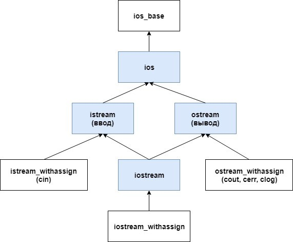

# Лекция 6: Динамический полиморфизм, абстрактные классы и потоки

### План лекции:

1. Статическое и динамическое связывание
2. Виртуальные функции
3. Виртуальный деструктор
4. Приведения в иерархии
5. Чистые виртуальные функции и абстрактные классы
6. `override` и `final`
7. Интерфейсные классы
8. Иерархия потоков C++
9. Стандартные, строковые и файловые потоки

### От общего указателя к конкретному поведению

Практический сценарий — обработка набора графических фигур. Коллекция хранит указатели на общий тип, а фактические объекты представляют круги, прямоугольники и другие варианты. Код обхода вызывает одну операцию `draw`, не создавая отдельную ветвь для каждого класса.

При таком вызове статический тип указателя ограничивает доступный интерфейс, а динамический тип объекта определяет реализацию виртуальной функции. Эти два типа могут совпадать, но именно их различие делает динамический полиморфизм полезным.


На прошлой лекции мы построили иерархию типов. Теперь возникает вопрос: какую функцию вызвать, если указатель имеет тип базы, а объект на самом деле относится к производному классу?

При обычном невиртуальном вызове выбор функции определяется статическим типом выражения:

```cpp
class Weapon {
public:
    void printName() const {
        std::cout << "Weapon\n";
    }
};

class Sword : public Weapon {
public:
    void printName() const {
        std::cout << "Sword\n";
    }
};
```

Вызов через `Weapon*` выберет `Weapon::printName`, даже если адрес относится к `Sword`. Это раннее, или статическое, связывание.

### Виртуальные функции

#### Механика вызова

Виртуальность задаётся в базовом контракте. Когда функция вызывается через ссылку или указатель на базовый тип, программа выбирает конечный переопределитель для фактического объекта. Конкретный способ реализации таблиц виртуальных функций определяется компилятором, но наблюдаемое правило выбора задаётся языком.

В примере полезно проследить три шага: какой объект был создан, к какому базовому типу привязана ссылка и какая реализация является конечной для этого объекта. Если вызов выполняется непосредственно для объекта известного типа, компилятор иногда может оптимизировать диспетчеризацию, не меняя смысла программы.

`virtual` добавляет динамический выбор, но не читает мысли автора: неверный контракт останется неверным на любой скорости вызова.

Виртуальная функция выбирается по динамическому типу объекта:

```cpp
class Weapon {
public:
    virtual void printName() const {
        std::cout << "Weapon\n";
    }

    virtual ~Weapon() = default;
};

class Sword : public Weapon {
public:
    void printName() const override {
        std::cout << "Sword\n";
    }
};

void print(const Weapon& weapon) {
    weapon.printName();
}
```

`print(Sword{})` вызовет версию `Sword`. В реализации это обычно связано с таблицей виртуальных функций, но стандарт не требует конкретного устройства vtable.

В производном классе ключевое слово `virtual` повторять необязательно, а `override` желательно: компилятор проверит, что сигнатура действительно переопределяет виртуальную функцию.

### Срезка объекта

При передаче производного объекта по значению в параметр базового типа создаётся новый базовый объект. В него копируется только базовая часть; дополнительные поля производного типа не помещаются в целевой объект. Это и называется срезкой.

После срезки динамического производного объекта внутри параметра уже нет, поэтому виртуальный вызов ведёт себя как для самостоятельного базового объекта. Чтобы сохранить идентичность исходного экземпляра, полиморфные объекты обычно передают по ссылке или указателю.

Передача производного объекта по значению в параметр базового типа создаёт только базовую часть:

```cpp
void printByValue(Weapon weapon); // полиморфизм потерян
```

Это называется **object slicing**. Для динамического полиморфизма объекты передают по ссылке или указателю.

### Виртуальный деструктор

Если объект производного класса уничтожается через указатель на базовый тип, базовый деструктор должен быть виртуальным. Тогда сначала выполняется деструктор фактического производного объекта, затем последовательно уничтожаются его базовые части.

Практически это критично для владельца коллекции полиморфных объектов. Производная часть может держать файл или буфер, и пропуск её деструктора оставит ресурс незавершённым. Виртуальный деструктор делает уничтожение частью общего полиморфного контракта.

Деструктор без `virtual` в полиморфной базе похож на аварийный выход, который ведёт только с первого этажа.

Если объект удаляется через указатель на базовый класс, деструктор базы должен быть виртуальным:

```cpp
class Base {
public:
    virtual ~Base() = default;
};

Base* object{new Derived};
delete object;
```

Без виртуального деструктора такое удаление производного объекта через базовый указатель приводит к неопределённому поведению. Практическое правило: полиморфная база обычно имеет открытый виртуальный деструктор либо защищённый невиртуальный, если удаление через базу запрещено.

### Виртуальные вызовы при создании и уничтожении

В конструкторе и деструкторе базового класса виртуальный вызов не переходит к ещё не созданной или уже уничтоженной производной части. Вызывается реализация текущего этапа иерархии.

Поэтому не следует строить инициализацию производного объекта на вызове переопределяемой функции из конструктора базы.

### Приведение типов

`static_cast` выражает преобразование, корректность которого в значительной степени обосновывает программист. `dynamic_cast` для полиморфных типов проверяет соответствие фактического объекта во время выполнения. Для указателя неудача даёт `nullptr`, а для ссылки приводит к исключению `std::bad_cast`.

Практический разбор начинается не с выбора синтаксиса cast, а с вопроса, почему общий интерфейс оказался недостаточен. Частые обратные приведения могут указывать, что вызывающий код знает слишком много о производных типах.

Приведение типа — не телепортация: объект не становится другим только потому, что мы очень убедительно записали угловые скобки.

Восходящее преобразование от производного указателя к базовому выполняется безопасно и обычно не требует явного cast:

```cpp
Sword sword;
Weapon* weapon{&sword};
```

Для проверяемого нисходящего преобразования полиморфной базы используется `dynamic_cast`:

```cpp
if (auto* sword_pointer{dynamic_cast<Sword*>(weapon)}) {
    sword_pointer->sharpen();
}
```

При неудаче указательная форма возвращает `nullptr`. Ссылочная форма бросает `std::bad_cast`.

`static_cast` вниз не проверяет реальный динамический тип. Если объект не является экземпляром требуемого производного класса, дальнейшее использование результата может привести к неопределённому поведению. Различие нельзя описывать просто как «`static_cast` быстрее»: сначала выбирают корректную модель типов.

### Абстрактные классы

Абстрактный класс формулирует общий контракт, но не предоставляет достаточного поведения для самостоятельного объекта. Чистая виртуальная функция требует, чтобы конкретный производный тип определил операцию перед созданием экземпляров.

В системе экспорта это может быть общий метод `write`, реализованный для текста и двоичного формата. Код верхнего уровня работает с контрактом, а конкретный объект отвечает за детали представления. При этом базовый класс может хранить общее состояние и реализовывать общие части алгоритма, если это предусмотрено лекционной моделью.

Абстрактный класс нельзя создать, зато обсуждать его архитектуру можно удивительно долго.

Класс с хотя бы одной чистой виртуальной функцией является абстрактным:

```cpp
class Weapon {
public:
    virtual void printName() const = 0;
    virtual ~Weapon() = default;
};
```

Объект `Weapon` создать нельзя, но можно использовать ссылки и указатели на него. Производный класс остаётся абстрактным, пока не реализует все унаследованные чистые виртуальные функции.

```cpp
class Sword final : public Weapon {
public:
    void printName() const override {
        std::cout << "Sword\n";
    }
};
```

### Реализация чистой виртуальной функции

Чистая виртуальная функция может иметь определение вне класса:

```cpp
class Base {
public:
    virtual void describe() const = 0;
};

void Base::describe() const {
    std::cout << "base part\n";
}
```

Класс от этого не перестаёт быть абстрактным. Производная реализация может вызвать `Base::describe()` явно, но обычный виртуальный вызов всё равно требует финального переопределителя.

Чистый виртуальный деструктор также обязан иметь определение, потому что деструктор базовой части всё равно выполняется.

### `override` и `final`

`override` просит компилятор проверить, что метод действительно переопределяет виртуальную функцию базы. Несовпадение `const`, типа параметра или другой части сигнатуры превращается в понятную диагностику вместо появления независимой функции.

`final` запрещает дальнейшее переопределение метода либо наследование от класса. Это сильное ограничение, поэтому оно должно выражать реальный контракт, а не временное желание автора прекратить обсуждение иерархии.

```cpp
class Base {
public:
    virtual void show(int value);
};

class Derived final : public Base {
public:
    void show(int value) override;
};
```

`override` проверяет совпадение виртуальной сигнатуры. `final` у функции запрещает дальнейшее переопределение, у класса — дальнейшее наследование.

### Интерфейсный класс

В C++ нет отдельного ключевого слова `interface`. Так называют абстрактный класс, который задаёт контракт и почти не содержит состояния или реализации:

```cpp
class Storage {
public:
    virtual void save(std::string_view data) = 0;
    virtual std::string load() const = 0;
    virtual ~Storage() = default;
};
```

Это соглашение проектирования, а не дополнительная категория в стандарте. Интерфейс может иметь необходимые определения, типы и даже защищённые вспомогательные элементы, если контракт остаётся ясным.

### Потоки как пример иерархии

Поток отделяет алгоритм форматирования данных от конкретного устройства. Один и тот же оператор записи может направить значение на экран, в строку или в файл, потому что код работает через общий интерфейс потоковых классов.

Во время операции меняется состояние самого потока: позиция, флаги форматирования и признаки ошибок. Поэтому поток передают и возвращают по ссылке, сохраняя единую последовательность операций.

Поток данных отличается от потока сознания тем, что у первого хотя бы можно проверить `fail()`.

Стандартная библиотека ввода-вывода показывает применение общего интерфейса к разным источникам. `std::istream` предоставляет операции чтения, `std::ostream` — записи, а `std::iostream` объединяет обе стороны.



Поток — объект, через который программа последовательно получает или отправляет данные. Он скрывает детали консоли, файла или строки за общими операциями.

### Стандартные потоки

- `std::cin` связан со стандартным вводом;
- `std::cout` — со стандартным выводом;
- `std::cerr` — со стандартным потоком ошибок и обычно выводит данные сразу;
- `std::clog` — также связан с ошибками, но ориентирован на буферизованный вывод.

Точное устройство и буферизация зависят от реализации и окружения, поэтому не стоит строить корректность программы на предположении о физическом устройстве.

### Состояние потока

Рассмотрим ввод числа из пользовательской строки. Поток пытается интерпретировать следующие символы согласно типу переменной. При успехе он изменяет переменную и сдвигает позицию чтения; при неудаче устанавливает флаг состояния, после чего последующие операции обычно не выполняют полезной работы до восстановления потока.

Поэтому проверка `if (input >> value)` объединяет действие и контроль результата. Она не просто спрашивает, существует ли поток, а оценивает его состояние после конкретной попытки чтения.

Операция чтения меняет состояние потока. Самый надёжный способ организовать цикл — проверять сам результат чтения:

```cpp
int value;
while (std::cin >> value) {
    std::cout << "Получено: " << value << '\n';
}
```

Поток хранит флаги `goodbit`, `eofbit`, `failbit` и `badbit`. Методы `good()`, `eof()`, `fail()` и `bad()` позволяют их исследовать, `clear()` — сбросить состояние, а `ignore()` — пропустить нежелательные символы.

Дополнительный файл [`Флаги для манипуляции с потоками ввода вывода.md`](Флаги%20для%20манипуляции%20с%20потоками%20ввода%20вывода.md) содержит справочную таблицу форматирования и состояний.

### Форматирование

Манипуляторы изменяют представление данных:

```cpp
#include <iomanip>

std::cout << std::fixed << std::setprecision(2) << 12.345 << '\n';
std::cout << std::hex << 255 << '\n';
```

Часть настроек сохраняется в потоке для следующих операций. Если функция временно меняет формат общего потока, она должна учитывать необходимость восстановить состояние.

`std::endl` добавляет перевод строки и выполняет `flush`. Для обычного переноса строки достаточно `'\n'`.

### Строковые потоки

`std::istringstream` читает из строки, `std::ostringstream` пишет в строку, `std::stringstream` делает оба действия:

```cpp
#include <sstream>

std::istringstream input{"10 20"};
int first;
int second;

if (input >> first >> second) {
    std::cout << first + second << '\n';
}
```

Они удобны для разбора и форматирования без работы с внешним устройством.

### Строковый ввод

`std::getline` из `<string>` считывает строку до разделителя:

```cpp
std::string line;
if (std::getline(std::cin, line)) {
    std::cout << line << '\n';
}
```

После форматированного ввода `operator>>` в потоке может остаться символ новой строки. Его нужно осознанно обработать, например через `std::ws` или `ignore` с корректным пределом.

Метод `get()` извлекает символ, включая пробельные символы. Поэтому утверждение «`get()` не считывает перевод строки» неверно. `peek()` смотрит следующий символ без извлечения, `unget()` пытается вернуть последний, а `putback()` помещает указанный символ обратно при поддержке буфера.

### Файловые потоки

Файловый поток связывает объект C++ с внешним файлом. Открытие устанавливает ресурс и режим работы, операции чтения или записи меняют позицию и состояние, а деструктор закрывает файл при завершении времени жизни объекта.

Практически это пример RAII из лекции о классах: если функция завершится раньше из-за ошибки, локальный поток всё равно будет уничтожен. Однако успешное открытие и успешная запись — разные события, поэтому состояние нужно проверять в подходящих местах.

```cpp
#include <fstream>

std::ofstream output{"result.txt"};
if (!output) {
    std::cerr << "Не удалось открыть файл\n";
    return;
}

output << "result: " << 42 << '\n';
```

`std::ifstream` читает, `std::ofstream` пишет, `std::fstream` поддерживает оба направления. Явный `close()` допустим, но не обязателен перед обычным выходом из области: деструктор закроет файл по RAII.

Для произвольного доступа используются позиции чтения и записи: `tellg`/`seekg` и `tellp`/`seekp`. Их следует применять только после проверки состояния потока и с учётом текстового или бинарного режима.

### Итоги

При разборе полиморфного примера нужно одновременно следить за статическим типом выражения, фактическим типом объекта и его временем жизни. При разборе потока к этим вопросам добавляются позиция чтения или записи и флаги состояния. Такая последовательность объясняет результат точнее, чем попытка запомнить отдельные вызовы.

Общий интерфейс уменьшает число ветвей в пользовательском коде, но не снимает требований с реализаций. Каждая производная функция сохраняет контракт базы, а каждая потоковая операция обязана оставлять проверяемое состояние.

Виртуальная функция делает выбор поведения зависимым от реального типа объекта, абстрактный класс формулирует контракт, а `override` помогает компилятору проверить нашу задумку. Иерархия потоков показывает эту идею в стандартной библиотеке: один общий способ чтения и записи работает со стандартным вводом, строками и файлами.
